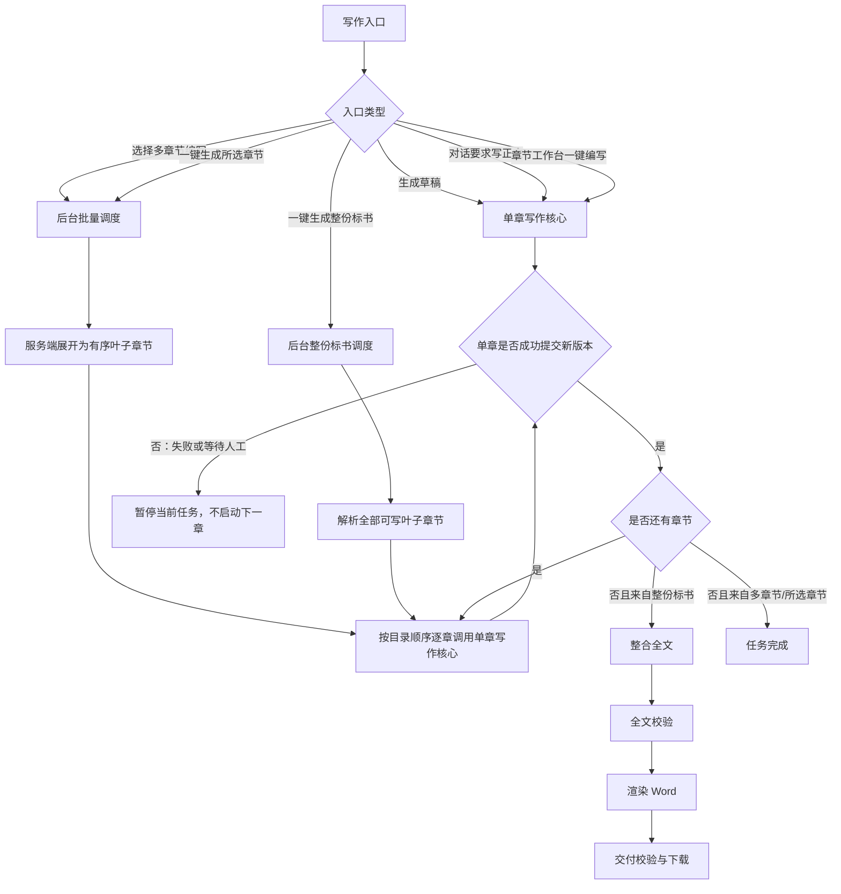
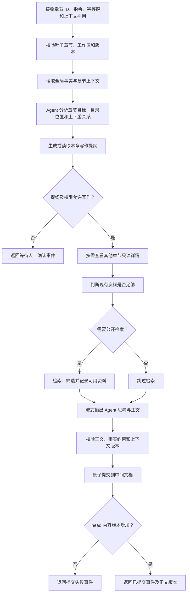
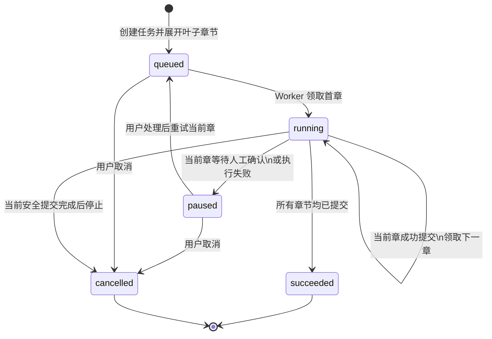

# 标书编写统一逻辑流程

本文描述目标实现，不代表当前临时实现。唯一的章节写作核心是用户手动点击“生成草稿”后触发的章节 Agent 流程；其他入口只能顺序调用该核心，不能另行实现分析、检索、生成、校验或提交。

## 总体入口与调度

## 公共单章写作核心

单章核心产生的分析、检索、思考、正文、校验、提交和错误事件，是所有入口展示 Agent 过程的唯一来源。

## 批量任务状态流

批量 Worker 只做以下工作：维护队列、选择当前叶子章节、调用公共单章写作核心、持久化事件与检查点、确认版本增长后推进下一章。它不得复制单章 Agent 流程，也不得将“模型已回复”或“检索已完成”当作章节成功。

## 入口与职责对应

| 入口 | 调度职责 | 正文生成职责 |
| --- | --- | --- |
| 手动“生成草稿” | 无；只启动当前叶子章节 | 直接调用公共单章写作核心 |
| 对话触发写正文 | 无；只启动当前叶子章节 | 直接调用公共单章写作核心 |
| 章节工作台“一键编写” | 无；只启动当前叶子章节 | 直接调用公共单章写作核心 |
| 选择多章节编写 | 展开、排序、逐章调度、暂停/重试 | 每章调用公共单章写作核心 |
| 一键生成所选章节 | 展开、排序、逐章调度 | 每章调用公共单章写作核心 |
| 一键生成整份标书 | 遍历全部叶子章节；完成后整合与交付 | 每章调用公共单章写作核心 |

## 前后端职责

| 责任 | 后端 | 前端 |
| --- | --- | --- |
| 章节生成、检索、校验、提交 | 执行公共单章写作核心并持久化结果 | 不实现生成逻辑 |
| 批量/整份标书 | 持久化队列、顺序调度、恢复、暂停和取消 | 创建任务及发送重试/取消指令 |
| 实时过程 | 发布真实单章执行事件 | 订阅事件并显示在对应章节 Agent 聊天框 |
| 章节展示 | 返回当前章、阶段、错误和正文版本 | 打开真实当前叶子章节；目录圆点反映任务状态 |

目录圆点默认灰色；排队或执行中为蓝色；提交成功为绿色；失败或暂停为红色。前端不得创建虚假的“正在处理”提示；显示文案必须来自后台的真实任务状态或公共单章服务事件。

