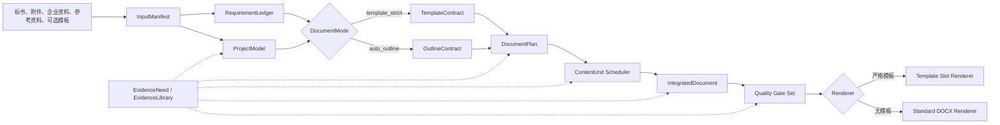

# 标书 Agent 整体架构 V3

> 版本：V3 目标架构  
> 状态：已确定方案，待按 `v3_development_plan.md` 实施  
> 日期：2026-07-26  
> 当前生产基线：V2 控制面  
> 配套开发计划：[v3_development_plan.md](./v3_development_plan.md)

## 1. 架构结论

V3 不是在现有章节提示词上继续打补丁，也不是推翻已经稳定的控制面重写项目。

V3 的总体策略是：

1. 保留 V2 已建立的工作空间、`control.db`、CommandGateway、唯一执行内核、Artifact、事件、断点续跑、材料状态、Issue 和质量门禁。
2. 替换从“理解项目”到“生成正式文档”的内容生产核心。
3. 将系统的基本生产单位从“独立章节”改为“共享项目模型驱动的全文论证系统”。
4. 有模板时严格原位填充模板；无模板时根据标书生成项目专属标题。
5. 检索是全过程可调用的共享能力，不是必须在开头一次性完成的线性阶段。
6. 正式出稿前必须完成全文责任规划、依赖化写作、实际整合重写和可验证的质量门禁。
7. V1 文件状态、兼容 API、旧执行内核以及被 V3 替代的 V2 内容链全部删除，不保留静默回退。

V3 的内容主链为：

```text
输入归类与版本冻结
  → 标书解析与原子要求台账
  → 最低充分的项目整体理解
  → 确定文档模式
  → 编译文档结构契约
  → 规划全文内容责任
  → 按依赖执行内容单元
       ↕ 任意阶段按需检索与证据回写
  → 章节内 / 章节间 / 全文三级整合
  → 覆盖、事实、合规、重复与结构门禁
  → 分模式渲染
  → Word 结构与页面验收
  → 正式交付
```

## 2. 当前问题的实证结论

当前问题不是模型偶尔写得不好，而是内容任务模型存在系统性错误。

现有真实运行样本中：

| 指标 | 当前结果 |
|---|---:|
| 一级标题 | 7 |
| 被创建的独立章节任务 | 198 |
| 最深标题层级 | 8 |
| 评分点 | 92 |
| 评分点累计绑定次数 | 1198 |
| 平均每个评分点绑定次数 | 13.02 |
| 单个评分点最高绑定次数 | 131 |

这会稳定地产生以下问题：

- 模板中的每个深层标题都被当成独立 Writer，章节之间互不知情。
- 同一评分点被多个 Writer 重复完整响应。
- Writer 只看到局部上下文，不知道其他章节已经负责什么。
- “项目背景、总体思路、质量、进度、风险”等公共主题在多个章节反复出现。
- 全文审核发生在写完之后，只能报告问题，无法从源头阻止重复。
- 模板模式虽然保留了部分样式，但 Word 生成时会清除模板正文并重新追加 Markdown，不属于严格套模。
- 新增的项目理解和联网检索被设计为前置线性阶段，与真实编标过程中随时补资料的行为不符。
- 当前阶段注册表已经登记项目理解和联网检索，但正常 Runner 与 Graph 未完整接入，可能出现阶段被静默跳过或 Graph 构建失败。

因此，V3 必须同时解决“内容生产模型”“模板渲染模型”“证据获取模型”和“旧架构清理”四个方面，不能分别打补丁。

## 3. V3 目标与成功标准

V3 的目标不是“成功生成一个 DOCX 文件”，而是生成可继续校审、可追溯、结构正确且能够正式交付的标书。

成功标准如下：

1. 项目理解、要求、评分点、事实、证据和正文位置可以双向追溯。
2. 每个要求、评分点和核心主题有且仅有一个主责位置。
3. 允许的重复必须有明确原因，例如招标要求多处响应；其余重复必须在整合阶段实际删除或改写。
4. 所有 Writer 使用同一版项目模型、全文结构、责任计划、事实和术语。
5. 外部资料不能被写成企业事实或项目承诺。
6. 新资料或用户修改可以通过影响分析只重算相关内容。
7. 上传模板时，标题、层级、编号、顺序、固定内容、表格、分节和页眉页脚保持不变。
8. 未上传模板时，标题来自本次标书，不使用固定万能目录。
9. 任何模板失败、强制要求缺失、关键事实无证据或结构漂移都不得静默降级。
10. 只有全部硬门禁通过的文档才能标记为 `ready`。

## 4. 架构不变量

以下规则属于 V3 不变量，后续实现和提示词不得绕过：

1. `control.db` 是控制状态的唯一权威源，文件只保存内容 Artifact 和不可变证据。
2. Pipeline 是唯一阶段执行内核；Web、CLI、Agent 和页面按钮只能提交 Command。
3. 文档始终由共享 `ProjectModel` 驱动，Writer 不得各自重新理解项目。
4. 未达到“最低充分整体理解”前不得编译正式文档结构，但不要求提前查完所有资料。
5. 模板输入存在且有效时只能进入 `template_strict`。
6. 模板存在但损坏或无法可靠识别时必须阻断，不能转成无模板模式。
7. 无模板时，标题必须从标书要求和评分逻辑中生成。
8. 每个要求、评分点和核心主题只能有一个 `primary_owner`。
9. Writer 不得改变目录、扩大责任或直接修改共享事实和证据。
10. 检索只能由明确的 `EvidenceNeed` 触发，结果验证后才能进入共享证据库。
11. 全文审查必须能够触发实际重写，不能只生成问题报告。
12. 正式渲染必须消费通过审核的 `IntegratedDocument`，不能直接拼接各章节临时文件。
13. V1/V2 兼容路径不得成为回退方案；失败必须显式暴露。

## 5. 总体组件关系



## 6. 输入与来源模型

### 6.1 输入角色

所有输入必须登记在 `InputManifest`，不能只根据扩展名猜测用途。

| 角色 | 用途 | 是否可证明企业能力 |
|---|---|---|
| `tender` | 招标要求、任务、参数、成果、验收和合同约束 | 否 |
| `score` | 评分规则、评分点、分值和判定条件 | 否 |
| `template` | 决定严格模式的结构和版式 | 否 |
| `company` | 企业资质、人员、设备、证书、业绩和真实能力 | 是 |
| `reference` | 政策、标准、技术方法、公开案例和行业资料 | 否 |
| `guidance` | 用户对结构、重点、术语和写作粒度的要求 | 否 |

只有专门标记为 `template` 的一个活动文件触发严格模板模式。普通 DOCX 参考资料仍属于 `reference` 或 `guidance`。

### 6.2 输入冻结

每项输入记录：

- `input_id`
- `role`
- 文件名和 MIME 类型
- SHA-256
- 版本和上传时间
- 来源主体
- 是否活动
- 替代的旧版本

内容阶段只能消费冻结后的输入快照。输入变化后由依赖图计算失效范围。

## 7. 项目整体理解

### 7.1 最低充分理解

项目整体理解不是一段摘要，而是可版本化、可追溯的 `ProjectModel`。

它至少包含：

- 项目名称、背景和采购目的；
- 服务对象、地域、业务和时间范围；
- 项目边界和明确不属于本项目的内容；
- 工作任务、工作包和依赖顺序；
- 输入数据、技术对象和处理逻辑；
- 交付物、阶段成果和最终成果；
- 里程碑、工期和验收条件；
- 关键技术、难点、风险和约束；
- 参与方、角色和责任；
- 招标指定标准和规范；
- 统一术语、名称、数字和承诺口径；
- 已确认事实、合理推断、冲突和未知项；
- 需要补充的企业材料和外部证据。

### 7.2 原子要求台账

`RequirementLedger` 将招标内容拆成最小可验证单元：

```text
RequirementItem:
  requirement_id
  kind: mandatory | score | qualification | deliverable | acceptance | contract
  source_anchor
  original_text
  normalized_requirement
  severity
  response_type
  evidence_policy
  status
```

要求台账与项目模型分别解决两个问题：

- `ProjectModel` 解决“这个项目整体是什么、怎么实施”；
- `RequirementLedger` 解决“招标文件每一项必须在哪里得到响应”。

### 7.3 理解门禁

进入文档结构编译前必须满足：

- 项目目标、范围、工作包、交付物、验收和工期均有来源；
- 所有强制要求和评分点已经登记；
- 已发现的冲突和未知项已标注；
- 不要求关闭全部外部资料缺口；
- 阻断项目语义的未知项必须解决或进入人工确认。

## 8. 双文档模式

### 8.1 `template_strict`

模板分为不可变结构和允许填充区域。

不可变结构包括：

- 标题文字、级别、编号关系、父子关系和顺序；
- 封面、目录、固定说明和正文元素相对次序；
- 表格位置、列结构、合并关系和样式；
- 分节、纸张、页边距、页眉页脚和页码；
- 样式、编号定义、书签、域和内容控件。

允许填充区域包括：

- `text_slot`：替换明确占位文字或内容控件；
- `cell_slot`：填写已有表格单元格；
- `flow_slot`：在固定标题下的合法正文区域增加段落、列表或允许的表格；
- `repeat_slot`：模板明确声明可复制的表格行或重复块。

页面数量可以增长，但模板骨架不能变化。

`TemplateContract` 必须包含：

```text
TemplateContract:
  template_hash
  contract_version
  structural_fingerprint
  immutable_nodes[]
  headings[]
  sections[]
  tables[]
  slots[]
  allowed_mutations[]
  warnings[]
  blocking_gaps[]
```

标题识别需要综合：

- Word `outlineLvl`
- 样式 ID 和本地化名称
- 编号定义和层级
- 书签、内容控件、段落 ID
- 标题编号文本和段落视觉特征

仅使用 `Heading N` 或“标题 N”名称不满足 V3 要求。

模板契约编译失败、槽位歧义、锚点不唯一或重要要求无处映射时，正式流程阻断。

### 8.2 `auto_outline`

无模板时编译 `OutlineContract`。

标题来源优先级为：

1. 招标文件规定的响应目录或顺序；
2. 评分办法；
3. 采购任务和服务范围；
4. 实施阶段、工作包和技术依赖；
5. 交付物和验收要求；
6. 为保证全文逻辑必须增加的衔接主题。

每个标题记录来源要求和设置原因。禁止：

- 套用固定万能目录；
- 一个评分点机械生成一个章节；
- 在文末追加“补充评分点响应”；
- 将未覆盖评分点塞入最后一个无关章节；
- 为外部资料单独创造与标书无关的章节。

## 9. 全文内容责任规划

`DocumentPlan` 在任何正文写作前生成，是解决“各章各自为政”的核心。

每个结构节点至少定义：

```text
DocumentNodePlan:
  node_id / slot_id
  purpose
  primary_requirement_ids[]
  owned_topics[]
  supporting_topics[]
  forbidden_topics[]
  required_evidence_ids[]
  pending_evidence_need_ids[]
  upstream_dependencies[]
  downstream_consumers[]
  cross_references[]
  planned_tables[]
  target_size
  generation_order
```

规则：

- 每个原子要求、评分点和主题只有一个主责节点。
- 非主责节点只能摘要、承接或交叉引用。
- 招标明确要求多处响应时，使用 `required_mentions` 登记受控重复。
- 摘要、总体思路和综合承诺在详细方案完成后生成。
- 内容计划通过后才创建写作单元。

## 10. 按需检索与证据系统

### 10.1 检索不是线性阶段

以下阶段都可以创建 `EvidenceNeed`：

- 项目理解；
- 文档结构映射；
- 全文内容规划；
- 内容单元写作；
- 章节整合；
- 全文审核和时效性复核。

### 10.2 检索需求

```text
EvidenceNeed:
  need_id
  question
  reason
  topic_id
  affected_unit_ids[]
  allowed_source_types[]
  priority
  blocking_scope
  deadline_stage
  query_budget
  stop_condition
  status
```

每次检索只解决明确问题，不允许“搜集所有相关资料”式无限任务。

停止条件包括：

- 已找到足够的权威证据；
- 多个来源已经交叉验证；
- 达到查询预算仍无结果，转为缺口；
- 来源冲突需要人工判断；
- 该证据被确认非关键。

### 10.3 证据分级

优先级为：

1. 招标文件和附件；
2. 用户确认的企业材料；
3. 政府、标准发布机构和采购主体官方来源；
4. 权威行业、科研和学术来源；
5. 一般网络资料。

外部资料不得：

- 证明企业资质、人员、设备、业绩；
- 修改招标参数和合同要求；
- 将类似项目案例改写为本企业经历；
- 将未核实标准版本写成强制依据。

### 10.4 证据存储

- `control.db` 保存 EvidenceNeed 的状态、依赖和调度信息。
- 证据元数据和经过验证的结论按批次保存为不可变 Artifact。
- 原文快照、摘要、URL、发布机构、发布日期、访问日期和适用范围均可追溯。
- Writer 只读固定证据快照，不直接修改共享证据库。
- 新证据只使依赖它的内容单元和整合结果失效。

## 11. 内容单元执行

### 11.1 写作单元

写作单元是完整父章节、工作包或连续模板区域，不是每个叶子标题。

如果一个父章节超出上下文预算，可以拆成多个相邻片段，但必须：

- 共享同一个章节契约；
- 使用同一事实和术语版本；
- 由同一个章节整合步骤合并；
- 在进入全文整合前通过章节内一致性检查。

### 11.2 Writer 输入

每个 Writer 必须看到：

- `ProjectModel`
- 全文 `DocumentContract`
- 全文 `DocumentPlan`
- 当前 `ContentUnitContract`
- 主责、支撑和禁止主题
- 相关要求和评分点
- 已验证证据
- 相邻和上游单元摘要
- 统一术语、数字、工期和承诺

### 11.3 Writer 输出

Writer 输出结构化 `ContentBlock`，而不是只输出无法追踪的 Markdown：

```text
ContentBlock:
  block_id
  target_node_id / slot_id
  type: paragraph | list | table | figure_ref | cross_reference
  content
  topic_ids[]
  requirement_ids[]
  score_point_ids[]
  evidence_ids[]
  fact_ids[]
  confidence
```

严格模板模式不得输出新标题。无模板模式也只能使用已经冻结的标题。

### 11.4 调度

- 按依赖图分批执行。
- 只有互不依赖且主题不冲突的单元可以并行。
- 缺少局部证据时只阻塞对应单元。
- Writer 发现新事实或结构问题时只能提交 Proposal，不能直接改变共享模型。

## 12. 全文整合

V3 新增真正的 `integrate_document` 阶段。

整合分为三级：

1. 内容单元内部整合：处理同一父章节中的重复和衔接。
2. 相邻章节整合：处理前后依赖、交叉引用和重复背景。
3. 全文语义整合：通过主题账本和一致性账本定向重写全文。

整合必须实际执行：

- 删除或合并重复段落；
- 将非主责位置改为简述或交叉引用；
- 统一项目名称、术语、范围、数字和时间；
- 统一技术路线、工作包、交付物和验收口径；
- 修正前后冲突；
- 补充章节过渡；
- 将综合章节改为对详细方案的真实归纳。

`global_review` 在 V3 中降为只读终稿审计。审计失败必须回到整合阶段，不能只生成报告后继续出稿。

## 13. 追溯、覆盖和质量门禁

### 13.1 两次覆盖检查

覆盖矩阵执行两次：

1. 规划覆盖：确认每项要求和评分点已分配唯一主责位置。
2. 终稿覆盖：确认最终渲染内容中确实存在可验证响应。

### 13.2 五道门禁

1. **项目理解门**
   - 目标、范围、任务、成果、验收和约束完整；
   - 事实、推断和未知项分离。
2. **文档设计门**
   - 强制要求和评分点全部有唯一主责；
   - 模板结构或自动目录合法；
   - 无无关兜底章节。
3. **内容单元门**
   - 不越权、不重复主责主题；
   - 关键结论有证据；
   - 企业事实不虚构。
4. **全文整合门**
   - 重复和冲突已经实际修订；
   - 术语、数据、工期和交付物一致。
5. **交付门**
   - 正文覆盖、合规、Claim、模板结构和页面检查通过；
   - 无未批准占位符和关键缺口；
   - Artifact 与 GateReceipt 指纹一致。

### 13.3 交付状态

```text
ready            所有硬门禁通过，可以正式交付
draft_with_gaps  可供预览，但存在待补事实或证据
blocked          模板、强制要求、事实冲突或结构问题阻断
```

## 14. 分模式渲染

### 14.1 严格模板渲染

严格模式必须：

1. 复制原模板文件；
2. 验证模板指纹与契约一致；
3. 按 `slot_id` 在原位置填充；
4. 仅执行契约白名单允许的 OOXML 变化；
5. 保留样式、编号、关系、页眉页脚、分节和固定内容；
6. 生成结构差异报告；
7. 渲染页面并进行视觉验收；
8. 差异超出白名单时阻断正式出稿。

严禁：

- 清空模板正文；
- 从 Markdown 重建模板目录；
- 在模板末尾追加另一套正文；
- 模板失败后创建空白 Word；
- 未经声明增删普通表格的行列；
- 修改标题文字、级别、顺序和编号。

### 14.2 无模板渲染

无模板模式从 `IntegratedDocument` 生成 Markdown 和 DOCX：

- 标题来自 `OutlineContract`；
- 内容顺序来自 `DocumentPlan`；
- 表格和列表来自结构化内容块；
- 样式使用默认投标文档样式配置；
- 正式渲染后执行目录、编号、表格、分页和页面检查。

## 15. 变更与失效传播

所有用户补充和编辑先形成 `ChangeSet`：

```text
ChangeSet:
  change_id
  source
  changed_inputs[]
  changed_facts[]
  changed_requirements[]
  affected_contract_nodes[]
  affected_content_units[]
  required_actions[]
  status
```

失效规则：

- 企业材料变化：失效依赖对应企业事实的内容单元。
- 外部证据变化：失效引用该证据的内容单元。
- 招标文件变化：重新构建要求台账、项目模型、结构和全部下游内容。
- 模板变化：重新编译模板契约、责任计划和全部正文位置映射。
- 用户修改局部正文：形成锁定内容块，重新执行相关整合、覆盖和渲染门禁。
- 文档模式变化：结构及下游全部失效，但项目模型和可复用证据保留。

## 16. 控制面与公共接口

V3 继续使用“一个控制面、一个执行内核、一个权威状态源”。

新增或调整的主要 Command：

- `pipeline.start`
- `pipeline.resume`
- `pipeline.run_stage`
- `research.request`
- `research.retry`
- `document.replan`
- `document.rebuild_affected`
- `template.remap`
- `content.lock`
- `content.unlock`
- `quality.revalidate`
- `export.build_draft`
- `export.build_final`

V3 WorkspaceSnapshot 增加：

- `document_mode`
- `project_model_revision`
- `document_contract_revision`
- `document_plan_revision`
- `evidence_need_summary`
- `content_unit_summary`
- `integration_revision`
- `delivery_status`

正式 API 使用 `/api/v3/workspaces/{id}/...`。前端切换完成后删除 `/api/v2` 和非版本化工作空间兼容接口，不建立 V2 → V3 永久代理。

## 17. V1/V2 保留与删除边界

### 17.1 保留并升级

- `control.db` 及其事务、revision 和审计事件；
- CommandGateway、CommandDispatcher 和唯一执行 Worker；
- WorkspaceContext 和显式 workspace_id；
- Artifact manifest、依赖指纹、stale 和断点续跑；
- 材料提交、验证和 Fulfillment 状态机；
- Finding、Issue、PolicyDecision 和 GateReceipt；
- 前端 WorkspaceSnapshot 和事件流模式；
- 招标文件转换、切分和基础事实抽取能力；
- Claim、合规、价格表和偏离表等确定性检查器。

### 17.2 删除或替换

- V1 `run_state.json`、`goal_state.json`、`materials_checklist.json`、`repair_job.json` 和 Issue 文件状态的权威或兼容投影；
- V1 状态自动导入、冲突调和和旧工作区恢复逻辑；
- 非版本化的工作空间读写 API 和 mutation 兼容适配器；
- `AGENT_SUPERVISOR_ENABLED` 旧编排器回退；
- `session_orchestrator` 的 legacy fallback；
- LangGraph 完整 Pipeline、`graph-run` 和第二套阶段执行路径；
- 外部可直接执行阶段的旧 CLI；内部 StageRunner 继续由 ExecutionWorker 调用；
- “一个标题一个 job”的 `plan_chapter_jobs` 语义；
- 独立章节 `select_contexts → write_chapters → review_fix` 内容链；
- `summarize_chapters` 独立末端阶段；
- 只报告不修订的旧 `global_review`；
- 末尾追加“补充评分点响应”的大纲兜底；
- 将未覆盖评分点塞入模板最后标题的逻辑；
- 当前一次性前置 `research_project_materials`；
- 直接修改 `inputs/reference.md` 的联网研究写入方式；
- 模板清空正文、Markdown 重建和空白 Word 降级；
- 前端和测试中仅服务于 V1/V2 兼容接口、文件状态和旧 Runner 的代码。

### 17.3 历史文档

V1、V2 架构文档可以保留为历史取证，但必须明确标记“非运行时依据”。运行代码、API 和测试不得继续依赖历史文档中的兼容行为。

## 18. V3 验收基线

至少覆盖以下场景：

1. 只有招标文件、没有企业资料和模板：生成标书驱动目录和 `draft_with_gaps`，不得虚构企业能力。
2. 上传含中文自定义标题、复杂编号、分节、页眉页脚和合并表格的模板：输出骨架与模板一致。
3. 模板损坏或槽位歧义：明确 `blocked`，不产生空白替代 Word。
4. 模板中无位置承载重要评分项：输出模板覆盖缺口，不新增标题。
5. 无模板标书：所有标题均能追溯到标书要求，禁止万能目录和补充兜底章。
6. 同一评分点被多个主题涉及：只有一个主责位置，其余为受控引用。
7. 写作中途发现标准缺口：即时检索，只重写受影响单元。
8. 用户中途上传参考实施方案或分类图片：更新全局模型并同步影响全部相关章节和表格。
9. 外部资料与招标文件冲突：招标要求保持不变，冲突进入人工确认。
10. 长文多批写作：章节内和全文整合后术语、数字、工期和交付物一致。
11. 断点恢复：使用相同契约、证据和内容单元版本恢复，不重复已完成工作。
12. V2 工作空间迁移：保留输入、企业材料和可验证证据，旧大纲、jobs、contexts、chapters 和 final 输出全部失效。
13. V1 文件状态工作空间：拒绝运行并提供归档/重建提示，不进行隐式导入。
14. 正式交付：只有当前 GateReceipt 与输入和终稿 Artifact 指纹一致时允许下载。

V3 的详细实施顺序、删除清单、迁移步骤和测试计划见 [v3_development_plan.md](./v3_development_plan.md)。
