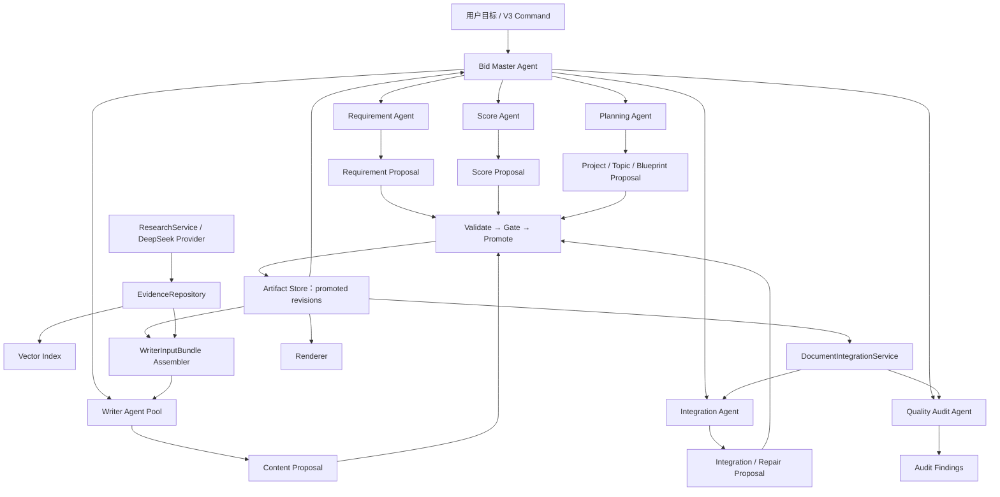
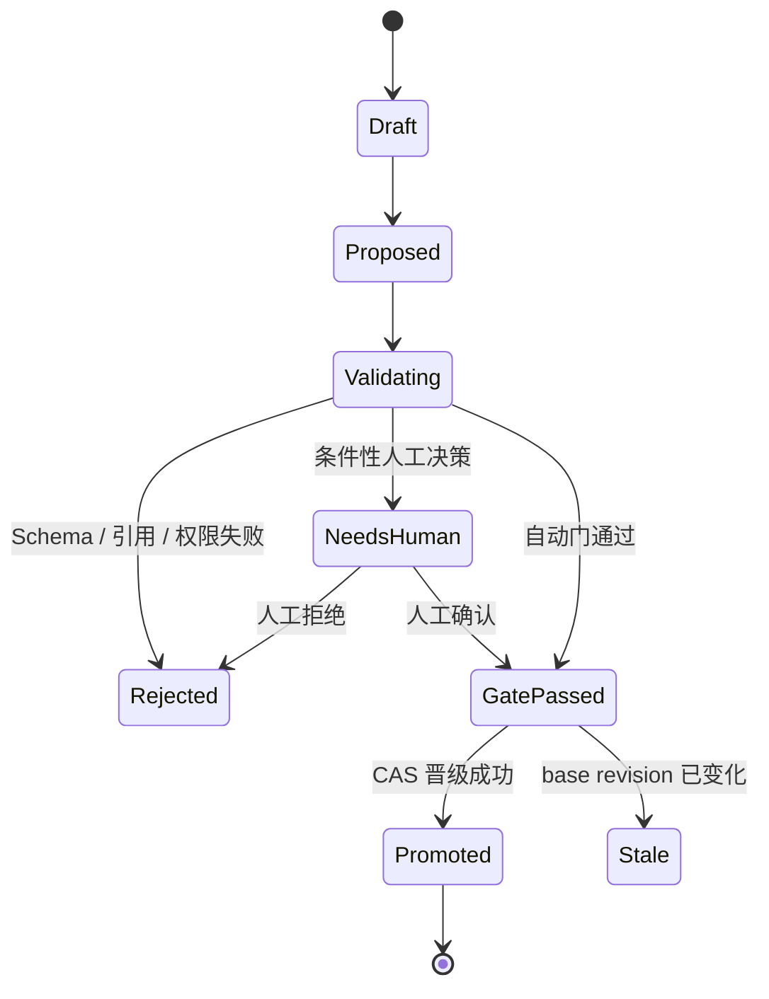

# V3 Bid Master Agent 与投标中间语言详细开发计划

> 状态：V3 主架构基线已冻结，待 PR-14
> 日期：2026-07-27
> 适用基线：V3 PR-13 收尾后的唯一执行链
> 上位方案：[v3_development_plan.md](./v3_development_plan.md)
> 当前逻辑：[current_logic_flow_v3.md](./current_logic_flow_v3.md)
> 实施记录：[v3_implementation_log.md](./v3_implementation_log.md)

## 1. 计划结论

V3 不再按“多个 Agent 依次读标书、各自理解、各自写作”的流水线设计，而按投标知识编译系统设计：

```text
招标文件
→ RequirementLedger
→ ScoreModel
→ ResponseTopicGraph / ResponseDuty
→ ChapterBlueprint
→ EvidenceSnapshot
→ WriterInputBundle
→ ContentBlock
→ IntegratedDocument
→ Word
```

这条链中的中间 Artifact 是系统事实和决策的唯一载体。Agent 只负责提出决策候选，Service 负责确定性执行，Gate 决定候选能否晋级为权威 Artifact。

必须落实以下架构结论：

1. `Bid Master Agent` 是唯一顶层编排者，但不建立第二套状态机；它复用现有 `CommandGateway`、`StageRunner`、`ControlStore`、Goal 和 Budget。
2. 专业 Agent 不直接互调、不直接写 `control.db`、不直接覆盖权威 Artifact，只读取冻结快照并输出 `Proposal`。
3. `FeatureModel` 不再作为中央语义模型。软件功能只是 `ResponseTopicGraph` 中 `topic_type=function` 的一种主题。
4. `ResponseDuty` 位于 Topic 与 Chapter 之间，用于表达同一主题在架构、安全、实施、验收等章节中的不同响应责任。
5. `ChapterBlueprint` 是 Writer 唯一的结构、章节目的和响应责任来源，但不是 Writer 唯一的物理数据。
6. Writer 的唯一调用参数是冻结且带哈希的 `WriterInputBundle`；Writer 不得重读整份标书、访问工作区、查询证据仓或自行联网。
7. `EvidenceRepository` 独立管理企业资质、案例、产品参数、官方标准、公开研究等证据及其用途权限；Vector Store 只是可重建索引，不是事实源。
8. 全文整合保留语义决策能力，但拆成两层：确定性 `DocumentIntegrationService` 负责机械装配，`Integration Agent` 只处理需要判断的跨章矛盾、重复和定向返工。
9. `Quality Audit Agent` 只读检查并输出 Finding，不直接修改正文。
10. Skill 不是核心能力载体。核心四阶段上线并通过真实样本验收后，才可增加一个仅调用 Bid Master 的可选 Skill。

V3 总原则：

> **任何新增 Agent 能力，都必须证明自己不能通过绕过 Artifact/Gate/Promotion 获得额外权限。**

该原则适用于行业分析、搜索、图表、格式及未来使用 GPT、Claude、DeepSeek 或本地模型实现的任何 Agent。模型只是可替换的受控推理模块，不能改变权威写入路径。证明必须落在能力权限、调用契约、架构测试和运行时审计上，不能只写在 Prompt 中。

产品建设优先级为：

```text
Phase 1：Requirement + Score + Topic + Blueprint
         回答“这份标书应该怎么写”

Phase 2：Evidence
         回答“凭什么这样写”

Phase 3：ContentBlock
         生成受控章节内容

Phase 4：Integration + Audit
         保证全文一致并完成发布门禁
```

不得先投入复杂 Writer、自由 Agent 编排或 Skill，再补中间语义层。

## 2. 目标与非目标

### 2.1 目标

完成后，系统必须能够：

1. 从活动招标文件、评分办法、技术要求、商务要求、补遗和模板中恢复可追溯结构。
2. 抽取强制、资格、废标、评分、功能、非功能、交付、验收、工期、合同和证明材料要求。
3. 独立形成 `RequirementLedger` 和引用 Requirement 的 `ScoreModel`，不让评分事实散落在 Prompt 或正文中。
4. 建立覆盖功能、架构、数据、安全、实施、服务、交付、验收、资格和商务的 `ResponseTopicGraph`。
5. 通过 `ResponseDuty` 描述每个 Topic 在不同响应上下文中的责任、深度、证据和评分关系。
6. 生成可审阅、可追溯、可映射严格模板的 `ChapterBlueprint`。
7. 在正文生成前，用一个规划确认页完成项目摘要、异常要求、Topic/Duty、章节树和主责映射的统一确认。
8. 将企业材料、官方标准和公开资料晋级为带权限的证据记录，并生成不可变 `EvidenceSnapshot`。
9. 为每个 ContentUnit 编译最小充分的 `WriterInputBundle`。
10. 让 Writer 仅在 Bundle 授权范围内生成结构化 `ContentProposal`。
11. 让 Integration 和 Audit 发现跨章术语、数字、工期、产品、成果、验收和承诺冲突。
12. 使每个关键 Claim 可回溯到 Requirement、Score、Topic、Duty、Chapter 和 Evidence。

### 2.2 非目标

本计划不负责：

- 让 Agent 直接读取或修改最终 Word；
- 为每个 Requirement、Topic、模板节点或章节创建一个持久 Agent；
- 新增 LangGraph 或与 `StageRunner` 并行的第二套工作流引擎；
- 让 DeepSeek 网页回答代替本地招标文件解析；
- 未经逐次授权把真实标书或企业材料上传到外部网页；
- 将历史优秀标书、外部网页或官方标准当作本企业资质和业绩证明；
- 在规划确认前生成正式正文；
- 在首版承诺完整 OCR；扫描件无法可靠解析时应明确阻断；
- 用通用目录或首尾章节回退掩盖语义规划失败；
- 在核心能力稳定前创建承担业务正确性的 Skill。

## 3. 架构不变量

以下规则属于 V3 架构不变量，任何实现 PR 都不得绕过：

1. **Agent = 决策者**：读取冻结快照，产生 Proposal、Finding 或 RepairRequest。
2. **Artifact = 事实载体**：下游只读取已晋级的特定 revision。
3. **Service = 执行者**：负责解析、校验、装配、索引、CAS 晋级、渲染和状态投影。
4. **Agent 无权直接晋级**：LLM 输出永远不是权威 Artifact。
5. **单一状态机**：Bid Master 通过现有 Command 和 Stage 推进，不复制 observe/plan/tool/budget 循环。
6. **单一规划确认门**：正文前只有一个新增的必经人工 Gate；其他问题采用自动门或条件性阻断。
7. **引用不等于事实复制**：ProjectModel、Blueprint 和 Bundle 使用稳定引用，不能各自复制一套可编辑 Requirement/Score 事实。
8. **Evidence 权限先于写作**：Evidence 必须先验证用途，再进入 Writer 的冻结快照。
9. **Blueprint 控制写作范围**：Writer 不得新增章节、Topic、主责关系或关键承诺。
10. **Audit 只读**：审核结果必须路由回对应 Agent 修复，审核器不能静默改终稿。
11. **Vector Store 非权威**：只保存 embedding 和 Artifact 引用，允许随时重建。
12. **最终 Word 是编译产物**：所有语义修改先形成 Artifact，再由 Renderer 输出。
13. **严格模板先冻结结构**：必须先编译只读 `TemplateStructureContract`，再做 Blueprint 映射。
14. **无票据不晋级**：任何 canonical Artifact 都必须有 Validation、Gate 和 Promotion Receipt。
15. **新增 Agent 权限不扩张**：任何新增 Agent 必须用代码和负向测试证明无法绕过 Artifact、Gate 和 Promotion。

## 4. 总体架构

### 4.1 Agent 与 Artifact 架构



### 4.2 角色边界

| 角色 | 只读输入 | 只允许输出 | 明确禁止 |
|---|---|---|---|
| Bid Master | WorkflowState、Artifact refs、Gate receipts、预算 | Command、任务分派、停止/重试/回退决定 | 写业务事实、改正文、直写数据库 |
| Requirement Agent | SourceSnapshot | ExtractionProposal、RequirementLedgerProposal、冲突和缺口 | 发布 Ledger、生成章节、搜索外网 |
| Score Agent | SourceSnapshot、已晋级 Requirement refs | ScoreModelProposal、评分冲突和证明需求 | 修改 Requirement、决定正文 |
| Planning Agent | RequirementLedger、ScoreModel、TemplateStructure、项目约束 | ProjectModelProposal、ResponseTopicGraphProposal、ChapterBlueprintProposal | 写正文、编造企业证据 |
| Writer Agent | 单个 WriterInputBundle | ContentProposal、EvidenceNeedProposal、PlanIssueProposal | 读取整标、改 Blueprint、自行联网 |
| Integration Agent | 已晋级 ContentBlocks、全局约束、IntegrationIssue | IntegrationProposal、受限 RepairRequest | 绕过 Writer 大段重写、改规划 |
| Quality Audit Agent | 冻结的 Blueprint、Evidence、IntegratedDocument | Finding、严重性、定位、回退目标 | 直接修改任何 Artifact |

这些是逻辑能力角色，不等于常驻进程数。Phase 1 只实现 Bid Master、Requirement、Score、Planning 及规划审计；Writer 在 Phase 3 接入，Integration 与最终 Audit 在 Phase 4 接入。

Writer 是同一无状态角色的短生命周期 Worker Pool，首版默认并发 3，压力测试后再决定是否提高；不得按 198 个模板节点创建 198 个 Agent。

### 4.3 Agent 与 Service 的拆分

以下能力属于 Service，不得伪装成 Agent：

- `SourceNormalizer`：恢复文档结构；
- `TemplateStructureCompiler`：冻结模板标题、级别、顺序、编号和 Slot；
- `ProposalValidator`：校验 Schema、引用、权限和依赖；
- `GateService`：执行确定性门禁和人工决策绑定；
- `ArtifactPromotionService`：CAS 原子晋级；
- `EvidenceRepositoryService`：证据版本、权限和快照；
- `VectorIndexService`：索引已晋级证据；
- `ResearchService`：执行授权后的公开研究或 DeepSeek 浏览器调用；
- `WriterInputBundleAssembler`：编译 Writer 唯一输入；
- `DocumentIntegrationService`：按合同顺序进行机械装配；
- `Renderer`：输出 Markdown/DOCX；
- `WorkspaceSnapshotProjector`：投影当前状态。

全文整合的职责拆分为：

```text
DocumentIntegrationService
  - 顺序装配
  - Slot 校验
  - 锁定块保护
  - 显式交叉引用解析
  - 完全相同内容哈希去重

Integration Agent
  - 判断跨章语义重复
  - 判断术语、数字、产品和承诺冲突
  - 设计局部移动、合并或定向返工方案
  - 只输出 Proposal / RepairRequest
```

“引用相同 Requirement”不能作为自动删除内容的依据。共享 Requirement 的两个块可能分别承担 primary 和 supporting 责任。

### 4.4 权威边界

- 招标、评分、补遗、澄清和模板是采购要求权威来源。
- 补遗按发布日期、适用范围和显式替代关系覆盖早期条款。
- 企业材料只能证明投标人自身事实。
- 产品资料只能证明对应产品参数和能力。
- 官方标准可以支持标准条文、方法和设计依据。
- 公开网页、DeepSeek 和历史标书默认只能作为背景、方法或写法参考。
- Agent 输出是候选，不是事实。
- `promoted Artifact + Receipt` 是唯一运行时事实。
- 下游 Snapshot 不得把 draft、rejected 或 needs_human Proposal 投影为当前状态。

## 5. 投标中间语言与领域契约

### 5.1 `SourceIndex` 与 `ExtractionProposal`

`SourceBlock` 至少包含：

```text
block_id
input_id
input_role
block_kind
ordinal
content
heading_path[]
page
paragraph_index
table_index
row_index
column_index
bbox
source_anchor
content_hash
```

要求：

- 标题路径、页码和表格坐标来自解析器，不由 Agent 生成；
- DOCX 段落和表格保持原始顺序；
- PDF 页码对应原文件；
- OCR 不可靠时产生结构缺口，不生成假文本；
- 所有活动 SourceBlock 必须有处理状态；
- 原始输入保持只读，Proposal 只能引用真实 anchor。

### 5.2 `RequirementLedger`

`RequirementItem` 至少包含：

```text
requirement_id
parent_requirement_id
requirement_type
obligation                 must | should | may | prohibited
subject
action
object
conditions[]
exceptions[]
metrics[]
response_expectation
source_anchors[]
related_requirement_ids[]
topic_ids[]
score_point_ids[]
confidence
review_status
```

`metrics` 保存数量、工期、频率、比例、金额、等级、SLA 和允许偏差。

复合条款拆分后仍保留父条款及子句关系，不能因语义去重删除法律原文。资格、合同、付款等要求保持本来类型，不强行伪装为软件功能。

### 5.3 `ScoreModel`

评分模型独立表达评审逻辑，但通过引用与 Requirement 保持一致：

```text
ScoreModel
  model_id
  source_input_ids[]
  total_points
  groups[]
  points[]
  source_hashes[]

ScorePoint
  score_point_id
  group_id
  title
  criterion
  max_points
  scoring_levels[]
  disqualifying
  response_expectation
  required_evidence_types[]
  linked_requirement_ids[]
  source_anchors[]
  confidence
  review_status
```

约束：

- 每个 ScorePoint 必须有评分来源锚点；
- 分值、档位和总分可确定性复核；
- 相同条款不得在 RequirementLedger 和 ScoreModel 中形成互相冲突的可编辑原文；
- ScoreModel 保存评分解释，RequirementLedger 保存采购义务，两者用 ID 关联。

### 5.4 `ProjectModel`

`ProjectModel` 保留为整标摘要和全局约束投影，不再成为与 Requirement、Score、Topic 并列的第二事实库。

它至少投影：

- 项目身份、背景、目标和范围；
- 明确边界和不在范围；
- 角色、对象、场景和业务流程摘要；
- 交付物、里程碑、验收、工期和关键指标；
- 统一术语、全局承诺、风险、冲突和未知项；
- Requirement、Score、Topic 和 EvidenceNeed 引用。

`goals`、`scope` 和 `work_packages` 不允许用同一列表复制后通过门禁。ProjectModel 的确认事实必须可回到上游 Artifact。

### 5.5 `ResponseTopicGraph` 与 `ResponseDuty`

`ResponseTopicGraph` 是整个投标系统的中央响应语义层：

```text
ResponseTopicGraph
  graph_id
  requirement_ledger_revision
  score_model_revision
  project_model_revision
  root_topic_ids[]
  topics[]
  duties[]
  edges[]
  review_status
  source_hashes[]

ResponseTopic
  topic_id
  parent_topic_id
  topic_type
  canonical_name
  intent
  summary
  aliases[]
  attributes
  source_anchors[]
  confidence
  review_status

ResponseDuty
  duty_id
  topic_id
  duty_type
  requirement_ids[]
  score_point_ids[]
  response_expectations[]
  evidence_need_ids[]
  priority
  confidence
  review_status

TopicEdge
  edge_id
  source_topic_id
  target_topic_id
  relation
  order
  requirement_ids[]
  rationale
  confidence
```

首版 `topic_type`：

```text
business_domain
business_flow
business_capability
function
architecture
data
integration
security
non_functional
implementation
project_management
service_operation
training
deliverable
acceptance
qualification
commercial
compliance
```

首版 `duty_type`：

```text
summarize
explain
design
implement
operate
verify
accept
commit
cross_reference
```

首版 `relation`：

```text
parent_of
depends_on
realizes
constrained_by
step_of
produces
consumes
interfaces_with
verified_by
supports_score
```

同一 Topic 可以存在多个 Duty。例如“统一身份认证”可以同时拥有：

- 总体架构中的 `summarize` Duty；
- 安全设计中的 `design` Duty；
- 实施方案中的 `implement` Duty；
- 验收章节中的 `verify` Duty。

章节映射 Duty，而不是把 Topic 简单复制到多个章节。每个 Duty 恰好一个 primary chapter，其他位置只能是 supporting、mention 或 cross_reference。

`FeatureModel` 如因前端功能树展示需要保留，只能作为 `topic_type=function` 子图的派生 View，不能独立保存主责、评分和章节映射。

### 5.6 `ChapterBlueprint`

```text
ChapterBlueprint
  blueprint_id
  mode
  topic_graph_revision
  template_structure_revision
  nodes[]
  assignments[]
  coverage_summary
  review_status
  source_hashes[]

BlueprintNode
  chapter_id
  parent_chapter_id
  order
  title
  purpose
  writing_objectives[]
  forbidden_topic_ids[]
  required_mentions[]
  cross_references[]
  planned_tables[]
  planned_figures[]
  target_size
  template_target

TopicChapterAssignment
  assignment_id
  duty_id
  chapter_id
  role                       primary | supporting | mention | cross_reference
  response_scope
  rationale
  confidence
  needs_human
```

约束：

- 每个 blocking Requirement、ScorePoint 和核心 Duty 必须能反向追到一个 primary assignment；
- 每个 Duty 恰好一个 primary assignment；
- supporting/mention 不计为重复主责；
- Blueprint 中用于 UI 展示的 Requirement/Score 列表必须从 Duty 投影，不能独立编辑；
- 自动标题必须有 Topic、Duty、评分或招标固定结构依据；
- 严格模板模式下，标题、级别、顺序、编号和 Slot 与 `TemplateStructureContract` 完全一致；
- 无承载位置时形成 `TEMPLATE_MAPPING_GAP`，不得自动追加章节。

### 5.7 `EvidenceRepository`

证据层由四类对象组成：

```text
EvidenceNeed
  evidence_need_id
  duty_id
  score_point_ids[]
  claim_scope
  evidence_kind
  allowed_authority_classes[]
  min_count
  blocking
  fallback_policy

EvidenceRecord
  evidence_id
  version
  source_type
  source_input_id
  source_url
  source_anchor
  content_hash
  excerpt
  publisher
  authority_class
  allowed_claim_scopes[]
  prohibited_claim_scopes[]
  valid_from
  valid_until
  verification_status
  access_policy

EvidenceBinding
  binding_id
  evidence_id
  duty_id
  score_point_ids[]
  relation                  proves | supports | constrains | illustrates | reference_only
  claim_scope
  confidence
  verification_status

EvidenceSnapshot
  snapshot_id
  unit_id
  blueprint_revision
  topic_graph_revision
  binding_ids[]
  record_versions[]
  repository_revision
  dependency_fingerprint
```

证据权限矩阵：

| authority_class | 可支持 | 禁止支持 |
|---|---|---|
| `tender_source` | 采购要求、评分依据、交付和验收口径 | 企业既有能力 |
| `company_qualification` | 企业资质、人员证书、认证 | 通用技术标准 |
| `company_case` | 本企业案例、合同、规模、时间 | 未经证明的产品参数 |
| `product_document` | 对应产品参数和能力 | 企业历史业绩 |
| `official_standard` | 标准条文、技术和管理依据 | 企业资质、案例 |
| `web_research` | 背景、公开方法、趋势 | 企业能力和关键承诺 |
| `historical_bid` | 结构、表达和方法参考 | 当前项目事实、企业证明 |

Evidence 变化只使受影响的 Snapshot、Bundle 和 ContentUnit stale。除非 EvidenceNeed 或章节责任发生变化，不应迫使用户重新确认 Blueprint。

### 5.8 `WriterInputBundle`

“ChapterBlueprint 是 Writer 唯一输入”应落实为两个不同层面的硬规则：

1. ChapterBlueprint 是 Writer 唯一的结构和响应责任来源。
2. Writer 的唯一调用参数是由 Service 编译的冻结 `WriterInputBundle`。

```text
WriterInputBundle
  bundle_id
  unit_id
  dependency_refs
  dependency_fingerprint
  blueprint_slice
  topic_and_duty_slice
  requirement_excerpts[]
  score_obligations[]
  evidence_snapshot
  allowed_facts[]
  project_constraints
  terminology
  commitments
  document_target_constraints
  upstream_summaries[]
  cross_reference_targets[]
  allowed_placeholders[]
  output_contract
  prompt_version
  model_config_hash
  bundle_hash
```

Writer 硬边界：

- 不能读取 SourceIndex、整个 ProjectModel、整个 EvidenceRepository 或任意工作区文件；
- 不能调用 DeepSeek、浏览器、搜索或上传工具；
- 只能使用 Bundle 中存在的 Topic、Duty、Requirement、Score、Fact、Evidence 和 target ID；
- 不能新增标题或移动主责；
- 缺少证据时只能返回 `EvidenceNeedProposal`；
- 发现规划问题时只能返回 `PlanIssueProposal`；
- 只输出 `ContentProposal`，通过内容门后才晋级为 `ContentBlock`；
- 任一上游 revision、Prompt 或模型配置变化后 Bundle 立即 stale。

### 5.9 内容、整合与审核契约

```text
ContentProposal
  proposal_id
  bundle_id
  blocks[]
  claims[]
  evidence_need_proposals[]
  plan_issue_proposals[]

ContentBlock
  block_id
  target_chapter_id
  duty_ids[]
  topic_ids[]
  requirement_ids[]
  score_point_ids[]
  evidence_binding_ids[]
  fact_ids[]
  claim_ids[]
  content
  lock_state
  source_bundle_hash

IntegrationIssue
  issue_id
  issue_type
  affected_block_ids[]
  affected_chapter_ids[]
  severity
  rationale
  recommended_route

AuditFinding
  finding_id
  rule_id
  severity
  location
  affected_ids[]
  evidence
  route_to
  status
```

Audit Finding 的修复路由必须确定：

| Finding 类型 | 回退目标 |
|---|---|
| Requirement 漏项、原文解释错误 | Requirement Agent |
| Score 分值、档位或证明要求错误 | Score Agent |
| Topic/Duty、主责或目录错误 | Planning Agent |
| 缺企业材料或证据用途不符 | Evidence 流程 / 用户材料补充 |
| 单章内容缺失或越权 | Writer Agent |
| 跨章冲突、重复、术语漂移 | Integration Agent，必要时定向 Writer 返工 |
| 模板结构或 Slot 问题 | Template/Planning Service |

## 6. Proposal、Gate 与 Artifact 晋级

### 6.1 统一 Proposal 契约

```text
ProposalEnvelope
  proposal_id
  artifact_kind
  producer_role
  operation_id
  base_revision
  dependency_fingerprint
  payload
  cited_source_ids[]
  prompt_version
  model_fingerprint
  created_at

ValidationReport
  proposal_id
  schema_valid
  references_valid
  authority_policy_valid
  dependency_current
  findings[]

GateReceipt
  proposal_id
  gate_id
  verdict                    pass | warn | block | needs_human
  findings[]
  reviewer
  reviewed_revision

PromotionReceipt
  proposal_id
  artifact_id
  promoted_revision
  artifact_hash
  dependency_fingerprint
  gate_receipt_ids[]
```

### 6.2 生命周期



### 6.3 晋级硬约束

- Agent、LLM 和普通 Service 不得直接写 canonical Artifact 路径；
- Validator 检查 Schema、引用、来源权威、访问权限和依赖版本；
- LLM Reviewer 只能输出 Finding，不能签发最终 Gate；
- Promotion 使用 `base_revision` 做 CAS，陈旧 Proposal 必须拒绝；
- 人工确认绑定 proposal hash、依赖 revision 和决策人；
- 同一 `operation_id` 幂等重试不能重复晋级；
- 晋级、active revision 更新和 Receipt 写入必须原子化；
- 进程中断不能留下半有效 revision；
- canonical Artifact 的确定性 Service 输出也必须经过同一晋级通道。

## 7. 阶段 DAG 与唯一执行链

### 7.1 正常阶段

| 顺序 | Stage | 决策角色 / Service | 主要 promoted 输出 |
|---:|---|---|---|
| 1 | `ingest_inputs` | Service | `InputManifest` |
| 2 | `normalize_sources` | Service | `SourceIndex` |
| 3 | `compile_template_structure` | Service | 可选 `TemplateStructureContract` |
| 4 | `analyze_requirements` | Requirement Agent | `RequirementLedger` |
| 5 | `analyze_scores` | Score Agent | `ScoreModel` |
| 6 | `plan_response` | Planning Agent | `ProjectModel`、`ResponseTopicGraph`、`ChapterBlueprint` |
| 7 | `confirm_planning` | Gate Service / 用户 | `PlanningGateReceipt` |
| 8 | `resolve_evidence` | Evidence Service / ResearchService | `EvidenceRepository revision`、`EvidenceSnapshot` |
| 9 | `compile_writing_packets` | Service | `WriterInputBundle` |
| 10 | `write_content` | Writer Pool | `ContentBlock` |
| 11 | `integrate_document` | Integration Service + Agent | `IntegratedDocument` |
| 12 | `audit_document` | Quality Audit Agent + Gate | `AuditReport`、`FinalGateReceipt` |
| 13 | `render_document` | Renderer | Markdown/DOCX |
| 14 | `verify_delivery` | 既有交付门 | 交付结果 |

Requirement 与 Score 在 SourceIndex 晋级后可分批并行，但 Planning 必须读取两者已经晋级且 fingerprint 相容的 revision。

### 7.2 模板模式顺序

模板模式必须使用：

```text
InputManifest
→ TemplateStructureContract（只读结构）
→ Requirement / Score
→ ResponseTopicGraph / ResponseDuty
→ ChapterBlueprint 映射
→ PlanningConfirm
→ 语义完备 DocumentContract
```

不能先生成需要 template target 的 Blueprint，再在其后首次编译模板结构。

### 7.3 与现有 V3 兼容

- 保留 `CommandGateway`、`StageRunner`、`ControlStore` 和现有公开命令入口；
- 新 Stage 可先作为现有阶段内部子步骤接入，再在前端状态投影准备好后公开；
- `Bid Master` 是现有 Supervisor/执行控制器的角色化薄层，不实现第二套循环；
- `DocumentContract` 和 `DocumentPlan` 是已确认 Blueprint 的确定性派生物；
- 未取得 `PlanningGateReceipt` 时，Pipeline 返回可恢复的 `blocked_human`；
- 研究和材料补充按显式 EvidenceNeed 触发，不作为无条件线性 Stage；
- 正式切换后不允许回退旧的 kind 分组目录或首节点匹配逻辑。

## 8. Agent 任务契约与 Prompt

### 8.1 Agent 调用规则

- 每个调用只接收显式 Snapshot refs 和 TaskContract；
- 每个角色无会话内隐式长期记忆；
- 所有必要状态写入 Proposal 或 promoted Artifact；
- Agent 不从其他 Agent 获取“口头总结”；
- Agent 之间的协作只通过 Bid Master 和 Artifact；
- 重试必须引用相同 operation 或新 revision，不能覆盖旧 Proposal；
- 模型、Prompt、温度和输出 Schema 进入 fingerprint；
- 角色超出权限时立即失败，不自动扩大工具范围。

### 8.2 Prompt 划分

```text
prompts/v3_requirement_agent_extract.md
prompts/v3_requirement_agent_reconcile.md
prompts/v3_score_agent_parse.md
prompts/v3_score_agent_reconcile.md
prompts/v3_planning_agent_project.md
prompts/v3_planning_agent_topics.md
prompts/v3_planning_agent_blueprint.md
prompts/v3_writer_agent.md
prompts/v3_integration_agent.md
prompts/v3_quality_audit_agent.md
```

共同约束：

- 只输出符合 Schema 的 Proposal 或 Finding；
- 不允许创建输入快照中不存在的 anchor 和 ID；
- 区分 confirmed、inferred、ambiguous、conflicted 和 unknown；
- 不允许把外部资料写成企业能力；
- 不允许用兜底章节掩盖映射缺口；
- 不允许直接给出“已发布”或“门禁通过”结论；
- 不允许输出或保存 Cookie、密码、Token 和浏览器配置路径。

## 9. Gate 设计

### 9.1 `G0 ProposalValidationGate`

检查：

- JSON/Pydantic Schema；
- ID、Anchor 和 revision 引用；
- Agent 角色权限；
- Evidence authority policy；
- base revision 与 dependency fingerprint；
- Prompt 和模型版本；
- Proposal 大小和敏感字段。

### 9.2 `G1 RequirementScoreIntegrityGate`

阻断：

- 活动招标或评分 SourceBlock 未处理；
- 强制、资格、废标、评分、交付或验收项无来源；
- 评分行、档位、分值或总分不一致；
- 指标值不能回到原文；
- 补遗优先级未处理；
- critical/score 低置信度结果被静默接受。

### 9.3 `G2 TopicBlueprintGate`

阻断：

- blocking Requirement 或 ScorePoint 没有对应 Duty；
- 核心 Duty 没有唯一 primary chapter；
- supporting/mention 被当作主责；
- Topic/Duty 存在悬空引用或执行依赖环；
- 标题与绑定 Duty 明显不一致；
- 无依据通用章节或首尾章节回退；
- 模板标题、级别、顺序、编号或 Slot 发生未授权变化；
- 无来源确认事实进入 ProjectModel；
- 关键冲突未处理。

### 9.4 `H1 PlanningConfirm`

这是本计划新增的唯一必经人工 Gate，一次展示并确认：

- 项目摘要、范围、边界、交付和验收；
- critical/low-confidence Requirement 与 Score；
- ResponseTopicGraph 和 ResponseDuty；
- ChapterBlueprint；
- primary/supporting/mention 覆盖矩阵；
- 模板映射缺口和规划风险。

只有以下变化使 H1 失效：

- blocking Requirement 或 Score 变化；
- 核心 Topic/Duty 变化；
- 标题、层级、primary owner 或模板目标变化；
- 项目范围、工期、交付、验收等全局约束变化。

新增普通 Evidence、正文重写、格式调整和非关键 supporting mention 变化不应要求重审规划。

### 9.5 `G3 EvidenceGate`

阻断：

- blocking Claim 缺少允许 authority class 的 Evidence；
- 外部网页、历史标书或官方标准被用于证明企业能力；
- Evidence 版本过期或来源不可回溯；
- 两份企业证据冲突且未处理；
- 未经授权向 DeepSeek 上传附件；
- 查询预算耗尽后仍伪造“已找到证据”。

缺少必须由用户提供的企业材料、需要外发敏感附件或企业证据冲突时进入条件性阻断，不新增固定人工质量 Gate。

### 9.6 `G4 WriterBundleContentGate`

检查：

- Bundle 依赖仍是 active revision；
- Bundle 引用最小、完整且未越权；
- Writer 输出没有 Bundle 外 ID；
- writing objectives 覆盖；
- forbidden Topic 未被完整展开；
- 关键 Claim 有允许的 Fact/Evidence；
- 数字、工期、人员、业绩和承诺有来源；
- target chapter、Duty 和 primary owner 合法；
- ContentBlock 保留完整追溯引用。

### 9.7 `G5 IntegrationGate`

检查：

- 所有 ContentBlock 均已晋级；
- 装配顺序和 Slot 正确；
- human lock 未被修改；
- supporting 内容没有因共享 Requirement ID 被删除；
- 完全重复的自动处理有确定性 trace；
- 语义移动、合并和重写有 IntegrationProposal；
- 同一输入重复整合得到相同 hash。

### 9.8 `G6 FinalSemanticGate`

阻断：

- critical Requirement/Score 最终覆盖不足 100%；
- 存在无来源关键 Claim；
- 数字、工期、产品、成果、验收或承诺冲突未解决；
- 存在非授权完整重复；
- 术语表和关键实体不一致；
- locked block 被未授权修改；
- critical Finding 未关闭；
- Audit 修复超过最大轮次或 no-progress 熔断。

Quality Audit Agent 只提出 Finding；Gate Service 根据确定性规则和 Finding 状态签发最终 Receipt。

## 10. 前端与人工协作

### 10.1 规划确认中心

前端优先建设一个页面，而不是 Requirement、ProjectModel、Topic 和 Blueprint 四个分散确认页：

- 左侧：输入、Source、Requirement 和 Score 异常；
- 中间：Topic/Duty 图与章节树；
- 右侧：来源、映射理由、置信度、评分和模板 Slot；
- 下方：Requirement/Score/Duty → Chapter 覆盖矩阵；
- 操作：调整 Topic/Duty、移动 primary、处理冲突、重新规划、确认；
- 严格模板模式禁用标题新增、删除、重命名和重排。

### 10.2 后续状态区

- EvidenceNeed 和材料缺口；
- 外部上传授权；
- EvidenceRecord、Binding 和有效期；
- WriterInputBundle fingerprint 和 stale 状态；
- ContentUnit 进度和定向重试；
- IntegrationIssue 和 RepairRequest；
- AuditFinding、路由目标和关闭状态；
- FinalGateReceipt 与交付状态。

前端只能发送 Command，不能直接编辑 JSON、Artifact 或 `control.db`。

## 11. 分阶段 PR 实施计划

### Phase 0：语义与权限内核

#### PR-14：冻结中间语言、架构约束与 Golden Set

工作：

1. 冻结 Requirement、Score、Topic、Duty、Blueprint、Evidence、Bundle、Content 和 Finding 最小 Schema。
2. 冻结 Agent/Service/Artifact/Gate 权限边界和中间语言依赖方向。
3. 为“新增 Agent 不能绕过 Artifact/Gate/Promotion”建立仓库级架构测试要求。
4. 选取至少 8 份匿名真实标书，包含当前 92 个评分点、198 个模板节点样本。
5. 建立 Requirement/Score、Topic/Blueprint、Evidence、Content、Integration/Audit 四组 Golden。
6. 为每个样本记录输入 hash、标注人、复核人、裁决人和版本。
7. 记录当前规则实现的真实基线，不以“字段非空”作为成功。

验收：

- Golden 标注可重复加载；
- 中间语言、角色权限和晋级链形成 ADR 并纳入代码审查模板；
- 新增 Agent 的权限证明成为强制合并项；
- 指标按阶段输出，不能用总平均分掩盖 Requirement 漏项；
- 敏感原件不进入 Git；
- 后续语义 PR 必须引用已冻结的评测版本。

工作量：4—7 人日，不含业务专家标注。

#### PR-15：Proposal / Validate / Gate / Promotion 可信运行内核

工作：

1. 新增 ProposalEnvelope、ValidationReport、GateReceipt 和 PromotionReceipt。
2. 实现角色能力注册表和权限策略。
3. 实现 dependency fingerprint、CAS 晋级和幂等 operation。
4. Proposal 使用追加式存储，canonical Artifact 使用 active revision 指针。
5. 让 WorkspaceSnapshot 只投影 promoted Artifact。
6. 将 Bid Master 接入现有 CommandGateway/StageRunner，不新增第二状态机。
7. 建立 Agent capability sandbox、越权审计和统一拒绝策略。

验收：

- Agent 直接写 canonical 路径的测试全部失败；
- 无 GateReceipt 无法晋级；
- 陈旧 base revision 无法晋级；
- 中途崩溃不产生半有效 revision；
- 相同 operation 重试不会重复发布。
- 更换 GPT、Claude、DeepSeek 或本地模型不会改变权限和晋级路径。

工作量：5—8 人日。

#### PR-16：结构化 SourceIndex 与 TemplateStructureContract

工作：

1. 恢复 DOCX 标题、列表、段落和表格原始顺序。
2. PDF 保留页码、文本块和表格位置。
3. 增加扫描件检测；首版无法可靠 OCR 时明确阻断。
4. 增加 amendment 输入角色、发布日期和替代关系。
5. 在语义规划前编译只读 TemplateStructureContract。
6. 生成全量 SourceBlock 处理覆盖表。

验收：

- 标题路径、页码和表格单元格可回跳；
- 同一文件重复处理得到稳定 block_id；
- 模板标题、级别、顺序、编号和 Slot 指纹稳定；
- 不支持或不可解析输入在 Agent 调用前被阻断。

工作量：5—8 人日。

### Phase 1：回答“这份标书应该怎么写”

#### PR-17：Requirement Agent 与 RequirementLedger

工作：

1. 实现分批 ExtractionProposal。
2. 提取主体、动作、对象、条件、例外和量化指标。
3. 保留父条款和原子子句关系。
4. 实现补遗覆盖、重复消解和冲突检测。
5. 进行 SourceIndex 反向遗漏审计。
6. 通过 G0/G1 后晋级 RequirementLedger。

验收：

- critical Requirement 来源锚点覆盖 100%；
- 关键词未命中的语义要求可以抽取；
- 跨页、列表和表格义务不因格式丢失；
- 无效 JSON、虚构 anchor 和越权输出不能晋级。

工作量：6—9 人日。

#### PR-18：Score Agent 与 ScoreModel

工作：

1. 解析评分组、评分点、档位、分值和证明要求。
2. 建立 ScorePoint 与 Requirement 的引用。
3. 校验分组小计和总分。
4. 识别废标/资格与评分条件的交叉关系。
5. 输出评分响应深度和 EvidenceNeed 候选。
6. 通过 G0/G1 后晋级 ScoreModel。

验收：

- Golden 样本评分行、档位和总分正确率 100%；
- 每个评分点有来源；
- Requirement 与 Score 不复制冲突事实；
- 92 个评分点样本不存在异常批量绑定。

工作量：4—7 人日。

#### PR-19：Planning Agent、ProjectModel 与 ResponseTopicGraph

工作：

1. 将 ProjectModel 改为上游 Artifact 的受控投影。
2. 新增 ResponseTopicGraph、ResponseTopic、ResponseDuty 和 TopicEdge。
3. 建立功能、架构、安全、数据、实施、运维、资格、商务、交付和验收主题。
4. 形成 Topic 层级、业务流程和依赖边。
5. 将 Requirement/Score 映射到 Duty，而不是直接映射章节。
6. 输出冲突、未知、低置信度和 EvidenceNeed。

验收：

- Feature 不再是中央权威模型；
- 每个 confirmed Topic 有来源或上游引用；
- blocking Requirement/Score 均有响应 Duty；
- BusinessFlow 不再维护第二套同权威图；
- 执行依赖无环，悬空引用为 0。

工作量：7—11 人日。

#### PR-20：ChapterBlueprint、规划门与统一确认页

工作：

1. Planning Agent 生成 BlueprintProposal。
2. 无模板模式生成项目专用多层章节树。
3. 严格模板模式只映射冻结节点和 Slot。
4. 用 TopicChapterAssignment 表达 primary/supporting/mention/cross-reference。
5. 实现 G2 与 H1 PlanningConfirm。
6. 编译 DocumentContract 和 DocumentPlan。
7. 删除按 RequirementKind 生成目录及首节点回退。

验收：

- 每个核心 Duty 恰好一个 primary chapter；
- 每个 blocking Requirement/Score 可反向追到 primary；
- 模板结构变化为 0；
- 用户可一次审阅项目摘要、Topic/Duty、目录和覆盖；
- 未确认规划不能进入 Evidence/Writer 阶段。

工作量：8—12 人日。

### Phase 2：回答“凭什么这样写”

#### PR-21：EvidenceRepository 与权限策略

工作：

1. 新增 EvidenceNeed、Record、Binding 和 Snapshot。
2. 将 company、product、official、web 和 historical_bid 分级。
3. 实现 allowed/prohibited claim scope。
4. 增加有效期、版本、来源、访问策略和冲突状态。
5. Vector Store 只索引 promoted EvidenceRecord。
6. 实现 Evidence 变化的精准 stale 传播。

验收：

- 外部资料证明企业能力为 0；
- Evidence 到来源和 Claim 的回溯率 100%；
- 过期、冲突或未验证 Evidence 不能进入 Snapshot；
- 新增 Evidence 不无条件使 Blueprint 失效。

工作量：5—8 人日。

#### PR-22：Evidence 匹配、ResearchService 与材料缺口

工作：

1. 从 Duty、Score 和 Claim scope 生成 EvidenceNeed。
2. 先匹配本地企业/产品材料，再按需执行公开研究。
3. DeepSeek 作为 Research Provider 接入，不产生 Agent 状态。
4. 保持逐次附件选择、哈希校验和显式授权。
5. 查询预算、超时和 Provider 失败形成明确 gap。
6. 为 ContentUnit 冻结 EvidenceSnapshot。

验收：

- 未授权附件上传为 0；
- blocking Evidence 缺失时只阻断依赖单元；
- DeepSeek 不可用不会伪造证据；
- 公开研究不能改写采购范围和企业事实；
- 相同依赖生成稳定 Snapshot fingerprint。

工作量：5—8 人日。

### Phase 3：受控生成 ContentBlock

#### PR-23：DocumentPlan 与 WriterInputBundleAssembler

工作：

1. Planner 直接消费已确认 Blueprint。
2. ContentUnit 按语义工作包生成，不按叶子标题数量生成。
3. 编译 Blueprint slice、Duty、Requirement、Score、Evidence、术语和全局约束。
4. 实现 Bundle 大小预算和最小权限切片。
5. 实现 bundle hash、stale 和 target 校验。
6. 在 API/前端展示 Bundle 状态而非完整敏感内容。

验收：

- Writer 的公开入口只接受 Bundle ID；
- Bundle 外工作区访问被拒绝；
- 198 模板节点不会产生 198 个 Writer；
- 上游变化只使依赖单元 stale；
- Bundle 可确定性重建并验证 hash。

工作量：5—8 人日。

#### PR-24：Writer Agent、ContentProposal 与内容门

工作：

1. 用受控 Writer 替换固定占位句实现。
2. 输出结构化 ContentProposal 和 Claim。
3. 强制 primary/supporting/forbidden 边界。
4. 缺证据返回 EvidenceNeedProposal，规划错误返回 PlanIssueProposal。
5. 实现 G4 和单 ContentUnit 重试。
6. ContentBlock 保留 Requirement/Score/Topic/Duty/Evidence/Fact 引用。

验收：

- Writer 引用 Bundle 外 ID 为 0；
- 关键 Claim 无来源为 0；
- Writer 新增标题或主责为 0；
- 单元失败不使无关单元 stale；
- 专家对 ContentBlock 可用性评分达到阈值。

工作量：6—9 人日。

### Phase 4：全文一致性与独立审核

#### PR-25：DocumentIntegrationService 与 Integration Agent

工作：

1. Service 按 DocumentContract 和 Slot 装配 promoted ContentBlock。
2. 删除“共享 Requirement ID 即重复”的误删策略。
3. 建立 Terminology、Fact、Commitment 和 CrossReference Ledger。
4. 生成 IntegrationIssue。
5. Integration Agent 输出移动、合并或 RepairRequest Proposal。
6. 每项保留、删除、移动、合并和重写都记录 trace。
7. 实现最大返工轮次和 no-progress 熔断。

验收：

- supporting 内容因共享 Requirement 被误删为 0；
- 相同输入重复整合 hash 一致率 100%；
- locked block 未授权修改为 0；
- 语义改写都能追到 Proposal 和 Bundle；
- 整合失败不发布 IntegratedDocument。

工作量：7—11 人日。

#### PR-26：Quality Audit Agent 与 FinalSemanticGate

工作：

1. Audit 使用独立、只读、冻结上下文。
2. 检查 Requirement/Score 覆盖、关键 Claim、跨章一致性、重复和模板约束。
3. Finding 明确定位、证据、严重性和回退角色。
4. Bid Master 按路由表派发定向返工。
5. 实现 G6 和最终 GateReceipt。
6. 审核失败不得渲染正式交付件。

验收：

- 注入的 critical 问题检出率 100%；
- critical Finding 未关闭时发布为 0；
- Audit Agent 直接修改正文为 0；
- 修复循环可收敛或明确熔断；
- 最终 critical Requirement/Score 覆盖 100%。

工作量：6—9 人日。

### Phase 5：生产切换与可选协作入口

#### PR-27：Bid Master 端到端编排、灰度和旧逻辑清理

工作：

1. 打通四阶段状态、预算、重试、停止和恢复。
2. 在只读工作空间克隆上执行 shadow compare。
3. 完成统一规划页、Evidence gap、Content、Integration 和 Audit 状态投影。
4. 达标后切换 V3 唯一写路径。
5. 删除旧 Feature 中央模型、kind 分组目录、首节点回退和错误去重。
6. 更新逻辑文档、实施记录、操作文档和恢复演练。

验收：

- Web、CLI 和 Bid Master 读取同一 promoted revision；
- 无第二状态机和隐藏 fallback；
- 全量后端测试、前端测试和生产构建通过；
- 旧工作空间有明确重建提示；
- Golden、灰度和恢复演练全部通过。

工作量：6—10 人日。

#### PR-28：可选 `bid-master` Skill

Skill 只负责：

- 接收 `/bid analyze`、`/bid plan`、`/bid continue` 等用户意图；
- 调用 Bid Master 公开 Command；
- 展示 PlanningConfirm、Evidence gap 和 Audit Finding；
- 在用户确认后继续现有工作流。

Skill 禁止：

- 重新解析标书；
- 内置另一套 Requirement/Topic/Blueprint Prompt；
- 直接读写 Artifact 或 `control.db`；
- 绕过 Gate；
- 自动上传真实文件；
- 保存账号、Cookie 或真实标书。

该 PR 不在核心生产切换关键路径上；不创建 Skill，Web/API 产品也必须完整可用。

工作量：2—4 人日。

## 12. 测试与评测

### 12.1 测试分层

| 层级 | 重点 | 通过标准 | 频率 |
|---|---|---|---|
| 契约测试 | Proposal、Topic/Duty、Blueprint、Evidence、Bundle、Finding | 非法引用和越权对象无法晋级 | 每次提交 |
| 权限测试 | Agent 读写范围、外部工具、Artifact promotion | 角色越权全部失败 | 每次提交 |
| 单元测试 | 原子要求、评分、Topic、Duty、映射、证据权限 | 固定夹具符合预期 | 每次提交 |
| Golden Set | 四阶段语义质量 | 达到发布阈值 | Prompt、模型或代码变化 |
| 变形测试 | 空白、换行、文件顺序、重复条款 | 非语义变化不改变硬门结果 | 每次提交 |
| 对抗测试 | Prompt 注入、证据污染、冲突补遗 | 不越权、不污染、不绕门 | 每次提交 |
| 故障注入 | 超时、非法 JSON、崩溃、陈旧 revision | 无半成品，可恢复 | 每次提交 |
| 端到端 | 规划确认到交付 | revision、Receipt 和页面状态一致 | 发布前 |
| 性能测试 | 200/500 页、多附件、198 节点 | 满足批准预算 | 夜间及发布前 |
| 人工验收 | 专业完整性、可写性、可用性 | 双人评审达阈值 | 每个灰度阶段 |

### 12.2 Golden-A：Requirement / Score / Topic / Blueprint

至少包括：

- 无模板软件项目；
- 运维/服务采购；
- 系统集成；
- 独立复杂评分文件；
- 补遗冲突；
- 表格密集项目；
- 严格 Word 模板；
- 当前 92 Score / 198 节点样本。

发布指标：

| 指标 | 阈值 |
|---|---:|
| 强制、资格、废标、评分、交付、验收 Requirement 召回率 | 100% |
| 全部 Requirement 召回率 / 精确率 | ≥95% / ≥92% |
| Requirement 来源锚点可回跳率 | 100% |
| Score 行、档位和总分正确率 | 100% |
| Topic 召回率 / 精确率 | ≥95% / ≥90% |
| blocking Requirement/Score → Duty 覆盖 | 100% |
| Duty 唯一 primary chapter 覆盖 | 100% |
| 主责章节语义正确率 | ≥95% |
| 重复 primary、孤儿 critical Duty、首尾章回退 | 0 |
| 模板未授权结构变化 | 0 |
| 人工一次接受主责映射 | ≥90% |
| 专家理解与目录评分 | 平均 ≥4.2/5，单维度 ≥4.0 |

### 12.3 Golden-B：Evidence

使用冻结 Provider 响应和本地附件快照，CI 不依赖实时网页。

至少覆盖：

- 招标原文直接证明；
- 企业资质、案例和产品附件；
- 官方标准；
- 外部网页试图证明企业能力；
- 历史标书错误复用；
- 来源冲突；
- 查询预算耗尽；
- 敏感附件未授权。

发布指标：

- blocking Claim 证据策略准确率 100%；
- 外部资料错误证明企业能力 0；
- 未授权外发附件 0；
- Evidence → Claim → Source 回溯率 100%；
- 缺 blocking Evidence 时正确阻断率 100%。

### 12.4 Golden-C：ContentBlock

不以逐字相同的优秀正文为 Golden，重点评估结构和语义不变量：

- writing objectives 覆盖率 ≥95%；
- critical Requirement/Score 引用覆盖 100%；
- 无来源数字、业绩和企业能力 Claim 为 0；
- forbidden Topic 越权完整展开为 0；
- Bundle 外引用为 0；
- target、Duty 和 ownership 合法率 100%；
- 专家可用性评分平均 ≥4.0/5。

### 12.5 Golden-D：Integration / Audit

至少包含 20 组故意注入问题和 2 份完整长文：

- 重复展开；
- primary/supporting 混淆；
- 术语漂移；
- 数据库、产品和架构冲突；
- 数字、工期、成果和验收冲突；
- 无来源 Claim；
- locked block；
- 交叉引用和相邻章节承接问题。

发布指标：

- 注入 critical 问题检出率 100%；
- 全部注入问题检出率 ≥95%；
- 严重误报率 ≤5%；
- 修复后未解决 critical Finding 为 0；
- locked block 未授权修改为 0；
- supporting 误删为 0；
- 每项语义改动有 trace 率 100%。

### 12.6 Proposal 与运行时指标

- 无 GateReceipt 的 promoted Artifact：0；
- Agent 直接写 canonical Artifact：0；
- 陈旧 Proposal 晋级成功：0；
- 相同 operation 重复晋级：0；
- Writer 引用 Bundle 外对象：0；
- 未通过内容门的 ContentProposal 进入整合：0；
- 任一阶段进程终止产生半有效 revision：0；
- 相同冻结输入的硬门结果一致率：100%；
- 缓存复用必须基于完全相同 dependency fingerprint；
- Jaccard 只作为离线模型稳定性观察指标，不得作为运行时复用或错误回退依据。

### 12.7 92/198 复杂样本专项门禁

- 92 个评分点各有一个 score-response Duty 和一个 primary chapter；
- 198 个模板节点标题、级别、顺序、编号和父子关系零变化；
- 不创建 198 个 Writer；
- ContentUnit 建议不超过 14；超过时必须记录语义拆分理由；
- 模板固定正文不被覆盖或删除；
- 项目范围、工期、交付和验收口径全文一致；
- 任一 Topic/Score 出现异常高频 supporting 绑定时阻断并解释。

### 12.8 建议验证命令

```bash
python -m pytest -q tests/test_v3_proposal_promotion.py
python -m pytest -q tests/test_v3_source_structure.py
python -m pytest -q tests/test_v3_requirement_agent.py
python -m pytest -q tests/test_v3_score_agent.py
python -m pytest -q tests/test_v3_response_topic_graph.py
python -m pytest -q tests/test_v3_chapter_blueprint.py
python -m pytest -q tests/test_v3_evidence_repository.py
python -m pytest -q tests/test_v3_writer_input_bundle.py
python -m pytest -q tests/test_v3_content_gate.py
python -m pytest -q tests/test_v3_integration_agent.py
python -m pytest -q tests/test_v3_quality_audit_agent.py
python scripts/evaluate_v3_bid_pipeline.py --fixtures tests/fixtures/v3_bid_pipeline
python -m pytest -q
npm --prefix frontend test
npm --prefix frontend run build
```

## 13. 数据安全与外部模型边界

1. 在任何外部 LLM、DeepSeek 或网页上传接入生产前，部署方必须批准工作空间数据处理、出境、保留和删除策略。
2. DeepSeek 附件必须继续使用显式 `attachment_input_ids`、SHA-256 校验和逐次用户授权。
3. 浏览器登录态保存在受控 Playwright profile 中，不进入 Artifact、日志、Git 或 Skill。
4. Writer、Integration 和 Audit 默认无浏览器、搜索、上传和任意文件读取权限。
5. ResearchService 只处理已批准 EvidenceNeed。
6. 真实 Golden 样本必须匿名化；仓库只保存匿名夹具、manifest、Schema 和 hash。
7. Prompt、失败响应和调试报告不得记录 API Key、Cookie、密码和浏览器目录内容。
8. EvidenceRecord 保存最小必要摘录；敏感原件继续由 Workspace 输入层控制。
9. Vector Index 必须按 workspace 隔离，禁止跨项目召回。
10. 历史优秀标书默认禁止作为当前企业事实或当前项目承诺来源。

## 14. 灰度、迁移与回滚

### 14.1 灰度

1. Phase 0—1 在只读工作空间克隆上 shadow 运行，只生成 Proposal 和报告。
2. Shadow 结果不得修改生产 active revision、ControlStore 和用户可见目录。
3. Phase 2—4 只对内部新工作空间开放。
4. 达到 Golden 指标后按 10% → 25% → 50% 扩大。
5. 不对正在执行的旧工作空间中途切换语义链。
6. 每阶段至少观察 7 天或 10 个完整项目。
7. 正式切换后不保留隐藏旧 Planner fallback。

### 14.2 暂停条件

出现以下任一情况立即停止扩大灰度：

- 漏掉任一强制、废标或评分要求；
- 产生无来源企业事实或关键承诺；
- 无有效 Receipt 晋级 Artifact；
- Agent 越权读写或跨工作空间数据泄漏；
- 未授权上传真实文件；
- 模板结构发生未授权变化；
- supporting 内容被整合误删；
- critical Audit Finding 未关闭仍交付；
- Artifact 或 ControlStore 损坏；
- 人工主责修订率超过 10%；
- 工作流失败率超过 2%；
- P95 时延超过批准预算 30%，或成本超过预算 20%。

### 14.3 迁移

- 保留 InputManifest 和原始只读 Source；
- 旧 RequirementLedger、ProjectModel、DocumentContract 和下游 Artifact 标记 stale；
- 从 SourceIndex 重新构建新中间语言；
- 旧 FeatureModel 只读展示，不迁移为权威 Topic；
- 人工锁定正文不自动搬运到未确认的新 Blueprint；
- 旧 GateReceipt 立即失效；
- 提供迁移预览和明确重建提示。

### 14.4 回滚

- 灰度阶段关闭新链写入，保留只读 Proposal 报告；
- 正式切换后回滚应用发布包、ControlStore 备份和 active revision 指针；
- 失败 Proposal、Artifact 标记 rejected、quarantined 或 superseded，不删除审计记录；
- 不允许旧代码直接读取不兼容的新 Schema；
- 每次发布前完成一次备份恢复演练，并校验 Artifact hash 和 GateReceipt。

## 15. 主要风险与缓解

| 风险 | 影响 | 缓解 |
|---|---|---|
| Agent 各自重新理解 | 多套事实和状态 | 只读 Snapshot、Proposal、promoted Artifact |
| Bid Master 变成第二状态机 | 状态分叉 | 复用 CommandGateway/StageRunner，薄适配 |
| Topic 仍直接映射多章 | 主责模糊、重复写作 | 增加 ResponseDuty 与 assignment role |
| Blueprint 变成第二事实库 | Evidence/Requirement 漂移 | Blueprint 只保存结构和 Duty assignment |
| Writer 直接读整标 | 自行规划、扩范围 | 唯一 WriterInputBundle、无工作区权限 |
| Evidence 污染 | 编造企业能力 | authority class、claim scope、EvidenceGate |
| Vector Store 被当事实库 | 召回结果冒充权威 | 只存引用，可重建，下游核验 Artifact |
| 共享 Requirement 被判重复 | supporting 内容误删 | 禁止按 Requirement ID 去重 |
| Audit 直接改稿 | 无法追责、修复越界 | Finding 路由回责任 Agent |
| Proposal 陈旧或半晋级 | 新旧语义混杂 | dependency fingerprint、CAS、原子 Receipt |
| 模板阶段循环依赖 | target 不稳定 | 先 TemplateStructureContract，后 Blueprint |
| 人工 Gate 过多 | 使用成本过高 | 一个 PlanningConfirm，其他条件性阻断 |
| 大型 Bundle 过长 | 成本、遗漏、越权 | 最小切片、预算、分 ContentUnit |
| 外部模型数据风险 | 标书泄露 | 数据策略、逐次附件授权、默认无外部权限 |
| Skill 复制核心逻辑 | 两套实现 | Skill 只调用 Bid Master，置于最后 |

## 16. 里程碑与工作量

| 里程碑 | 包含 PR | 完成定义 |
|---|---|---|
| M0：权威写入可控 | PR-14—PR-16 | Golden、Proposal kernel、结构输入稳定 |
| M1：知道怎么写 | PR-17—PR-20 | Requirement、Score、Topic/Duty、Blueprint 和 H1 可用 |
| M2：知道凭什么写 | PR-21—PR-22 | Evidence 权限、匹配、快照和材料缺口可用 |
| M3：受控生成章节 | PR-23—PR-24 | Bundle-only Writer 和 Content Gate 可用 |
| M4：全文可交付 | PR-25—PR-27 | Integration、Audit、灰度和唯一写路径完成 |
| M5：可选协作入口 | PR-28 | Skill 只编排稳定 Bid Master 能力 |

核心生产链 PR-14—PR-27 粗略工作量为 79—118 人日，另需招投标专家完成标注、裁决和灰度验收。PR-28 另计 2—4 人日。

估算用于排期，不是交付承诺。每个 PR 开发前应根据真实样本、模型、文档格式和前端范围重新拆分。

## 17. 完成定义

只有同时满足以下条件，才能宣布 V3“理解整标、规划响应、基于证据写作并完成全文审计”：

1. Requirement、Score、Topic/Duty、Blueprint 四层达到 Golden-A 阈值。
2. FeatureModel 不再承担中央权威；功能是 Topic 子图或派生 View。
3. 同一 Topic 可在多个章节承担不同 Duty，但每个 Duty 只有一个 primary chapter。
4. ProjectModel 不复制另一套可编辑事实。
5. 严格模板结构零未授权变化。
6. 规划确认前不能进入正式写作。
7. Evidence 权限错误、未授权外发和外部资料证明企业能力均为 0。
8. Writer 只接收 WriterInputBundle，Bundle 外引用和工具访问为 0。
9. ContentBlock 可追溯 Requirement、Score、Topic、Duty、Evidence 和 Bundle。
10. Integration 不按共享 Requirement ID 误删 supporting 内容。
11. Quality Audit 只输出 Finding，critical Finding 未关闭不能交付。
12. 所有 canonical Artifact 均有有效 Validation、Gate 和 Promotion Receipt。
13. Bid Master、Web 和 CLI 使用同一 StageRunner、ControlStore 和 active Artifact revision。
14. 输入、Prompt、模型、Evidence 或规划变化可精准 stale 和恢复。
15. 全量测试、Golden、故障注入、灰度和恢复演练通过。
16. 删除旧规则目录和隐藏 fallback 后，系统仍只有一条 V3 权威写路径。
17. 不安装或删除 Skill 时，产品核心能力保持完整。

## 18. 预计代码变更范围

新增建议：

```text
src/agent/bid_master.py
src/agent/capability_registry.py
src/agent/capabilities/requirement_agent.py
src/agent/capabilities/score_agent.py
src/agent/capabilities/planning_agent.py
src/agent/capabilities/writer_agent.py
src/agent/capabilities/integration_agent.py
src/agent/capabilities/quality_audit_agent.py

src/document_pipeline/proposals.py
src/document_pipeline/proposal_validators.py
src/document_pipeline/artifact_promotion.py
src/document_pipeline/score_model.py
src/document_pipeline/response_topic_graph.py
src/document_pipeline/chapter_blueprint.py
src/document_pipeline/evidence_repository.py
src/document_pipeline/writer_input_bundle.py
src/document_pipeline/integration_service.py

prompts/v3_requirement_agent_extract.md
prompts/v3_requirement_agent_reconcile.md
prompts/v3_score_agent_parse.md
prompts/v3_score_agent_reconcile.md
prompts/v3_planning_agent_project.md
prompts/v3_planning_agent_topics.md
prompts/v3_planning_agent_blueprint.md
prompts/v3_writer_agent.md
prompts/v3_integration_agent.md
prompts/v3_quality_audit_agent.md

scripts/evaluate_v3_bid_pipeline.py
tests/fixtures/v3_bid_pipeline/
tests/golden/v3_bid_pipeline/
```

重点修改：

```text
src/document_pipeline/contracts.py
src/document_pipeline/input_manifest.py
src/document_pipeline/source_normalizer.py
src/document_pipeline/requirement_ledger.py
src/document_pipeline/project_model.py
src/document_pipeline/template_contract.py
src/document_pipeline/outline_contract.py
src/document_pipeline/document_contract.py
src/document_pipeline/document_planner.py
src/document_pipeline/content_writer.py
src/document_pipeline/integrator.py
src/document_pipeline/quality.py
src/document_pipeline/stage_runner.py
src/document_pipeline/execution_controller.py
src/document_pipeline/workspace_snapshot.py
src/document_pipeline/research_tool.py
src/document_pipeline/research_adapters.py
src/api/v3_app.py
frontend/src/api/index.js
frontend/src/components/V3WorkspaceView.vue
```

迁移完成后删除或降级为派生 View：

```text
FeatureModel 的中央权威路径
按 RequirementKind 生成目录的旧实现
未匹配 Requirement 回退首节点的逻辑
按共享 requirement_id 删除 ContentBlock 的逻辑
重复的 project_understanding / outline_generator Prompt 注册
```

## 19. 架构决策记录

实施前应把以下内容分别固化为 ADR：

1. ADR-01：Agent / Artifact / Service 权限模型；
2. ADR-02：Proposal、Gate 和 CAS Promotion；
3. ADR-03：ResponseTopicGraph 与 ResponseDuty；
4. ADR-04：ChapterBlueprint 与 WriterInputBundle 边界；
5. ADR-05：Evidence authority class 与 claim scope；
6. ADR-06：Integration Service / Agent 双层职责；
7. ADR-07：单一 PlanningConfirm；
8. ADR-08：TemplateStructureContract 的前置顺序；
9. ADR-09：Bid Master 复用 V3 唯一状态机；
10. ADR-10：Skill 仅作为可选外部入口。
