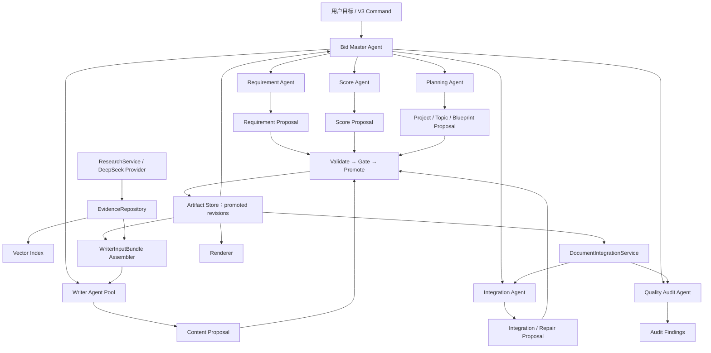
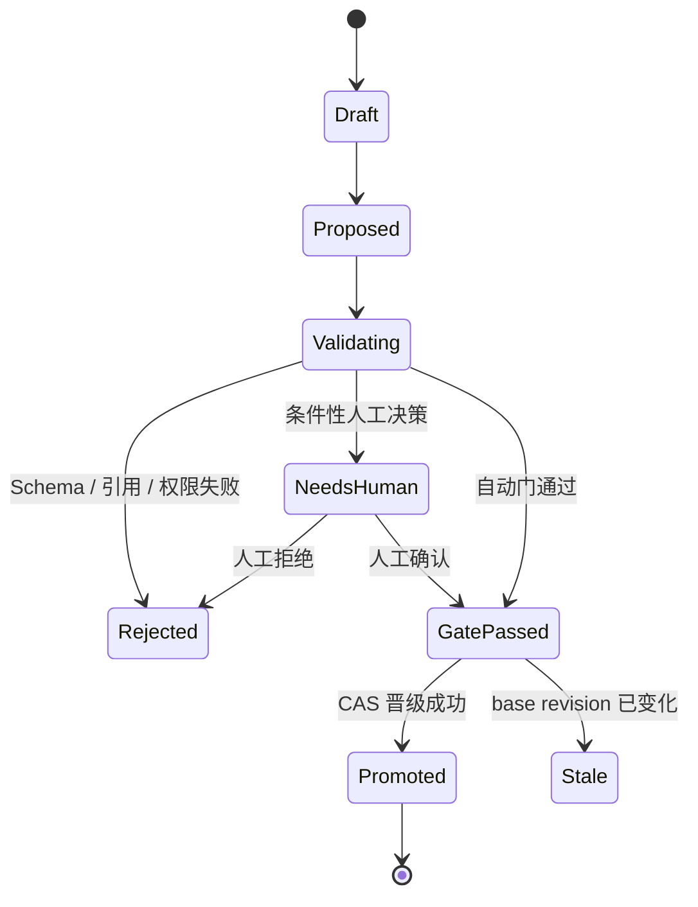

# V3 Bid Master Agent 与投标中间语言详细开发计划

> 状态：PR-14～PR-20 已形成工程骨架但尚未通过 M0/M1 收口验收，PR-21 暂停
> 日期：2026-07-27
> 审计基线：`45c7715 feat(v3): require planning confirmation before writing`
> 历史 PR-0～PR-13 方案：[v3_development_plan.md](./v3_development_plan.md)
> 当前逻辑：[current_logic_flow_v3.md](./current_logic_flow_v3.md)
> 实施记录：[v3_implementation_log.md](./v3_implementation_log.md)

## 1. 计划结论

V3 不再按“多个 Agent 依次读标书、各自理解、各自写作”的流水线设计，而按投标知识编译系统设计：

```text
招标文件
→ RequirementLedger
→ ScoreModel
→ ResponseTopicGraph / ResponseDuty
→ ChapterBlueprint
→ EvidenceSnapshot
→ WriterInputBundle
→ ContentBlock
→ IntegratedDocument
→ Word
```

这条链中的中间 Artifact 是系统事实和决策的唯一载体。Agent 只负责提出决策候选，Service 负责确定性执行，Gate 决定候选能否晋级为权威 Artifact。

必须落实以下架构结论：

1. `Bid Master Agent` 是唯一顶层编排者，但不建立第二套状态机；它复用现有 `CommandGateway`、`StageRunner`、`ControlStore`、Goal 和 Budget。
2. 专业 Agent 不直接互调、不直接写 `control.db`、不直接覆盖权威 Artifact，只读取冻结快照并输出 `Proposal`。
3. `FeatureModel` 不再作为中央语义模型。软件功能只是 `ResponseTopicGraph` 中 `topic_type=function` 的一种主题。
4. `ResponseDuty` 位于 Topic 与 Chapter 之间，用于表达同一主题在架构、安全、实施、验收等章节中的不同响应责任。
5. `ChapterBlueprint` 是 Writer 唯一的结构、章节目的和响应责任来源，但不是 Writer 唯一的物理数据。
6. Writer 的唯一调用参数是冻结且带哈希的 `WriterInputBundle`；Writer 不得重读整份标书、访问工作区、查询证据仓或自行联网。
7. `EvidenceRepository` 独立管理企业资质、案例、产品参数、官方标准、公开研究等证据及其用途权限；Vector Store 只是可重建索引，不是事实源。
8. 全文整合保留语义决策能力，但拆成两层：确定性 `DocumentIntegrationService` 负责机械装配，`Integration Agent` 只处理需要判断的跨章矛盾、重复和定向返工。
9. `Quality Audit Agent` 只读检查并输出 Finding，不直接修改正文。
10. 架构、Golden、运行时 G6 或迁移测试通过都不能单独证明正式标书可用。生产切换前必须使用独立真实项目盲测并通过 `Gate U：Real-Bid Usability`。
11. Skill 不是核心能力载体。核心四阶段上线并通过 Gate U 后，才可增加一个仅调用 Bid Master 的可选 Skill。

V3 总原则：

> **任何新增 Agent 能力，都必须证明自己不能通过绕过 Artifact/Gate/Promotion 获得额外权限。**

该原则适用于行业分析、搜索、图表、格式及未来使用 GPT、Claude、DeepSeek 或本地模型实现的任何 Agent。模型只是可替换的受控推理模块，不能改变权威写入路径。证明必须落在能力权限、调用契约、架构测试和运行时审计上，不能只写在 Prompt 中。

产品建设优先级为：

```text
Phase 1：Requirement + Score + Topic + Blueprint
         回答“这份标书应该怎么写”

Phase 2：Evidence
         回答“凭什么这样写”

Phase 3：ContentBlock
         生成受控章节内容

Phase 4：Integration + Audit
         保证全文一致并完成发布门禁

Phase 5：Usability Holdout + Release
         证明真实标书可用后再迁移生产
```

不得先投入复杂 Writer、自由 Agent 编排或 Skill，再补中间语义层。

### 1.1 当前实施审计与纠偏结论

2026-07-27 对 PR-14～PR-20 的代码、测试、调用链和计划验收项进行复核后，必须区分三个状态：

1. **Implemented**：类、Schema、Stage 或测试夹具已经存在。
2. **Integrated**：唯一运行入口真实消费该实现，上下游权威关系已接通。
3. **Accepted**：安全负向测试、Golden 阈值、独立真实标书盲测、人工验收和适用的仓库发布门全部通过。

只有第三种状态才能在实施日志中写“已完成”。构造样本单元测试、Golden 或运行时 G6 通过都不能替代 Gate U 的真实标书可用性验收。

当前准确状态为：

| PR | 当前状态 | 阻断原因 |
|---|---|---|
| PR-14 | 原则和部分契约已实现，验收重开 | Golden、ADR、评测基线和部分领域 Schema 尚未建立 |
| PR-15 | 事务晋级骨架已实现，P0 阻断 | Validation 未强绑定被持久化的 exact Proposal 内容；Gate、引用和依赖策略仍需收口 |
| PR-16 | 基础结构恢复已实现，验收重开 | InputManifest/SourceIndex/TemplateStructureContract 尚未统一成为 canonical Artifact；普通 JSON 直写与 PDF/DOCX 结构保真仍需收口 |
| PR-17 | 受控 Requirement 骨架已实现，未验收 | 规则抽取、补遗、遗漏审计和真实召回率未达到 Golden 证明 |
| PR-18 | 受控 Score 骨架已实现，未验收 | 复杂评分表、档位、总分和跨来源绑定没有真实准确率证据 |
| PR-19 | Topic/Duty 契约和晋级链已实现，未验收 | 当前仍接近“一 Requirement/Score 一个根 Topic”，领域聚合和多上下文 Duty 未形成 |
| PR-20 | 进行中，P0 阻断 | H1 可被流水线自动代签；Blueprint 尚未成为下游唯一结构权威 |

当前实际链路是：

```text
文件态 InputManifest / SourceIndex
→ promoted RequirementLedger
→ promoted ScoreModel
→ promoted ProjectModel / ResponseTopicGraph
→ promoted ChapterBlueprint
↛ H1 真实人工确认
↛ Blueprint 派生 DocumentContract / DocumentPlan / WriterInputBundle
```

因此当前不能宣称“已经进入纯领域准确性优化阶段”。架构方向不需要推翻，但必须先完成可信内核、canonical Source、真实 H1 和 Blueprint 下游权威四项工程收口，再以 Golden Set 校准语义质量。

在本计划第 20 章定义的 Gate K、Gate S、Gate A、Gate P 全部通过前：

- PR-21 及后续生产能力暂停；
- Gate K/S 通过前，PR-17～PR-20 输出只允许用于开发和 shadow evaluation；Gate K/S 通过后，可在隔离的 acceptance/staging workspace 按新可信内核晋级 candidate Artifact，用于 Golden、G2、H1 和迁移预览，但不得切换生产 active chain；
- 不得把现有自动 H1 Receipt、旧 SourceIndex JSON 或仅按 `proposal_id` 绑定的 Receipt 视为可信生产事实。

## 2. 目标与非目标

### 2.1 目标

完成后，系统必须能够：

1. 从活动招标文件、评分办法、技术要求、商务要求、补遗和模板中恢复可追溯结构。
2. 抽取强制、资格、废标、评分、功能、非功能、交付、验收、工期、合同和证明材料要求。
3. 独立形成 `RequirementLedger` 和引用 Requirement 的 `ScoreModel`，不让评分事实散落在 Prompt 或正文中。
4. 建立覆盖功能、架构、数据、安全、实施、服务、交付、验收、资格和商务的 `ResponseTopicGraph`。
5. 通过 `ResponseDuty` 描述每个 Topic 在不同响应上下文中的责任、深度、证据和评分关系。
6. 生成可审阅、可追溯、可映射严格模板的 `ChapterBlueprint`。
7. 在正文生成前，用一个规划确认页完成项目摘要、异常要求、Topic/Duty、章节树和主责映射的统一确认。
8. 将企业材料、官方标准和公开资料晋级为带权限的证据记录，并生成不可变 `EvidenceSnapshot`。
9. 为每个 ContentUnit 编译最小充分的 `WriterInputBundle`。
10. 让 Writer 仅在 Bundle 授权范围内生成结构化 `ContentProposal`。
11. 让 Integration 和 Audit 发现跨章术语、数字、工期、产品、成果、验收和承诺冲突。
12. 使每个关键 Claim 可回溯到 Requirement、Score、Topic、Duty、Chapter 和 Evidence。

### 2.2 非目标

本计划不负责：

- 让 Agent 直接读取或修改最终 Word；
- 为每个 Requirement、Topic、模板节点或章节创建一个持久 Agent；
- 新增 LangGraph 或与 `StageRunner` 并行的第二套工作流引擎；
- 让 DeepSeek 网页回答代替本地招标文件解析；
- 未经逐次授权把真实标书或企业材料上传到外部网页；
- 将历史优秀标书、外部网页或官方标准当作本企业资质和业绩证明；
- 在规划确认前生成正式正文；
- 在首版承诺完整 OCR；扫描件无法可靠解析时应明确阻断；
- 用通用目录或首尾章节回退掩盖语义规划失败；
- 在核心能力稳定前创建承担业务正确性的 Skill。

## 3. 架构不变量

以下规则属于 V3 架构不变量，任何实现 PR 都不得绕过：

1. **Agent = 决策者**：读取冻结快照，产生 Proposal、Finding 或 RepairRequest。
2. **Artifact = 事实载体**：下游只读取已晋级的特定 revision。
3. **Service = 执行者**：负责解析、校验、装配、索引、CAS 晋级、渲染和状态投影。
4. **Agent 无权直接晋级**：LLM 输出永远不是权威 Artifact。
5. **单一状态机**：Bid Master 通过现有 Command 和 Stage 推进，不复制 observe/plan/tool/budget 循环。
6. **单一规划确认门**：正文前只有一个新增的必经人工 Gate；其他问题采用自动门或条件性阻断。
7. **引用不等于事实复制**：ProjectModel、Blueprint 和 Bundle 使用稳定引用，不能各自复制一套可编辑 Requirement/Score 事实。
8. **Evidence 权限先于写作**：Evidence 必须先验证用途，再进入 Writer 的冻结快照。
9. **Blueprint 控制写作范围**：Writer 不得新增章节、Topic、主责关系或关键承诺。
10. **Audit 只读**：审核结果必须路由回对应 Agent 修复，审核器不能静默改终稿。
11. **Vector Store 非权威**：只保存 embedding 和 Artifact 引用，允许随时重建。
12. **最终 Word 是编译产物**：所有语义修改先形成 Artifact，再由 Renderer 输出。
13. **严格模板先冻结结构**：必须先编译只读 `TemplateStructureContract`，再做 Blueprint 映射。
14. **无票据不晋级**：任何 canonical Artifact 都必须有 Validation、Gate 和 Promotion Receipt。
15. **新增 Agent 权限不扩张**：任何新增 Agent 必须用代码和负向测试证明无法绕过 Artifact、Gate 和 Promotion。
16. **Validation 必须内容寻址**：ValidationReport 必须绑定 Store 中 exact `proposal_id + proposal_hash + dependency snapshot + validator/policy version`；Validator 必须重新读取持久化 Proposal，禁止验证调用方另传的同 ID 不同内容。
17. **Gate 必须按策略签发**：`GatePolicyRegistry` 固定每种 Artifact 所需 gate、issuer、validator 和 policy version；任意一个名为 `pass` 的 Receipt 不能替代必需 Gate 集合。
18. **依赖不得由生产者自证**：Agent 只声明依赖，Validator 和 Promotion 必须从 active promoted Artifact 独立解析并重算 dependency fingerprint，Promotion 前再次校验。
19. **H1 必须是真人动作**：全流程在 H1 产生 Receipt verdict `needs_human`，StageRun 返回 `blocked_human`；只有已认证用户通过显式 Command 对冻结规划快照作出决定，HumanGateService 才能签发 Receipt。字符串 `reviewer="user"` 不构成身份。
20. **Source 也是 canonical Artifact**：InputManifest、SourceIndex 和 TemplateStructureContract 必须是强类型、不可变、带 revision/hash/Receipt 的版本化事实；JSON 只允许作为序列化或可重建投影。
21. **引用必须 fail closed**：引用必须解析到同 workspace、正确 artifact kind、明确 promoted revision/hash；悬空、draft、跨 workspace、类型错误或无权限引用一律阻断。
22. **Blueprint 是下游结构权威**：DocumentContract、DocumentPlan 和 WriterInputBundle 只能由有效 H1 所绑定的 ChapterBlueprint 确定性编译，必须携带 Blueprint revision/hash，不得成为第二套可编辑规划。

## 4. 总体架构

### 4.1 Agent 与 Artifact 架构



### 4.2 角色边界

| 角色 | 只读输入 | 只允许输出 | 明确禁止 |
|---|---|---|---|
| Bid Master | WorkflowState、Artifact refs、Gate receipts、预算 | Command、任务分派、停止/重试/回退决定 | 写业务事实、改正文、直写数据库 |
| Requirement Agent | SourceSnapshot | ExtractionProposal、RequirementLedgerProposal、冲突和缺口 | 发布 Ledger、生成章节、搜索外网 |
| Score Agent | SourceSnapshot、已晋级 Requirement refs | ScoreModelProposal、评分冲突和证明需求 | 修改 Requirement、决定正文 |
| Planning Agent | RequirementLedger、ScoreModel、TemplateStructure、项目约束 | ProjectModelProposal、ResponseTopicGraphProposal、ChapterBlueprintProposal | 写正文、编造企业证据 |
| Writer Agent | 单个 WriterInputBundle | ContentProposal、EvidenceNeedProposal、PlanIssueProposal | 读取整标、改 Blueprint、自行联网 |
| Integration Agent | 已晋级 ContentBlocks、全局约束、IntegrationIssue | IntegrationProposal、受限 RepairRequest | 绕过 Writer 大段重写、改规划 |
| Quality Audit Agent | 冻结的 Blueprint、Evidence、IntegratedDocument | Finding、严重性、定位、回退目标 | 直接修改任何 Artifact |

这些是逻辑能力角色，不等于常驻进程数。Phase 1 只实现 Bid Master、Requirement、Score、Planning 及规划审计；Writer 在 Phase 3 接入，Integration 与最终 Audit 在 Phase 4 接入。

Writer 是同一无状态角色的短生命周期 Worker Pool，首版默认并发 3，压力测试后再决定是否提高；不得按 Requirement、ScorePoint、Topic、章节或模板节点数量线性创建 Agent。

### 4.3 Agent 与 Service 的拆分

以下能力属于 Service，不得伪装成 Agent：

- `SourceNormalizer`：恢复文档结构；
- `TemplateStructureCompiler`：冻结模板标题、级别、顺序、编号和 Slot；
- `ProposalValidator`：校验 Schema、引用、权限和依赖；
- `GateService`：执行确定性门禁和人工决策绑定；
- `ArtifactPromotionService`：CAS 原子晋级；
- `EvidenceRepositoryService`：证据版本、权限和快照；
- `VectorIndexService`：索引已晋级证据；
- `ResearchService`：执行授权后的公开研究或 DeepSeek 浏览器调用；
- `WriterInputBundleAssembler`：编译 Writer 唯一输入；
- `DocumentIntegrationService`：按合同顺序进行机械装配；
- `Renderer`：输出 Markdown/DOCX；
- `WorkspaceSnapshotProjector`：投影当前状态。

全文整合的职责拆分为：

```text
DocumentIntegrationService
  - 顺序装配
  - Slot 校验
  - 锁定块保护
  - 显式交叉引用解析
  - 完全相同内容哈希去重

Integration Agent
  - 判断跨章语义重复
  - 判断术语、数字、产品和承诺冲突
  - 设计局部移动、合并或定向返工方案
  - 只输出 Proposal / RepairRequest
```

“引用相同 Requirement”不能作为自动删除内容的依据。共享 Requirement 的两个块可能分别承担 primary 和 supporting 责任。

### 4.4 权威边界

- 招标、评分、补遗、澄清和模板是采购要求权威来源。
- 补遗按发布日期、适用范围和显式替代关系覆盖早期条款。
- 企业材料只能证明投标人自身事实。
- 产品资料只能证明对应产品参数和能力。
- 官方标准可以支持标准条文、方法和设计依据。
- 公开网页、DeepSeek 和历史标书默认只能作为背景、方法或写法参考。
- Agent 输出是候选，不是事实。
- `promoted Artifact + Receipt` 是唯一运行时事实。
- 下游 Snapshot 不得把 draft、rejected 或 needs_human Proposal 投影为当前状态。

## 5. 投标中间语言与领域契约

### 5.1 `SourceIndex` 与 `ExtractionProposal`

`SourceBlock` 至少包含：

```text
block_id
input_id
input_role
block_kind
ordinal
content
heading_path[]
page
paragraph_index
table_index
row_index
column_index
bbox
source_anchor
content_hash
```

要求：

- 标题路径、页码和表格坐标来自解析器，不由 Agent 生成；
- DOCX 段落和表格保持原始顺序；
- PDF 页码对应原文件；
- OCR 不可靠时产生结构缺口，不生成假文本；
- `SourceNormalizationCoverage` 记录物理元素已规范化、豁免或形成 `StructureGap`，并随 SourceIndex 晋级；
- Requirement/Score 对条款的处理状态写入强类型、内容寻址的 `SemanticProcessingCoverageReport`；它是绑定 exact Source revision 与 Requirement/Score Proposal hash 的 ValidationReport 子报告，不是 canonical 业务 Artifact、没有 active revision，不得回写 immutable SourceIndex，也不得被下游当作领域事实；
- 原始输入保持只读，Proposal 只能引用真实 anchor。

### 5.2 `RequirementLedger`

`RequirementItem` 至少包含：

```text
requirement_id
parent_requirement_id
requirement_type
obligation                 must | should | may | prohibited
subject
action
object
conditions[]
exceptions[]
metrics[]
response_expectation
source_anchors[]
related_requirement_ids[]
topic_ids[]
score_point_ids[]
confidence
review_status
```

`metrics` 保存数量、工期、频率、比例、金额、等级、SLA 和允许偏差。

复合条款拆分后仍保留父条款及子句关系，不能因语义去重删除法律原文。资格、合同、付款等要求保持本来类型，不强行伪装为软件功能。

### 5.3 `ScoreModel`

评分模型独立表达评审逻辑，但通过引用与 Requirement 保持一致：

```text
ScoreModel
  model_id
  source_input_ids[]
  total_points
  groups[]
  points[]
  source_hashes[]

ScorePoint
  score_point_id
  group_id
  title
  criterion
  max_points
  scoring_levels[]
  disqualifying
  response_expectation
  required_evidence_types[]
  linked_requirement_ids[]
  source_anchors[]
  confidence
  review_status
```

约束：

- 每个 ScorePoint 必须有评分来源锚点；
- 分值、档位和总分可确定性复核；
- 相同条款不得在 RequirementLedger 和 ScoreModel 中形成互相冲突的可编辑原文；
- ScoreModel 保存评分解释，RequirementLedger 保存采购义务，两者用 ID 关联。

### 5.4 `ProjectModel`

`ProjectModel` 保留为整标摘要和全局约束投影，不再成为与 Requirement、Score、Topic 并列的第二事实库。

它至少投影：

- 项目身份、背景、目标和范围；
- 明确边界和不在范围；
- 角色、对象、场景和业务流程摘要；
- 交付物、里程碑、验收、工期和关键指标；
- 统一术语、全局承诺、风险、冲突和未知项；
- Requirement、Score、Topic 和 EvidenceNeed 引用。

`goals`、`scope` 和 `work_packages` 不允许用同一列表复制后通过门禁。ProjectModel 的确认事实必须可回到上游 Artifact。

### 5.5 `ResponseTopicGraph` 与 `ResponseDuty`

`ResponseTopicGraph` 是整个投标系统的中央响应语义层：

```text
ResponseTopicGraph
  graph_id
  requirement_ledger_revision
  score_model_revision
  project_model_revision
  root_topic_ids[]
  topics[]
  duties[]
  edges[]
  review_status
  source_hashes[]

ResponseTopic
  topic_id
  parent_topic_id
  topic_type
  canonical_name
  intent
  summary
  aliases[]
  attributes
  source_anchors[]
  confidence
  review_status

ResponseDuty
  duty_id
  topic_id
  duty_type
  requirement_ids[]
  score_point_ids[]
  response_expectations[]
  evidence_need_ids[]
  priority
  confidence
  review_status

TopicEdge
  edge_id
  source_topic_id
  target_topic_id
  relation
  order
  requirement_ids[]
  rationale
  confidence
```

首版 `topic_type`：

```text
business_domain
business_flow
business_capability
function
architecture
data
integration
security
non_functional
implementation
project_management
service_operation
training
deliverable
acceptance
qualification
commercial
compliance
```

首版 `duty_type`：

```text
summarize
explain
design
implement
operate
verify
accept
commit
cross_reference
```

首版 `relation`：

```text
parent_of
depends_on
realizes
constrained_by
step_of
produces
consumes
interfaces_with
verified_by
supports_score
```

同一 Topic 可以存在多个 Duty。例如“统一身份认证”可以同时拥有：

- 总体架构中的 `summarize` Duty；
- 安全设计中的 `design` Duty；
- 实施方案中的 `implement` Duty；
- 验收章节中的 `verify` Duty。

章节映射 Duty，而不是把 Topic 简单复制到多个章节。每个 Duty 恰好一个 primary chapter，其他位置只能是 supporting、mention 或 cross_reference。

`FeatureModel` 如因前端功能树展示需要保留，只能作为 `topic_type=function` 子图的派生 View，不能独立保存主责、评分和章节映射。

### 5.6 `ChapterBlueprint`

```text
ChapterBlueprint
  blueprint_id
  mode
  topic_graph_revision
  template_structure_revision
  nodes[]
  assignments[]
  coverage_summary
  review_status
  source_hashes[]

BlueprintNode
  chapter_id
  parent_chapter_id
  order
  title
  purpose
  writing_objectives[]
  forbidden_topic_ids[]
  required_mentions[]
  cross_references[]
  planned_tables[]
  planned_figures[]
  target_size
  template_target

TopicChapterAssignment
  assignment_id
  duty_id
  chapter_id
  role                       primary | supporting | mention | cross_reference
  response_scope
  rationale
  confidence
  needs_human
```

约束：

- 每个 blocking Requirement、ScorePoint 和核心 Duty 必须能反向追到一个 primary assignment；
- 每个 Duty 恰好一个 primary assignment；
- supporting/mention 不计为重复主责；
- Blueprint 中用于 UI 展示的 Requirement/Score 列表必须从 Duty 投影，不能独立编辑；
- 自动标题必须有 Topic、Duty、评分或招标固定结构依据；
- 严格模板模式下，标题、级别、顺序、编号和 Slot 与 `TemplateStructureContract` 完全一致；
- 无承载位置时形成 `TEMPLATE_MAPPING_GAP`，不得自动追加章节。

### 5.7 `EvidenceRepository`

证据层由四类对象组成：

```text
EvidenceNeed
  evidence_need_id
  duty_id
  score_point_ids[]
  claim_scope
  evidence_kind
  allowed_authority_classes[]
  min_count
  blocking
  fallback_policy

EvidenceRecord
  evidence_id
  version
  source_type
  source_input_id
  source_url
  source_anchor
  content_hash
  excerpt
  publisher
  authority_class
  allowed_claim_scopes[]
  prohibited_claim_scopes[]
  valid_from
  valid_until
  verification_status
  access_policy

EvidenceBinding
  binding_id
  evidence_id
  duty_id
  score_point_ids[]
  relation                  proves | supports | constrains | illustrates | reference_only
  claim_scope
  confidence
  verification_status

EvidenceSnapshot
  snapshot_id
  unit_id
  blueprint_revision
  topic_graph_revision
  binding_ids[]
  record_versions[]
  repository_revision
  dependency_fingerprint
```

证据权限矩阵：

| authority_class | 可支持 | 禁止支持 |
|---|---|---|
| `tender_source` | 采购要求、评分依据、交付和验收口径 | 企业既有能力 |
| `company_qualification` | 企业资质、人员证书、认证 | 通用技术标准 |
| `company_case` | 本企业案例、合同、规模、时间 | 未经证明的产品参数 |
| `product_document` | 对应产品参数和能力 | 企业历史业绩 |
| `official_standard` | 标准条文、技术和管理依据 | 企业资质、案例 |
| `web_research` | 背景、公开方法、趋势 | 企业能力和关键承诺 |
| `historical_bid` | 结构、表达和方法参考 | 当前项目事实、企业证明 |

Evidence 变化只使受影响的 Snapshot、Bundle 和 ContentUnit stale。除非 EvidenceNeed 或章节责任发生变化，不应迫使用户重新确认 Blueprint。

### 5.8 `WriterInputBundle`

“ChapterBlueprint 是 Writer 唯一输入”应落实为两个不同层面的硬规则：

1. ChapterBlueprint 是 Writer 唯一的结构和响应责任来源。
2. Writer 的唯一调用参数是由 Service 编译的冻结 `WriterInputBundle`。

```text
WriterInputBundle
  bundle_id
  unit_id
  dependency_refs
  dependency_fingerprint
  blueprint_slice
  topic_and_duty_slice
  requirement_excerpts[]
  score_obligations[]
  evidence_snapshot
  allowed_facts[]
  project_constraints
  terminology
  commitments
  document_target_constraints
  upstream_summaries[]
  cross_reference_targets[]
  allowed_placeholders[]
  output_contract
  prompt_version
  model_config_hash
  bundle_hash
```

Writer 硬边界：

- 不能读取 SourceIndex、整个 ProjectModel、整个 EvidenceRepository 或任意工作区文件；
- 不能调用 DeepSeek、浏览器、搜索或上传工具；
- 只能使用 Bundle 中存在的 Topic、Duty、Requirement、Score、Fact、Evidence 和 target ID；
- 不能新增标题或移动主责；
- 缺少证据时只能返回 `EvidenceNeedProposal`；
- 发现规划问题时只能返回 `PlanIssueProposal`；
- 只输出 `ContentProposal`，通过内容门后才晋级为 `ContentBlock`；
- 任一上游 revision、Prompt 或模型配置变化后 Bundle 立即 stale。

### 5.9 内容、整合与审核契约

```text
ContentProposal
  proposal_id
  bundle_id
  blocks[]
  claims[]
  evidence_need_proposals[]
  plan_issue_proposals[]

ContentBlock
  block_id
  target_chapter_id
  duty_ids[]
  topic_ids[]
  requirement_ids[]
  score_point_ids[]
  evidence_binding_ids[]
  fact_ids[]
  claim_ids[]
  content
  lock_state
  source_bundle_hash

IntegrationIssue
  issue_id
  issue_type
  affected_block_ids[]
  affected_chapter_ids[]
  severity
  rationale
  recommended_route

AuditFinding
  finding_id
  rule_id
  severity
  location
  affected_ids[]
  evidence
  route_to
  status
```

Audit Finding 的修复路由必须确定：

| Finding 类型 | 回退目标 |
|---|---|
| Requirement 漏项、原文解释错误 | Requirement Agent |
| Score 分值、档位或证明要求错误 | Score Agent |
| Topic/Duty、主责或目录错误 | Planning Agent |
| 缺企业材料或证据用途不符 | Evidence 流程 / 用户材料补充 |
| 单章内容缺失或越权 | Writer Agent |
| 跨章冲突、重复、术语漂移 | Integration Agent，必要时定向 Writer 返工 |
| 模板结构或 Slot 问题 | Template/Planning Service |

## 6. Proposal、Gate 与 Artifact 晋级

### 6.1 统一 Proposal 契约

```text
ProposalEnvelope
  proposal_id
  proposal_hash
  workspace_id
  artifact_kind
  producer_role
  operation_id
  base_revision
  declared_dependencies[]
  declared_dependency_fingerprint
  schema_version
  payload
  canonical_payload_hash
  cited_source_ids[]
  prompt_version
  model_fingerprint
  created_at

ValidationReport
  validation_report_id
  workspace_id
  artifact_kind
  proposal_id
  proposal_hash
  canonical_payload_hash
  base_revision
  resolved_dependency_snapshot[]
  resolved_dependency_fingerprint
  validator_version
  validation_policy_version
  schema_valid
  references_valid
  authority_policy_valid
  dependency_current
  findings[]
  validation_report_hash
  issued_at

GateReceipt
  receipt_id
  proposal_id
  proposal_hash
  workspace_id
  artifact_kind
  gate_id
  gate_policy_version
  validation_report_refs[]    id + immutable report_hash
  verdict                    pass | warn | block | needs_human
  findings[]
  issuer
  principal_id
  base_revision
  resolved_dependency_snapshot[]
  resolved_dependency_fingerprint
  receipt_hash
  issued_at
  expires_at
  permanent_stale_policy

PlanningGateReceipt extends GateReceipt
  receipt_mode               human_confirmation | deterministic_carry_forward
  planning_audit_snapshot_hash
  planning_confirmation_scope_hash
  planning_dependency_snapshot[]
  planning_dependency_root
  g2_receipt_ref             id + immutable receipt_hash
  nonce                      required for human confirmation
  decision                   required for human confirmation: approve | reject
  origin_human_receipt_ref   required for carry-forward: id + immutable receipt_hash
  origin_human_principal_id  required for carry-forward
  previous_dependency_snapshot[] required for carry-forward
  previous_dependency_root   required for carry-forward
  carry_forward_algorithm_version
  carry_forward_policy_version

PromotionReceipt
  promotion_receipt_id
  workspace_id
  proposal_id
  proposal_hash
  artifact_id
  base_revision
  promoted_revision
  artifact_hash
  resolved_dependency_snapshot[]
  dependency_fingerprint
  promotion_policy_version
  gate_receipt_refs[]         id + immutable receipt_hash
  promotion_receipt_hash
  promoted_at
```

`PlanningGateReceipt` 是 `GateReceipt` 的判别子类型：

- `human_confirmation` 只能由 HumanGateService 根据认证用户的显式 Command 签发，保存真实 principal、nonce 和用户 decision；
- `deterministic_carry_forward` 只能由注册的 H1ApplicabilityService 签发，必须引用原始 `human_confirmation` Receipt `id/hash`、原用户、旧/新 dependency root、相同 scope hash 和算法/policy version；
- carry-forward 的 issuer 是 Service，不能把原 principal 填成新决策人，也不能改变原 decision；
- 两种模式都必须保存完整 exact planning dependency snapshot。该快照至少包含 InputManifest、SourceIndex、RequirementLedger、ScoreModel、ProjectModel、ResponseTopicGraph、ChapterBlueprint，以及适用的 TemplateStructureContract 的 `artifact_id/revision/hash`，并计算完整 DAG/Merkle root。

### 6.2 生命周期



### 6.3 晋级硬约束

- Agent、LLM 和普通 Service 不得直接写 canonical Artifact 路径；
- Validator 必须从 append-only Store 重新加载 Proposal，按冻结 canonicalization/version 重算 proposal hash 和 payload hash；
- ValidationReport 必须绑定 exact Proposal hash、resolved dependency snapshot 和 validator/policy version，不能只绑定 `proposal_id`；
- Validator 检查 Schema、同 workspace promoted 引用、来源权威、访问权限和依赖版本；
- LLM Reviewer 只能输出 Finding，不能签发最终 Gate；
- GateService 必须按 `GatePolicyRegistry` 校验 artifact kind、所需 Validator、issuer 和 policy version；
- 未知 finding、未知 policy、`block`、`needs_human`、过期 Receipt 或非授权 reviewer 试图降级结论时一律 fail closed；
- Promotion 必须重新加载 Proposal、重算依赖，并验证该 Artifact 所需的完整 GateReceipt 集合；
- Promotion 使用 `base_revision` 做 CAS，陈旧 Proposal 或上游依赖已变化时必须拒绝；
- 人工确认绑定 promoted ChapterBlueprint 的 artifact ID/revision/hash、完整审计快照 hash、`planning_confirmation_scope_hash` 和认证决策人；
- 同一 `operation_id` 幂等重试不能重复晋级，且幂等键必须同时绑定 proposal hash；
- 晋级、active revision 更新和 Receipt 写入必须原子化；
- 进程中断不能留下半有效 revision；
- canonical Artifact 的确定性 Service 输出也必须经过同一晋级通道。

## 7. 阶段 DAG 与唯一执行链

### 7.1 正常阶段

| 顺序 | Stage | 决策角色 / Service | 主要 promoted 输出 |
|---:|---|---|---|
| 1 | `ingest_inputs` | Service | `InputManifest` |
| 2 | `normalize_sources` | Service | `SourceIndex` |
| 3 | `compile_template_structure` | Service | 可选 `TemplateStructureContract` |
| 4 | `analyze_requirements` | Requirement Agent | `RequirementLedger` |
| 5 | `analyze_scores` | Score Agent | `ScoreModel` |
| 6 | `plan_response` | Planning Agent | `ProjectModel`、`ResponseTopicGraph` |
| 7 | `compile_chapter_blueprint` | Planning Agent | `ChapterBlueprint` |
| 8 | `confirm_planning` | HumanGateService / 认证用户 | `PlanningGateReceipt` |
| 9 | `resolve_evidence` | Evidence Service / ResearchService | `EvidenceRepository revision`、`EvidenceSnapshot` |
| 10 | `compile_writing_packets` | Service | `DocumentContract`、`DocumentPlan`、`WriterInputBundle` |
| 11 | `write_content` | Writer Pool | `ContentBlock` |
| 12 | `integrate_document` | Integration Service + Agent | `IntegratedDocument` |
| 13 | `audit_document` | Quality Audit Agent + Gate | `AuditReport`、`FinalGateReceipt` |
| 14 | `render_document` | Renderer | Markdown/DOCX |
| 15 | `verify_delivery` | 既有交付门 | 交付结果 |

Requirement 抽取与 Score 原文结构/算术候选在 SourceIndex 晋级后可分批并行 shadow；Score→Requirement reconcile、Validation 和 Promotion 必须依赖 promoted RequirementLedger。Planning 必须读取两者已经晋级且 fingerprint 相容的 revision。

### 7.2 模板模式顺序

模板模式必须使用：

```text
InputManifest
→ TemplateStructureContract（只读结构）
→ Requirement / Score
→ ResponseTopicGraph / ResponseDuty
→ ChapterBlueprint 映射
→ PlanningConfirm
→ 语义完备 DocumentContract
```

不能先生成需要 template target 的 Blueprint，再在其后首次编译模板结构。

### 7.3 与现有 V3 兼容

- 保留 `CommandGateway`、`StageRunner`、`ControlStore` 和现有公开命令入口；
- 新 Stage 可先作为现有阶段内部子步骤接入，再在前端状态投影准备好后公开；
- `Bid Master` 是现有 Supervisor/执行控制器的角色化薄层，不实现第二套循环；
- `DocumentContract` 和 `DocumentPlan` 是已确认 Blueprint 的确定性派生物；
- Pipeline 不得自动执行人工确认；到达 H1 时必须返回可恢复的 `blocked_human`；
- 只有显式、已认证的 `ConfirmPlanning` Command 可以使 H1 从 `needs_human` 进入 `pass`；
- 研究和材料补充按显式 EvidenceNeed 触发，不作为无条件线性 Stage；
- 正式切换后不允许回退旧的 kind 分组目录或首节点匹配逻辑。

## 8. Agent 任务契约与 Prompt

### 8.1 Agent 调用规则

- 每个调用只接收显式 Snapshot refs 和 TaskContract；
- 每个角色无会话内隐式长期记忆；
- 所有必要状态写入 Proposal 或 promoted Artifact；
- Agent 不从其他 Agent 获取“口头总结”；
- Agent 之间的协作只通过 Bid Master 和 Artifact；
- 重试必须引用相同 operation 或新 revision，不能覆盖旧 Proposal；
- 模型、Prompt、温度和输出 Schema 进入 fingerprint；
- 角色超出权限时立即失败，不自动扩大工具范围。

### 8.2 Prompt 划分

```text
prompts/v3_requirement_agent_extract.md
prompts/v3_requirement_agent_reconcile.md
prompts/v3_score_agent_parse.md
prompts/v3_score_agent_reconcile.md
prompts/v3_planning_agent_project.md
prompts/v3_planning_agent_topics.md
prompts/v3_planning_agent_blueprint.md
prompts/v3_writer_agent.md
prompts/v3_integration_agent.md
prompts/v3_quality_audit_agent.md
```

共同约束：

- 只输出符合 Schema 的 Proposal 或 Finding；
- 不允许创建输入快照中不存在的 anchor 和 ID；
- 区分 confirmed、inferred、ambiguous、conflicted 和 unknown；
- 不允许把外部资料写成企业能力；
- 不允许用兜底章节掩盖映射缺口；
- 不允许直接给出“已发布”或“门禁通过”结论；
- 不允许输出或保存 Cookie、密码、Token 和浏览器配置路径。

## 9. Gate 设计

本章 `G0`～`G6`、`H1` 是工作空间运行时 Gate，会产生或消费具体 Artifact 的 Receipt。第 20 章的 `Gate K/S/A/P/B/U/M` 是仓库发布验收门，只汇总测试、Golden、真实项目盲测、迁移和发布证据，不签发运行时 `GateReceipt`，两类 Gate 不得混用。

运行时需要人工处理时，Receipt verdict 统一为 `needs_human`；StageRun 对外状态统一为 `blocked_human`。不得把 StageRun 状态写成 `needs_human`，也不得把 Receipt verdict 写成 `blocked_human`。

### 9.1 `G0 ProposalValidationGate`

检查：

- JSON/Pydantic Schema；
- ID、Anchor 和 revision 引用；
- Agent 角色权限；
- Evidence authority policy；
- base revision 与 dependency fingerprint；
- Prompt 和模型版本；
- Proposal 大小和敏感字段。

### 9.2 `G1 RequirementScoreIntegrityGate`

阻断：

- 活动招标或评分 SourceBlock 未处理；
- 强制、资格、废标、评分、交付或验收项无来源；
- 评分行、档位、分值或总分不一致；
- 指标值不能回到原文；
- 补遗优先级未处理；
- critical/score 低置信度结果被静默接受。

### 9.3 `G2 TopicBlueprintGate`

阻断：

- blocking Requirement 或 ScorePoint 没有对应 Duty；
- 核心 Duty 没有唯一 primary chapter；
- supporting/mention 被当作主责；
- Topic/Duty 存在悬空引用或执行依赖环；
- 标题与绑定 Duty 明显不一致；
- 无依据通用章节或首尾章节回退；
- 模板标题、级别、顺序、编号或 Slot 发生未授权变化；
- 无来源确认事实进入 ProjectModel；
- 关键冲突未处理。

### 9.4 `H1 PlanningConfirm`

这是本计划新增的唯一必经人工 Gate，一次展示并确认：

- 项目摘要、范围、边界、交付和验收；
- critical/low-confidence Requirement 与 Score；
- ResponseTopicGraph 和 ResponseDuty；
- ChapterBlueprint；
- primary/supporting/mention 覆盖矩阵；
- 模板映射缺口和规划风险。

H1 的签发规则是强制安全边界：

- `run_pipeline` 到达 H1 后必须暂停：运行时 Receipt verdict 为 `needs_human`，StageRun 状态为 `blocked_human`；不得把 H1 当作普通自动 Stage 连续执行；
- 只有认证用户通过显式 `ConfirmPlanning` Command 提交 `decision=approve|reject`，HumanGateService 才能签发 Receipt；
- Command 必须绑定 workspace、用户 principal、CSRF/认证上下文、InputManifest/SourceIndex/RequirementLedger/ScoreModel/ProjectModel/ResponseTopicGraph/promoted ChapterBlueprint 各自的 `artifact_id/revision/hash`、适用的 TemplateStructureContract `artifact_id/revision/hash`、完整 Artifact DAG/root、G2 Receipt `id/hash`、完整规划审计快照 hash、`planning_confirmation_scope_hash`、policy version、nonce 和时间；
- StageRunner、Agent、LLM、普通 Service、脚本和后台任务不得传入或伪造 `reviewer="user"` 代签；
- 前端确认页必须显示其正在确认的 revision/hash 和相对上次确认的变更 diff；
- H1 Receipt 只表示用户确认所见规划，不替代 G2 的机器完整性校验。

完整规划审计快照 hash 用于证明“用户当时看到了什么”，`planning_confirmation_scope_hash` 只包含会改变规划责任的字段，用于选择性失效；两者不得混为一个 hash。

只有以下变化会改变 `planning_confirmation_scope_hash` 并使 H1 失效：

- blocking Requirement 或 Score 变化；
- 核心 Topic/Duty 变化；
- 标题、层级、primary owner 或模板目标变化；
- 项目范围、工期、交付、验收等全局约束变化。

新增普通 Evidence、正文重写、格式调整和非关键 supporting mention 变化不应要求重审规划，但这不等于忽略上游 revision 变化。

任何 H1 依赖 revision/hash 变化都先把当前适用性置为待重评。H1ApplicabilityService 必须先证明整个 Artifact DAG 对当前 InputManifest/SourceIndex 仍 current，再验证新 G2 和完整依赖快照：若 `planning_confirmation_scope_hash` 与原 H1 相同，可签发一个引用原始人工 H1、同时绑定新 exact snapshot 的 `deterministic_carry_forward` Receipt；若 scope hash 变化，原 H1 才进入 stale 并要求用户重新确认。原 H1 Receipt 始终不可变，carry-forward 也不得伪装成新的人工决定。Evidence、DocumentContract、DocumentPlan、WriterInputBundle 和 Writer 在读取时都必须验证当前 exact snapshot 对应的人工 H1 或 carry-forward Receipt 链，不能只检查某个同名 gate 是否曾经存在。

### 9.5 `G3 EvidenceGate`

阻断：

- blocking Claim 缺少允许 authority class 的 Evidence；
- 外部网页、历史标书或官方标准被用于证明企业能力；
- Evidence 版本过期或来源不可回溯；
- 两份企业证据冲突且未处理；
- 未经授权向 DeepSeek 上传附件；
- 查询预算耗尽后仍伪造“已找到证据”。

缺少必须由用户提供的企业材料、需要外发敏感附件或企业证据冲突时进入条件性阻断，不新增固定人工质量 Gate。

### 9.6 `G4 WriterBundleContentGate`

检查：

- Bundle 依赖仍是 active revision；
- Bundle 引用最小、完整且未越权；
- Writer 输出没有 Bundle 外 ID；
- writing objectives 覆盖；
- forbidden Topic 未被完整展开；
- 关键 Claim 有允许的 Fact/Evidence；
- 数字、工期、人员、业绩和承诺有来源；
- target chapter、Duty 和 primary owner 合法；
- ContentBlock 保留完整追溯引用。

### 9.7 `G5 IntegrationGate`

检查：

- 所有 ContentBlock 均已晋级；
- 装配顺序和 Slot 正确；
- human lock 未被修改；
- supporting 内容没有因共享 Requirement ID 被删除；
- 完全重复的自动处理有确定性 trace；
- 语义移动、合并和重写有 IntegrationProposal；
- 同一输入重复整合得到相同 hash。

### 9.8 `G6 FinalSemanticGate`

阻断：

- critical Requirement/Score 最终覆盖不足 100%；
- 存在无来源关键 Claim；
- 数字、工期、产品、成果、验收或承诺冲突未解决；
- 存在非授权完整重复；
- 术语表和关键实体不一致；
- locked block 被未授权修改；
- critical Finding 未关闭；
- Audit 修复超过最大轮次或 no-progress 熔断。

Quality Audit Agent 只提出 Finding；Gate Service 根据确定性规则和 Finding 状态签发最终 Receipt。

## 10. 前端与人工协作

### 10.1 规划确认中心

前端优先建设一个页面，而不是 Requirement、ProjectModel、Topic 和 Blueprint 四个分散确认页：

- 左侧：输入、Source、Requirement 和 Score 异常；
- 中间：Topic/Duty 图与章节树；
- 右侧：来源、映射理由、置信度、评分和模板 Slot；
- 下方：Requirement/Score/Duty → Chapter 覆盖矩阵；
- 操作：调整 Topic/Duty、移动 primary、处理冲突、重新规划、确认；
- 严格模板模式禁用标题新增、删除、重命名和重排。

### 10.2 后续状态区

- EvidenceNeed 和材料缺口；
- 外部上传授权；
- EvidenceRecord、Binding 和有效期；
- WriterInputBundle fingerprint 和 stale 状态；
- ContentUnit 进度和定向重试；
- IntegrationIssue 和 RepairRequest；
- AuditFinding、路由目标和关闭状态；
- FinalGateReceipt 与交付状态。

前端只能发送 Command，不能直接编辑 JSON、Artifact 或 `control.db`。

## 11. 分阶段 PR 实施计划

### 11.0 审计后的重新验收规则

PR-14～PR-20 保留原编号和 Git 历史，不把“收口补丁”伪装成新业务功能。后续提交使用 `PR-14.1`～`PR-20.1` 表示原 PR 的重新验收批次；只有原工作项和本章增补工作项同时通过，原 PR 才能改回“Accepted”。

收口顺序固定为：

```text
R0：暂停 PR-21+ 生产扩展，现有语义链仅用于 shadow
→ R1 / PR-14.0 + PR-15.1：最小契约冻结、exact Proposal binding、Gate policy、可信依赖
→ R2 / PR-16.1：canonical Source、结构保真
→ R3 / PR-14.1：Golden Registry、ADR、正式评测基线
→ R4 / PR-17.1～PR-19.1：分层语义校准
→ R5 / PR-20.1：真实 H1、Blueprint 下游唯一链
→ R6：仓库发布验收门 Gate K/S/A/P 完成，解锁 PR-21
→ PR-21
```

R1 必须最先合入；Golden 资产匿名化、专家标注和评测基础设施可以与 R1/R2 并行建设，但正式语义 baseline/report 只能在 Gate K + Gate S 后消费可信内核和 canonical Source 产生的 Artifact。不得为了尽快进入 Writer/Evidence 而跳过任何收口门。

### Phase 0：语义与权限内核

#### PR-14：冻结中间语言、架构约束与 Golden Set

当前验收状态：**部分实现，重新打开验收。** 已冻结原则和指标定义，但 Golden 数据、Registry、ADR、代码审查模板和当前规则基线不存在。Gate K 所需的 PR-14.0 最小冻结包见 20.2，其余 PR-14.1 收口见 20.3。

工作：

1. 冻结 Requirement、Score、Topic、Duty、Blueprint、Evidence、Bundle、Content 和 Finding 最小 Schema。
2. 冻结 Agent/Service/Artifact/Gate 权限边界和中间语言依赖方向。
3. 为“新增 Agent 不能绕过 Artifact/Gate/Promotion”建立仓库级架构测试要求。
4. 选取至少 8 份匿名真实标书，评分点数量和模板结构以原始文件及双人复核的人工 Golden 为准；历史重复绑定场景与合成深层模板压力夹具分别管理，不把 `92/198` 作为固定样本规模。
5. 建立四套 Golden：A（Requirement/Score/Topic/Blueprint，内部 A1～A4）、B（Evidence）、C（Content）、D（Integration/Audit）。
6. 为每个样本记录输入 hash、标注人、复核人、裁决人和版本。
7. 记录当前规则实现的真实基线，不以“字段非空”作为成功。

验收：

- Golden 标注可重复加载；
- 中间语言、角色权限和晋级链形成 ADR 并纳入代码审查模板；
- 新增 Agent 的权限证明成为强制合并项；
- 指标按阶段输出，不能用总平均分掩盖 Requirement 漏项；
- 敏感原件不进入 Git；
- 后续语义 PR 必须引用已冻结的评测版本。

工作量：4—7 人日，不含业务专家标注。

#### PR-15：Proposal / Validate / Gate / Promotion 可信运行内核

当前验收状态：**P0 阻断，重新打开验收。** 事务/CAS 骨架已存在，但 Validation 可以只按 `proposal_id` 关联，尚未强绑定被持久化的 exact Proposal 内容。详细补充见 20.2。

工作：

1. 新增 ProposalEnvelope、ValidationReport、GateReceipt 和 PromotionReceipt。
2. 实现角色能力注册表和权限策略。
3. 实现 dependency fingerprint、CAS 晋级和幂等 operation。
4. Proposal 使用追加式存储，canonical Artifact 使用 active revision 指针。
5. 让 WorkspaceSnapshot 只投影 promoted Artifact。
6. 将 Bid Master 接入现有 CommandGateway/StageRunner，不新增第二状态机。
7. 建立 Agent capability sandbox、越权审计和统一拒绝策略。

验收：

- Agent 直接写 canonical 路径的测试全部失败；
- 无 GateReceipt 无法晋级；
- 陈旧 base revision 无法晋级；
- 中途崩溃不产生半有效 revision；
- 相同 operation 重试不会重复发布。
- 更换 GPT、Claude、DeepSeek 或本地模型不会改变权限和晋级路径。
- ValidationReport、GateReceipt 和 PromotionReceipt 必须绑定同一 exact proposal hash；同 ID 替换 payload、artifact kind、base revision 或依赖时全部拒绝。
- Promotion 必须按 artifact kind 验证 GatePolicyRegistry 声明的完整 Receipt 集合，并从 active Artifact 独立重算依赖。

工作量：5—8 人日。

#### PR-16：结构化 SourceIndex 与 TemplateStructureContract

当前验收状态：**基础解析已实现，canonical Artifact 与结构保真验收未完成。** 详细补充见 20.4。

工作：

1. 恢复 DOCX 标题、列表、段落和表格原始顺序。
2. PDF 保留页码、文本块和表格位置。
3. 增加扫描件检测；首版无法可靠 OCR 时明确阻断。
4. 增加 amendment 输入角色、发布日期和替代关系。
5. 在语义规划前编译只读 TemplateStructureContract。
6. 生成全量 SourceBlock 处理覆盖表。

验收：

- 标题路径、页码和表格单元格可回跳；
- 同一文件重复处理得到稳定 block_id；
- 模板标题、级别、顺序、编号和 Slot 指纹稳定；
- 不支持或不可解析输入在 Agent 调用前被阻断。

工作量：5—8 人日。

### Phase 1：回答“这份标书应该怎么写”

#### PR-17：Requirement Agent 与 RequirementLedger

当前验收状态：**受控骨架已实现，Golden 发布验收未完成。** 当前确定性规则是 baseline，不得标记为专业语义能力。详细补充见 20.5。

工作：

1. 实现分批 ExtractionProposal。
2. 提取主体、动作、对象、条件、例外和量化指标。
3. 保留父条款和原子子句关系。
4. 实现补遗覆盖、重复消解和冲突检测。
5. 进行 SourceIndex 反向遗漏审计。
6. 通过 G0/G1 后晋级 RequirementLedger。

验收：

- critical Requirement 来源锚点覆盖 100%；
- 关键词未命中的语义要求可以抽取；
- 跨页、列表和表格义务不因格式丢失；
- 无效 JSON、虚构 anchor 和越权输出不能晋级。

工作量：6—9 人日。

#### PR-18：Score Agent 与 ScoreModel

当前验收状态：**受控骨架已实现，Golden 发布验收未完成。** 详细补充见 20.6。

工作：

1. 解析评分组、评分点、档位、分值和证明要求。
2. 建立 ScorePoint 与 Requirement 的引用。
3. 校验分组小计和总分。
4. 识别废标/资格与评分条件的交叉关系。
5. 输出评分响应深度和 EvidenceNeed 候选。
6. 通过 G0/G1 后晋级 ScoreModel。

验收：

- Golden 样本评分行、档位和总分正确率 100%；
- 每个评分点有来源；
- Requirement 与 Score 不复制冲突事实；
- 所有人工 Golden 样本不存在静默批量绑定；异常高频映射必须阻断并解释。

工作量：4—7 人日。

#### PR-19：Planning Agent、ProjectModel 与 ResponseTopicGraph

当前验收状态：**契约和晋级骨架已实现，领域 TopicGraph 验收未完成。** 当前一对一根 Topic 投影只允许作为 baseline。详细补充见 20.7。

工作：

1. 将 ProjectModel 改为上游 Artifact 的受控投影。
2. 新增 ResponseTopicGraph、ResponseTopic、ResponseDuty 和 TopicEdge。
3. 建立功能、架构、安全、数据、实施、运维、资格、商务、交付和验收主题。
4. 形成 Topic 层级、业务流程和依赖边。
5. 将 Requirement/Score 映射到 Duty，而不是直接映射章节。
6. 输出冲突、未知、低置信度和 EvidenceNeed。

验收：

- Feature 不再是中央权威模型；
- 每个 confirmed Topic 有来源或上游引用；
- blocking Requirement/Score 均有响应 Duty；
- BusinessFlow 不再维护第二套同权威图；
- 执行依赖无环，悬空引用为 0。

工作量：7—11 人日。

#### PR-20：ChapterBlueprint、规划门与统一确认页

当前验收状态：**进行中，P0 阻断。** 自动代签 H1、平铺 Blueprint 和旧 DocumentPlan 路径均不能通过验收。详细补充见 20.8。

工作：

1. Planning Agent 生成 BlueprintProposal。
2. 无模板模式生成项目专用多层章节树。
3. 严格模板模式只映射冻结节点和 Slot。
4. 用 TopicChapterAssignment 表达 primary/supporting/mention/cross-reference。
5. 实现 G2 与 H1 PlanningConfirm。
6. 冻结 Blueprint → DocumentContract/DocumentPlan/WriterInputBundle 的单向派生契约和硬阻断接口；实际编译器在 PR-23 实现。
7. 禁止按 RequirementKind 生成目录、首节点回退和旧 DocumentPlan 进入正式写作链。

验收：

- 每个核心 Duty 恰好一个 primary chapter；
- 每个 blocking Requirement/Score 可反向追到 primary；
- 模板结构变化为 0；
- 用户可一次审阅项目摘要、Topic/Duty、目录和覆盖；
- 未确认规划不能进入 Evidence/Writer 阶段；
- PR-20 不以 Writer 实际编译作为自身验收条件，避免与 PR-23 形成循环依赖。

工作量：8—12 人日。

### Phase 2：回答“凭什么这样写”

#### PR-21：EvidenceRepository 与权限策略

工作：

1. 新增 EvidenceNeed、Record、Binding 和 Snapshot。
2. 将 company、product、official、web 和 historical_bid 分级。
3. 实现 allowed/prohibited claim scope。
4. 增加有效期、版本、来源、访问策略和冲突状态。
5. Vector Store 只索引 promoted EvidenceRecord。
6. 实现 Evidence 变化的精准 stale 传播。

验收：

- 外部资料证明企业能力为 0；
- Evidence 到来源和 Claim 的回溯率 100%；
- 过期、冲突或未验证 Evidence 不能进入 Snapshot；
- 新增 Evidence 不无条件使 Blueprint 失效。

工作量：5—8 人日。

#### PR-22：Evidence 匹配、ResearchService 与材料缺口

工作：

1. 从 Duty、Score 和 Claim scope 生成 EvidenceNeed。
2. 先匹配本地企业/产品材料，再按需执行公开研究。
3. DeepSeek 作为 Research Provider 接入，不产生 Agent 状态。
4. 保持逐次附件选择、哈希校验和显式授权。
5. 查询预算、超时和 Provider 失败形成明确 gap。
6. 为 ContentUnit 冻结 EvidenceSnapshot。

验收：

- 未授权附件上传为 0；
- blocking Evidence 缺失时只阻断依赖单元；
- DeepSeek 不可用不会伪造证据；
- 公开研究不能改写采购范围和企业事实；
- 相同依赖生成稳定 Snapshot fingerprint。

工作量：5—8 人日。

### Phase 3：受控生成 ContentBlock

#### PR-23：DocumentContract、DocumentPlan 与 WriterInputBundleAssembler

工作：

1. Service 只消费 promoted 且具有有效 H1 Receipt 的 ChapterBlueprint。
2. 从 Blueprint 确定性编译 DocumentContract 和 DocumentPlan；两者必须保存 `source_blueprint_revision/hash`，只能是只读派生物。
3. 删除或阻断旧 RequirementKind 目录、首节点回退和可独立编辑的 DocumentPlan。
4. ContentUnit 按语义工作包生成，不按叶子标题数量生成。
5. 编译 Blueprint slice、Duty、Requirement、Score、Evidence、术语和全局约束。
6. 实现 Bundle 大小预算和最小权限切片。
7. 实现 bundle hash、H1/Blueprint stale 和 target 校验。
8. 在 API/前端展示 Bundle 状态而非完整敏感内容。

验收：

- Writer 的公开入口只接受 Bundle ID；
- Bundle 外工作区访问被拒绝；
- 无 Blueprint、无有效 H1 或 source Blueprint hash 不匹配时不能编译 DocumentPlan/Bundle；
- DocumentContract、DocumentPlan 与 Blueprint 的标题、层级、顺序和 owner 一致率 100%；
- Writer 实例和 Agent 数量不得与模板节点数线性对应，并在多档深层模板压力夹具中验证；
- 上游变化只使依赖单元 stale；
- Bundle 可确定性重建并验证 hash；
- 通过仓库发布验收门 `Gate B：Bundle/Writer Entry Ready`，证明 Writer 的唯一入口只接受由有效 H1 和 promoted Blueprint 编译的 Bundle ID。

工作量：5—8 人日。

#### PR-24：Writer Agent、ContentProposal 与内容门

工作：

1. 用受控 Writer 替换固定占位句实现。
2. 输出结构化 ContentProposal 和 Claim。
3. 强制 primary/supporting/forbidden 边界。
4. 缺证据返回 EvidenceNeedProposal，规划错误返回 PlanIssueProposal。
5. 实现 G4 和单 ContentUnit 重试。
6. ContentBlock 保留 Requirement/Score/Topic/Duty/Evidence/Fact 引用。

验收：

- Writer 引用 Bundle 外 ID 为 0；
- 关键 Claim 无来源为 0；
- Writer 新增标题或主责为 0；
- 单元失败不使无关单元 stale；
- 专家对 ContentBlock 可用性评分达到 Golden-C 阈值；该结果只证明内容块质量，不能替代整份标书 Gate U。

工作量：6—9 人日。

### Phase 4：全文一致性与独立审核

#### PR-25：DocumentIntegrationService 与 Integration Agent

工作：

1. Service 按 DocumentContract 和 Slot 装配 promoted ContentBlock。
2. 删除“共享 Requirement ID 即重复”的误删策略。
3. 建立 Terminology、Fact、Commitment 和 CrossReference Ledger。
4. 生成 IntegrationIssue。
5. Integration Agent 输出移动、合并或 RepairRequest Proposal。
6. 每项保留、删除、移动、合并和重写都记录 trace。
7. 实现最大返工轮次和 no-progress 熔断。

验收：

- supporting 内容因共享 Requirement 被误删为 0；
- 相同输入重复整合 hash 一致率 100%；
- locked block 未授权修改为 0；
- 语义改写都能追到 Proposal 和 Bundle；
- 整合失败不发布 IntegratedDocument。

工作量：7—11 人日。

#### PR-26：Quality Audit Agent 与 FinalSemanticGate

工作：

1. Audit 使用独立、只读、冻结上下文。
2. 检查 Requirement/Score 覆盖、关键 Claim、跨章一致性、重复和模板约束。
3. Finding 明确定位、证据、严重性和回退角色。
4. Bid Master 按路由表派发定向返工。
5. 实现 G6 和最终 GateReceipt。
6. 审核失败不得渲染正式交付件。

验收：

- 注入的 critical 问题检出率 100%；
- critical Finding 未关闭时发布为 0；
- Audit Agent 直接修改正文为 0；
- 修复循环可收敛或明确熔断；
- 最终 critical Requirement/Score 覆盖 100%。

工作量：6—9 人日。

### Phase 5：生产切换与可选协作入口

#### PR-27：Bid Master 端到端编排、灰度和旧逻辑清理

工作：

1. 打通四阶段状态、预算、重试、停止和恢复。
2. 在只读工作空间克隆上执行 shadow compare。
3. 完成统一规划页、Evidence gap、Content、Integration 和 Audit 状态投影。
4. 建立与 Golden-A～D 隔离的 `Usability Holdout Set`，在看到结果前冻结 `supported_bid_profiles` 覆盖矩阵、版本和判定阈值。
5. 对每个盲测项目执行完整 staging 链，生成内容寻址的 `UsabilityRunManifest`，绑定输入、Evidence、全部 promoted Artifact、Prompt/模型/规则/Renderer、最终 DOCX、逐页渲染、Finding、专家意见和人工编辑记录。
6. 对最终 Word 逐页检查目录、标题编号、表格、图片、页眉页脚、交叉引用、分页、裁切、溢出和空白占位，并生成 Gate U 证据包。
7. Gate U 获批后生成 Gate M 迁移证据包；Gate M 必须绑定已通过的 exact Gate U `id/version/hash`。只有 Gate U 与 Gate M 均获批后，Release Service 才能 CAS 切换 production active revision 和 V3 唯一写路径。
8. 删除旧 Feature 中央模型、kind 分组目录、首节点回退和错误去重。
9. 更新逻辑文档、实施记录、操作文档和恢复演练。

验收：

- Web、CLI 和 Bid Master 读取同一 promoted revision；
- 无第二状态机和隐藏 fallback；
- 全量后端测试、前端测试和生产构建通过；
- 旧工作空间有明确重建提示；
- Golden、独立真实项目盲测、灰度和恢复演练全部通过；
- 每份盲测标书的强制/资格/废标/critical Score 漏项、无证据企业 Claim、跨章硬事实冲突、未关闭 critical Finding、模板未授权变化和 blocking 页面缺陷均为 0；
- 每份盲测标书专家可用性平均分 `≥4.2/5` 且任一维度 `≥4.0/5`，无需实质性重写的 ContentUnit `≥80%`，实质性重写 ContentUnit `≤20%`，critical 主责章节整章推倒重写为 0；
- Gate U 证据包由投标领域负责人、质量负责人和产品负责人批准；未覆盖 profile 明确阻断，任何单项目 blocking 失败不能被平均分掩盖；
- Gate M 证据包依赖 exact Gate U 并由数据迁移负责人和发布负责人批准，production CAS trace、active revision 校验和回滚点完整。

工作量：10—16 人日，另需投标专家完成独立盲审和争议裁决。

#### PR-28：可选 `bid-master` Skill

Skill 只负责：

- 接收 `/bid analyze`、`/bid plan`、`/bid continue` 等用户意图；
- 调用 Bid Master 公开 Command；
- 展示 PlanningConfirm、Evidence gap 和 Audit Finding；
- 在用户确认后继续现有工作流。

Skill 禁止：

- 重新解析标书；
- 内置另一套 Requirement/Topic/Blueprint Prompt；
- 直接读写 Artifact 或 `control.db`；
- 绕过 Gate；
- 自动上传真实文件；
- 保存账号、Cookie 或真实标书。

该 PR 不在核心生产切换关键路径上；不创建 Skill，Web/API 产品也必须完整可用。

工作量：2—4 人日。

## 12. 测试与评测

### 12.1 测试分层

| 层级 | 重点 | 通过标准 | 频率 |
|---|---|---|---|
| 契约测试 | Proposal、Topic/Duty、Blueprint、Evidence、Bundle、Finding | 非法引用和越权对象无法晋级 | 每次提交 |
| 权限测试 | Agent 读写范围、外部工具、Artifact promotion | 角色越权全部失败 | 每次提交 |
| 单元测试 | 原子要求、评分、Topic、Duty、映射、证据权限 | 固定夹具符合预期 | 每次提交 |
| Golden Set | 四套 Golden A～D 的分层质量 | 达到发布阈值 | Prompt、模型或代码变化 |
| 变形测试 | 空白、换行、文件顺序、重复条款 | 非语义变化不改变硬门结果 | 每次提交 |
| 对抗测试 | Prompt 注入、证据污染、冲突补遗 | 不越权、不污染、不绕门 | 每次提交 |
| 故障注入 | 超时、非法 JSON、崩溃、陈旧 revision | 无半成品，可恢复 | 每次提交 |
| 端到端 | 规划确认到交付 | revision、Receipt 和页面状态一致 | 发布前 |
| 性能测试 | 200/500 页、多附件、多档深层/宽型模板（例如 50/200/500 个标题） | 满足批准预算 | 夜间及发布前 |
| 人工验收 | 专业完整性、可写性、可用性 | 双人评审达阈值 | 每个灰度阶段 |
| Gate U 盲测 | 未参与调优的匿名真实项目、最终 DOCX 和逐页渲染 | 每个项目达到零容忍指标、专家评分和人工改写阈值 | 每个生产候选版本及受影响 scope 变化 |

### 12.2 Golden-A：Requirement / Score / Topic / Blueprint

至少包括：

- 无模板软件项目；
- 运维/服务采购；
- 系统集成；
- 独立复杂评分文件；
- 补遗冲突；
- 表格密集项目；
- 严格 Word 模板；
- 经双人复核的复杂评分表和历史重复绑定来源样本；每份样本的评分点数量由 Golden 独立确定。

发布指标：

| 指标 | 阈值 |
|---|---:|
| 强制、资格、废标、评分、交付、验收 Requirement 召回率 | 100% |
| 全部 Requirement 召回率 / 精确率 | ≥95% / ≥92% |
| Requirement 来源锚点可回跳率 | 100% |
| Score 行、档位和总分正确率 | 100% |
| Topic 召回率 / 精确率 | ≥95% / ≥90% |
| blocking Requirement/Score → Duty 覆盖 | 100% |
| Duty 唯一 primary chapter 覆盖 | 100% |
| 主责章节语义正确率 | ≥95% |
| 重复 primary、孤儿 critical Duty、首尾章回退 | 0 |
| 模板未授权结构变化 | 0 |
| 人工一次接受主责映射 | ≥90% |
| 专家理解与目录评分 | 平均 ≥4.2/5，单维度 ≥4.0 |

### 12.3 Golden-B：Evidence

使用冻结 Provider 响应和本地附件快照，CI 不依赖实时网页。

至少覆盖：

- 招标原文直接证明；
- 企业资质、案例和产品附件；
- 官方标准；
- 外部网页试图证明企业能力；
- 历史标书错误复用；
- 来源冲突；
- 查询预算耗尽；
- 敏感附件未授权。

发布指标：

- blocking Claim 证据策略准确率 100%；
- 外部资料错误证明企业能力 0；
- 未授权外发附件 0；
- Evidence → Claim → Source 回溯率 100%；
- 缺 blocking Evidence 时正确阻断率 100%。

### 12.4 Golden-C：ContentBlock

不以逐字相同的优秀正文为 Golden，重点评估结构和语义不变量：

- writing objectives 覆盖率 ≥95%；
- critical Requirement/Score 引用覆盖 100%；
- 无来源数字、业绩和企业能力 Claim 为 0；
- forbidden Topic 越权完整展开为 0；
- Bundle 外引用为 0；
- target、Duty 和 ownership 合法率 100%；
- 专家可用性评分平均 ≥4.0/5。

### 12.5 Golden-D：Integration / Audit

至少包含 20 组故意注入问题和 2 份完整长文：

- 重复展开；
- primary/supporting 混淆；
- 术语漂移；
- 数据库、产品和架构冲突；
- 数字、工期、成果和验收冲突；
- 无来源 Claim；
- locked block；
- 交叉引用和相邻章节承接问题。

发布指标：

- 注入 critical 问题检出率 100%；
- 全部注入问题检出率 ≥95%；
- 严重误报率 ≤5%；
- 修复后未解决 critical Finding 为 0；
- locked block 未授权修改为 0；
- supporting 误删为 0；
- 每项语义改动有 trace 率 100%。

### 12.6 Proposal 与运行时指标

- 无 GateReceipt 的 promoted Artifact：0；
- Agent 直接写 canonical Artifact：0；
- 陈旧 Proposal 晋级成功：0；
- 相同 operation 重复晋级：0；
- Writer 引用 Bundle 外对象：0；
- 未通过内容门的 ContentProposal 进入整合：0；
- 任一阶段进程终止产生半有效 revision：0；
- 相同冻结输入的硬门结果一致率：100%；
- 缓存复用必须基于完全相同 dependency fingerprint；
- Jaccard 只作为离线模型稳定性观察指标，不得作为运行时复用或错误回退依据。

### 12.7 历史重复绑定与深层模板专项门禁

- 每份人工 Golden 的每个原子评分点各有一个 score-response Duty 和一个 primary chapter；
- 评分点总数必须与该项目人工 Golden 一致，不设置跨项目固定数量；
- 冻结的合成深层模板压力夹具在标题、级别、顺序、编号、父子关系和 Slot 上零漂移；
- 不按模板节点、章节或评分点数量线性创建 Writer/Agent；
- 历史 `92/1198/S036=131` 仅在原始输入和人工预期正式冻结后启用可执行回归，不能作为发布阈值；
- ContentUnit 建议不超过 14；超过时必须记录语义拆分理由；
- 模板固定正文不被覆盖或删除；
- 项目范围、工期、交付和验收口径全文一致；
- 任一 Topic/Score 出现异常高频 supporting 绑定时阻断并解释。

### 12.8 Gate U：真实标书可用性盲测

Gate U 使用独立于 Golden-A～D 的 `Usability Holdout Set`。盲测项目不得参与 Prompt、模型、规则、阈值或 Golden 调优；评审人先看到匿名最终交付件和项目材料，完成独立评分后才能查看系统 trace。

Gate U 不批准“所有标书”，只批准证据包中声明的 `supported_bid_profiles`。覆盖矩阵必须在运行前冻结，至少区分输入文件类型、评分复杂度、模板模式、附件组合、补遗情况、是否需要 OCR 以及企业 Evidence 完整度。未覆盖 profile 或能力边界外项目必须在生成前明确阻断，不能自动降级到 V2、通用 Prompt 或空白模板。

每次盲测生成 `UsabilityRunManifest`，至少绑定：

- holdout 项目 ID、隔离声明、输入文件 hash 和 supported profile；
- InputManifest 至 IntegratedDocument 的全部 promoted Artifact `id/revision/hash`；
- EvidenceSnapshot、Prompt、模型、规则、policy、Renderer 和模板适配器版本；
- 最终 DOCX hash、逐页渲染产物 hash、运行时 G6 Receipt 和全部 Finding；
- 两名专家的独立评分、第三方裁决、人工编辑 taxonomy 版本和逐 ContentUnit 编辑分类。

每份项目必须分别满足：

- 强制、资格、废标和 critical Score 漏项为 0；
- 无证据企业资质、业绩、能力、产品参数或数字 Claim 为 0；
- 项目范围、工期、金额、参数、交付物和验收口径的跨章硬冲突为 0；
- 未关闭 critical Finding、模板未授权变化和 blocking 页面缺陷为 0；
- 关键 Requirement/Score/Duty/Evidence/Claim 到最终内容的可回溯率 100%；
- 专家可用性平均分 `≥4.2/5`，任一维度 `≥4.0/5`；
- 无需实质性重写的 ContentUnit `≥80%`，实质性重写 ContentUnit `≤20%`；
- critical 主责章节整章推倒重写为 0。

最终 Word 必须逐页渲染检查目录、标题编号、表格、图片、页眉页脚、交叉引用、分页、裁切、溢出和空白占位。任一单项目 blocking 失败即 Gate U 失败，不得用总体平均分抵消。

Gate U 证据包位于 `artifacts/release_gates/v3/U/<version>/`，批准角色固定为投标领域负责人、质量负责人和产品负责人。Gate U 未通过时只能输出 `test_draft`；Gate M 必须依赖已通过的 exact Gate U `id/version/hash`。影响语义、Evidence policy、Writer、Integration、Audit、Prompt、模型、Renderer 或模板适配器的变化必须使受影响的 Gate U scope stale 并重新盲测。

### 12.9 建议验证命令

```bash
python -m pytest -q tests/test_v3_proposal_promotion.py
python -m pytest -q tests/test_v3_source_structure.py
python -m pytest -q tests/test_v3_requirement_agent.py
python -m pytest -q tests/test_v3_score_agent.py
python -m pytest -q tests/test_v3_response_topic_graph.py
python -m pytest -q tests/test_v3_chapter_blueprint.py
python -m pytest -q tests/test_v3_evidence_repository.py
python -m pytest -q tests/test_v3_writer_input_bundle.py
python -m pytest -q tests/test_v3_content_gate.py
python -m pytest -q tests/test_v3_integration_agent.py
python -m pytest -q tests/test_v3_quality_audit_agent.py
python scripts/evaluate_v3_bid_pipeline.py --fixtures tests/fixtures/v3_bid_pipeline
python -m pytest -q
npm --prefix frontend test
npm --prefix frontend run build
```

以上命令是目标验收矩阵；不存在的测试、fixture 或评测脚本必须在对应收口批次中建立，不能把“命令尚不存在”解释为跳过验收。

### 12.10 可信内核与 H1 必备负向矩阵

以下内核用例全部通过前，仓库发布验收门 Gate K 不得通过：

- Store 中保存无效 Proposal，再用相同 `proposal_id` 的另一份有效 payload 生成 ValidationReport；
- 使用 Proposal B 的 ValidationReport 或 GateReceipt 晋级 Proposal A；
- 替换 payload、artifact kind、base revision、workspace、dependency snapshot 或 policy version；
- 使用伪造、过期、跨 workspace、错误 artifact kind、错误 issuer 或缺少必需 Gate 的 Receipt；
- producer 自行提供一个与自身声明恒等的 dependency fingerprint；
- 上游 active revision/hash 已变化但旧 Proposal 仍尝试晋级；
- 同一 operation ID 对应不同 proposal hash；
- Agent、Reviewer、StageRunner 或普通 Service 自签 `pass`。

以下规划用例全部通过前，仓库发布验收门 Gate P 不得通过；Gate P 同时继承 Gate K、Gate S、Gate A 均已通过这一前提：

- 全流程自动执行 H1，或通过字符串 `reviewer="user"` 冒充认证用户；
- 匿名用户、另一 workspace/用户、旧规划快照或已 stale Blueprint 重放 H1；
- 无原始人工 H1 `id/hash`、Source root 已变化但下游 DAG 未重建、scope hash 不同、错误 Service issuer 或缺少旧/新 exact snapshot 时签发 carry-forward；
- 无 Blueprint、无有效 H1、旧 DocumentPlan 或 Blueprint 外标题进入 Writer 前置入口。

PR-23 完成实际编译后，以下入口用例全部通过前，仓库发布验收门 Gate B 不得通过；Gate B 同时继承 Gate P 已通过这一前提：

- Writer 公开入口接受 Bundle ID 以外的结构输入；
- Bundle 的 Blueprint/H1/scope hash 不匹配仍可启动 Writer；
- 旧 DocumentPlan、Blueprint 外标题或未晋级 Evidence 被编入 WriterInputBundle。

PR-27 生产切换前，以下用例全部通过前，仓库发布验收门 Gate U 不得通过；Gate U 同时继承 Gate B 以及 PR-24～PR-26 的 Golden-C/D 已通过这一前提：

- 使用参与 Prompt、模型、规则、Golden 或阈值调优的项目冒充独立 holdout；
- supported profile 覆盖矩阵在看到结果后修改，或用未覆盖项目推断通用可用性；
- 单项目 blocking 失败被总体平均分、其他项目成功或人工口头豁免掩盖；
- 未绑定 exact 输入/Artifact/Prompt/模型/Renderer/DOCX/逐页渲染 hash 的结果进入证据包；
- 不做最终 Word 逐页检查，只以 JSON、单元测试、Golden-C/D 或运行时 G6 宣称可用；
- Prompt、模型、Writer、Integration、Audit、Renderer 或模板适配器变化后复用旧 Gate U scope；
- Gate U 未通过时输出正式标书、启用生产写路径或批准 Gate M。

### 12.11 Golden Registry 与评测报告

Golden 不是若干测试 JSON，而是可治理的专家标注资产。每个样本必须登记：

- `sample_id`、匿名输入 manifest/hash、外置敏感原件引用；
- Artifact schema/version、Prompt/model/tool/policy version；
- 标注指南版本、标注人、复核人、裁决人和裁决时间；
- SourceAnchor、预期对象、允许变体、严重性和 error taxonomy；
- baseline/current 指标、逐样本差异、最差样本和 paired regression 结论。

本计划只有四套 Golden：Golden-A（理解与规划）、Golden-B（Evidence）、Golden-C（ContentBlock）、Golden-D（Integration/Audit）。Golden-A 内部再拆成四层独立计分，不得把 A1～A4写成四套 Golden：

1. Golden-A1：Source → Requirement；
2. Golden-A2：Requirement → Score；
3. Golden-A3：Requirement/Score → Topic/Duty；
4. Golden-A4：Duty → ChapterBlueprint。

Gate A 只验收 Golden-A1～A3；Golden-A4 属于 PR-20/Gate P 的规划验收。不得用最终目录或总平均分掩盖上游漏项。报告至少输出 precision、recall、F1、critical recall、anchor accuracy、mapping accuracy、结构差异、abstain/needs_human 率、双人标注一致率和置信区间。任一 blocking 漏项按失败处理。

## 13. 数据安全与外部模型边界

1. 在任何外部 LLM、DeepSeek 或网页上传接入生产前，部署方必须批准工作空间数据处理、出境、保留和删除策略。
2. DeepSeek 附件必须继续使用显式 `attachment_input_ids`、SHA-256 校验和逐次用户授权。
3. 浏览器登录态保存在受控 Playwright profile 中，不进入 Artifact、日志、Git 或 Skill。
4. Writer、Integration 和 Audit 默认无浏览器、搜索、上传和任意文件读取权限。
5. ResearchService 只处理已批准 EvidenceNeed。
6. 真实 Golden 样本必须匿名化；仓库只保存匿名夹具、manifest、Schema 和 hash。
7. Prompt、失败响应和调试报告不得记录 API Key、Cookie、密码和浏览器目录内容。
8. EvidenceRecord 保存最小必要摘录；敏感原件继续由 Workspace 输入层控制。
9. Vector Index 必须按 workspace 隔离，禁止跨项目召回。
10. 历史优秀标书默认禁止作为当前企业事实或当前项目承诺来源。

## 14. 灰度、迁移与回滚

### 14.1 灰度

1. Phase 0—1 在只读工作空间克隆上 shadow 运行，只生成 Proposal 和报告。
2. Shadow 结果不得修改生产 active revision、ControlStore 和用户可见目录。
3. Phase 2—4 只对内部新工作空间开放。
4. 达到 Golden 指标后按 10% → 25% → 50% 扩大。
5. 不对正在执行的旧工作空间中途切换语义链。
6. 每阶段至少观察 7 天或 10 个完整项目。
7. 正式切换后不保留隐藏旧 Planner fallback。

### 14.2 暂停条件

出现以下任一情况立即停止扩大灰度：

- 漏掉任一强制、废标或评分要求；
- 产生无来源企业事实或关键承诺；
- 无有效 Receipt 晋级 Artifact；
- Agent 越权读写或跨工作空间数据泄漏；
- 未授权上传真实文件；
- 模板结构发生未授权变化；
- supporting 内容被整合误删；
- critical Audit Finding 未关闭仍交付；
- Artifact 或 ControlStore 损坏；
- 人工主责修订率超过 10%；
- 工作流失败率超过 2%；
- P95 时延超过批准预算 30%，或成本超过预算 20%。

### 14.3 迁移

- 保留 InputManifest 和原始只读 Source；
- 旧 RequirementLedger、ProjectModel、DocumentContract 和下游 Artifact 标记 stale；
- 从原始只读输入按新 parser/schema 重建 promoted SourceIndex，再重建新中间语言；旧 SourceIndex JSON 只用于 diff/诊断；
- 旧 FeatureModel 只读展示，不迁移为权威 Topic；
- 人工锁定正文不自动搬运到未确认的新 Blueprint；
- 旧 GateReceipt 立即失效；
- 提供迁移预览和明确重建提示。

### 14.4 回滚

- 灰度阶段关闭新链写入，保留只读 Proposal 报告；
- 正式切换后回滚应用发布包、ControlStore 备份和 active revision 指针；
- 失败 Proposal、Artifact 标记 rejected、quarantined 或 superseded，不删除审计记录；
- 不允许旧代码直接读取不兼容的新 Schema；
- 每次发布前完成一次备份恢复演练，并校验 Artifact hash 和 GateReceipt。

## 15. 主要风险与缓解

| 风险 | 影响 | 缓解 |
|---|---|---|
| Agent 各自重新理解 | 多套事实和状态 | 只读 Snapshot、Proposal、promoted Artifact |
| Bid Master 变成第二状态机 | 状态分叉 | 复用 CommandGateway/StageRunner，薄适配 |
| Topic 仍直接映射多章 | 主责模糊、重复写作 | 增加 ResponseDuty 与 assignment role |
| Blueprint 变成第二事实库 | Evidence/Requirement 漂移 | Blueprint 只保存结构和 Duty assignment |
| Writer 直接读整标 | 自行规划、扩范围 | 唯一 WriterInputBundle、无工作区权限 |
| Evidence 污染 | 编造企业能力 | authority class、claim scope、EvidenceGate |
| Vector Store 被当事实库 | 召回结果冒充权威 | 只存引用，可重建，下游核验 Artifact |
| 共享 Requirement 被判重复 | supporting 内容误删 | 禁止按 Requirement ID 去重 |
| Audit 直接改稿 | 无法追责、修复越界 | Finding 路由回责任 Agent |
| Proposal 陈旧或半晋级 | 新旧语义混杂 | dependency fingerprint、CAS、原子 Receipt |
| 模板阶段循环依赖 | target 不稳定 | 先 TemplateStructureContract，后 Blueprint |
| 人工 Gate 过多 | 使用成本过高 | 一个 PlanningConfirm，其他条件性阻断 |
| 大型 Bundle 过长 | 成本、遗漏、越权 | 最小切片、预算、分 ContentUnit |
| 外部模型数据风险 | 标书泄露 | 数据策略、逐次附件授权、默认无外部权限 |
| Skill 复制核心逻辑 | 两套实现 | Skill 只调用 Bid Master，置于最后 |
| 架构和 Golden 通过但整标不可用 | 重演 V2：结构正确、正文仍需推倒重写 | 独立 Usability Holdout、最终 Word 逐页验收、人工改写量和 Gate U |

## 16. 里程碑与工作量

| 里程碑 | 包含 PR | 完成定义 |
|---|---|---|
| M0：权威写入可控 | PR-14—PR-16 | Golden、Proposal kernel、结构输入稳定 |
| M1：知道怎么写 | PR-17—PR-20 | Requirement、Score、Topic/Duty、Blueprint 和 H1 可用 |
| M2：知道凭什么写 | PR-21—PR-22 | Evidence 权限、匹配、快照和材料缺口可用 |
| M3：受控生成章节 | PR-23—PR-24 | Bundle-only Writer 和 Content Gate 可用 |
| M4：全文可交付 | PR-25—PR-27 | Integration、Audit、独立真实项目盲测、Gate U/Gate M 和唯一写路径完成 |
| M5：可选协作入口 | PR-28 | Skill 只编排稳定 Bid Master 能力 |

当前里程碑状态：

- M0 未通过：PR-15 exact content binding、PR-16 canonical Source 和 PR-14 Golden/ADR 尚未闭合；
- M1 未通过：PR-17～PR-19 只有工程骨架，PR-20 的真实 H1 和 Blueprint 下游唯一链未完成；
- M2～M5 不得进入生产实施；只允许进行不依赖未验收 Artifact 的设计准备。

核心生产链 PR-14—PR-27 粗略工作量为 83—124 人日，另需招投标专家完成标注、裁决、真实项目盲审和灰度验收。PR-28 另计 2—4 人日。

估算用于排期，不是交付承诺。每个 PR 开发前应根据真实样本、模型、文档格式和前端范围重新拆分。

## 17. 完成定义

只有同时满足以下条件，才能宣布 V3“理解整标、规划响应、基于证据写作并完成全文审计”：

1. Requirement、Score、Topic/Duty、Blueprint 分别达到 Golden-A1～A4 的冻结阈值。
2. FeatureModel 不再承担中央权威；功能是 Topic 子图或派生 View。
3. 同一 Topic 可在多个章节承担不同 Duty，但每个 Duty 只有一个 primary chapter。
4. ProjectModel 不复制另一套可编辑事实。
5. 严格模板结构零未授权变化。
6. 规划确认前不能进入正式写作。
7. Evidence 权限错误、未授权外发和外部资料证明企业能力均为 0。
8. Writer 只接收 WriterInputBundle，Bundle 外引用和工具访问为 0。
9. ContentBlock 可追溯 Requirement、Score、Topic、Duty、Evidence 和 Bundle。
10. Integration 不按共享 Requirement ID 误删 supporting 内容。
11. Quality Audit 只输出 Finding，critical Finding 未关闭不能交付。
12. 所有 canonical Artifact 均有有效 Validation、Gate 和 Promotion Receipt。
13. Bid Master、Web 和 CLI 使用同一 StageRunner、ControlStore 和 active Artifact revision。
14. 输入、Prompt、模型、Evidence 或规划变化可精准 stale 和恢复。
15. 全量测试、Golden、故障注入、灰度和恢复演练通过。
16. 删除旧规则目录和隐藏 fallback 后，系统仍只有一条 V3 权威写路径。
17. 不安装或删除 Skill 时，产品核心能力保持完整。
18. 独立 Usability Holdout 中每份项目分别达到 Gate U 的零容忍、专家评分、人工改写量和最终 Word 逐页验收阈值。
19. Gate U 只批准明确的 supported profile；未覆盖范围显式阻断，Gate U 未通过时产品只能输出 `test_draft`。
20. Gate M 绑定已通过的 exact Gate U `id/version/hash`，Gate U 与 Gate M 均通过后才允许 production CAS。

## 18. 预计代码变更范围

新增建议：

```text
src/agent/bid_master.py
src/agent/capability_registry.py
src/agent/capabilities/requirement_agent.py
src/agent/capabilities/score_agent.py
src/agent/capabilities/planning_agent.py
src/agent/capabilities/writer_agent.py
src/agent/capabilities/integration_agent.py
src/agent/capabilities/quality_audit_agent.py

src/document_pipeline/proposals.py
src/document_pipeline/proposal_validators.py
src/document_pipeline/artifact_promotion.py
src/document_pipeline/score_model.py
src/document_pipeline/response_topic_graph.py
src/document_pipeline/chapter_blueprint.py
src/document_pipeline/evidence_repository.py
src/document_pipeline/writer_input_bundle.py
src/document_pipeline/integration_service.py

prompts/v3_requirement_agent_extract.md
prompts/v3_requirement_agent_reconcile.md
prompts/v3_score_agent_parse.md
prompts/v3_score_agent_reconcile.md
prompts/v3_planning_agent_project.md
prompts/v3_planning_agent_topics.md
prompts/v3_planning_agent_blueprint.md
prompts/v3_writer_agent.md
prompts/v3_integration_agent.md
prompts/v3_quality_audit_agent.md

scripts/evaluate_v3_bid_pipeline.py
tests/fixtures/v3_bid_pipeline/
tests/golden/v3_bid_pipeline/
```

重点修改：

```text
src/document_pipeline/contracts.py
src/document_pipeline/input_manifest.py
src/document_pipeline/source_normalizer.py
src/document_pipeline/requirement_ledger.py
src/document_pipeline/project_model.py
src/document_pipeline/template_contract.py
src/document_pipeline/outline_contract.py
src/document_pipeline/document_contract.py
src/document_pipeline/document_planner.py
src/document_pipeline/content_writer.py
src/document_pipeline/integrator.py
src/document_pipeline/quality.py
src/document_pipeline/stage_runner.py
src/document_pipeline/execution_controller.py
src/document_pipeline/workspace_snapshot.py
src/document_pipeline/research_tool.py
src/document_pipeline/research_adapters.py
src/api/v3_app.py
frontend/src/api/index.js
frontend/src/components/V3WorkspaceView.vue
```

迁移完成后删除或降级为派生 View：

```text
FeatureModel 的中央权威路径
按 RequirementKind 生成目录的旧实现
未匹配 Requirement 回退首节点的逻辑
按共享 requirement_id 删除 ContentBlock 的逻辑
重复的 project_understanding / outline_generator Prompt 注册
```

## 19. 架构决策记录

PR-14.1 重新验收前必须把以下内容分别固化为 ADR，并在仓库代码审查模板中引用：

1. ADR-01：Agent / Artifact / Service 权限模型；
2. ADR-02：Proposal、Gate 和 CAS Promotion；
3. ADR-03：ResponseTopicGraph 与 ResponseDuty；
4. ADR-04：ChapterBlueprint 与 WriterInputBundle 边界；
5. ADR-05：Evidence authority class 与 claim scope；
6. ADR-06：Integration Service / Agent 双层职责；
7. ADR-07：单一 PlanningConfirm；
8. ADR-08：TemplateStructureContract 的前置顺序；
9. ADR-09：Bid Master 复用 V3 唯一状态机；
10. ADR-10：Skill 仅作为可选外部入口。
11. ADR-11：Proposal 内容寻址、Validation/Gate 精确绑定与 GatePolicyRegistry；
12. ADR-12：canonical Source、解析器版本与 SourceBlock 稳定身份；
13. ADR-13：H1 认证签发、快照绑定和失效规则；
14. ADR-14：ChapterBlueprint 到 DocumentContract/DocumentPlan/WriterInputBundle 的单向权威关系。
15. ADR-15：独立真实标书盲测、supported profile、最终 Word 逐页验收与 Gate U。

## 20. PR-14～PR-20 审计后架构收口计划

### 20.1 收口目标与停止条件

本章是 2026-07-27 审计后的强制增补，优先级高于各 PR 原有的“已实现”描述。目标不是继续增加模块，而是证明：

1. 晋级的确实是被验证的 exact 内容；
2. Source、语义 Artifact 和人工决定都可追溯、不可伪造；
3. PR-17～PR-19 的输出接近投标专家，而不是仅满足 Schema；
4. ChapterBlueprint 经真实 H1 后成为写作唯一结构权威。

`Gate K/S/A/P/B/U/M` 是 repository release acceptance gates，不是运行时 GateReceipt；它们由版本化证据包和评审结论通过。运行时仍只使用 G0～G6/H1 Receipt。

立即执行以下停止条件：

- PR-15.1 合入前先 inventory 现有 Validation/Gate/Promotion 链；只有无法证明 exact Proposal binding、完整依赖和合法 policy 的记录才标记为 `legacy_untrusted`，不得迁移为新链 active revision；
- Gate K 未通过时，任何新语义 Artifact 只能 shadow 生成；Gate K/S 通过后允许在隔离的 acceptance/staging workspace 按新内核晋级 candidate Artifact，以执行 Golden、G2、H1 和迁移验收，但不得切换生产 active chain；
- Gate S 未通过时，PR-17～PR-20 不得读取普通 `source_index.json` 作为生产事实；
- Gate A 未通过时，不得把规则命中、字段非空或构造测试通过写成“语义完成”；
- Gate P 未通过时，不得进入 PR-21 及后续生产实现；不消费未验收 Artifact 的接口设计、Schema 讨论和测试准备可以继续；
- Gate U 未通过时，只能在 staging 输出 `test_draft`，不得宣称正式标书、批准 Gate M 或切换 production active chain。

### 20.2 首批：PR-14.0 最小冻结包 + PR-15.1 可信内核

PR-14.0 与 PR-15.1 是同一首批的两个不可分割交付。PR-14.0 先冻结 ADR-01/02/11、canonicalization test vectors、ProposalEnvelope/ValidationReport/GateReceipt/PlanningGateReceipt/PromotionReceipt Schema 和当前 `enabled/promotable` artifact-kind registry；未完成这些最小契约时 Gate K 不得通过。这里的 Registry 只要求当前已启用、可晋级的 kind 具有真实 payload Schema，PR-21～PR-27 尚未启用的 kind 默认拒绝，不反向阻塞 Gate K。

#### 20.2.1 PR-14.0：最小契约冻结包

必须完成：

1. 冻结 ADR-01 Agent/Artifact/Service 权限模型、ADR-02 Proposal/Gate/CAS Promotion、ADR-11 exact Proposal/Receipt binding；唯一中间语言与依赖方向作为同批独立架构契约冻结，不冒用 ADR-02 编号。
2. 冻结 canonicalization version、跨语言 test vectors、包含/排除字段和 hash 稳定性规则。
3. 冻结 ProposalEnvelope、ValidationReport、GateReceipt、PlanningGateReceipt 和 PromotionReceipt Schema；Receipt subtype、内容哈希、有效期、stale 与 carry-forward 规则必须可执行。
4. 建立当前 `enabled/promotable` artifact-kind registry，逐项登记 payload Schema、合法 producer、Validator、Gate policy、依赖 kind 和 issuer。
5. 建立架构 review checklist，要求每个新增 Agent/artifact kind 证明无法绕过 Artifact/Gate/Promotion。
6. 未登记、未启用或 Schema/Policy 未实现的 kind 默认拒绝。

DoD：

- canonicalization vectors 在受支持运行时产生相同 proposal/payload/receipt hash；
- 四类基础契约及 PlanningGateReceipt 判别子类型均通过合法/非法 fixture；
- Registry 当前所有 `enabled/promotable` kind 均有真实 payload Schema 和完整 GatePolicy，空 `{}`、未知 kind 与未知 policy 全部失败；
- ADR-01/02/11、review checklist 和版本化 Registry 可由 PR-15.1 测试直接引用；
- PR-14.0 有独立验收报告和提交，不得被 PR-15.1 的实现提交隐式代替。

#### 20.2.2 PR-15.1：可信内核阻断修复

这是第一合入批次。先保证晋级对象正确，再评价对象语义是否正确。

必须完成：

1. Proposal 持久化后由可信 Service 按冻结 canonicalization version 计算 `proposal_hash` 和 `canonical_payload_hash`。
2. hash 覆盖 workspace、artifact kind、producer、operation、base revision、完整 payload、声明依赖、Schema、Prompt 和模型版本；仅排除显示型、非决策字段。
3. Validator 只接受 `proposal_id`，从 append-only Store 重新加载 Proposal；禁止调用方同时传入另一份 payload 参与验证。
4. ValidationReport 绑定 `proposal_id + proposal_hash + canonical_payload_hash + resolved dependency snapshot/fingerprint + validator/schema/policy version`。
5. GateReceipt 绑定 exact Proposal、ValidationReport hash 集合、artifact kind、base revision、依赖快照、Gate policy、issuer 和 decision。
6. 建立版本化 `GatePolicyRegistry`，声明每种 Artifact 所需 Gate、Validator、issuer、允许 verdict 和 stale 条件。
7. Promotion 只从 Store 重新加载已验证 Proposal，重算 hash 和 active 依赖，并校验该 Artifact 的完整必需 Receipt 集合。
8. 引用必须解析到同 workspace、正确 kind、明确 promoted revision/hash；draft、stale、悬空、跨 workspace 和类型错误引用 fail closed。
9. dependency fingerprint 由可信内核根据 Artifact DAG、active revision/hash、Schema/Prompt/model/policy version 确定性计算；producer 只能声明，不能自证。
10. operation 幂等键必须绑定 proposal hash；相同 operation 的不同内容必须冲突，不能静默返回另一 Proposal 的 Receipt。
11. CAS active pointer、Artifact revision、PromotionReceipt 和审计事件在一个事务中原子提交。
12. Bid Master 接入唯一 StageRunner/CommandGateway；Stage 不再分别复制一套 sandbox → validate → gate → promote 逻辑。
13. capability denied、非法 Gate、引用失败和 stale 拒绝必须产生不可变审计事件。
14. Registry 当前 `enabled/promotable` 的每个 artifact kind 都必须有实际 payload Schema；未知、未启用或未实现 kind 默认拒绝，不能把 `{}` 当作合法对象。
15. Receipt 必须内容寻址并绑定 workspace、base revision、完整 resolved dependency snapshot、issued/expires 或永久失效规则；`block`、`needs_human`、未知 finding 或未知 policy 一律 fail closed，非授权角色不得降级为 `pass`。

DoD：

- 任一 promoted revision 可反查 exact Proposal、ValidationReport、GateReceipt、dependency snapshot 和 policy version；
- “Store 中无效 payload + 同 proposal_id 的另一份有效 payload”漏洞复现稳定失败；
- Proposal A 不能使用 Proposal B 的 Validation 或 Gate；
- 同 ID 替换 payload、kind、revision、workspace 或依赖全部失败；
- 伪造、过期、跨 workspace、错误 issuer、错误 kind、旧 policy 或缺 Gate Receipt 全部失败；
- 上游 revision/hash 变化后，旧 Proposal 在 Promotion 事务内再次失败；
- 并发晋级只允许一个 CAS 成功；
- 故障注入不产生半有效 revision；
- 更换模型 Provider 不改变验证和晋级路径。

### 20.3 PR-14.1：Golden、ADR 与评测基础设施

匿名化和专家标注可与首批 PR-14.0/PR-15.1 并行，但正式语义 baseline 必须在 Gate K 与 Gate S 都通过后，使用可信 Source Artifact 运行。

必须完成：

1. 建立 `GoldenRegistry`、fixture manifest、loader、评测脚本和版本化报告格式。
2. 至少选择 8 份匿名真实项目，覆盖普通 DOCX、复杂表格、PDF、多页表、补遗冲突、严格模板、扫描件阻断和独立评分文件。
3. 纳入历史评分点异常重复绑定场景；待原始输入和人工预期冻结后建立可执行回归。另建立独立的合成深层模板结构压力夹具，不把 `92` 或 `198` 作为业务规模、Golden 数量或发布阈值。
4. 四套 Golden 固定为 A～D；Golden-A 内部分为 A1 Source→Requirement、A2 Requirement→Score、A3 Requirement/Score→Topic/Duty、A4 Duty→Blueprint 四层独立数据集。
5. 每条标注记录输入 hash、Schema/评测版本、SourceAnchor、允许变体、严重性、标注人、复核人、裁决人和标签指南版本。
6. 建立错误分类：漏项、误抽、拆分错误、否定/例外错误、补遗覆盖错误、分值错误、错误绑定、虚构 anchor、Topic 过度拆分/合并、Duty 上下文错误、primary 章节错误。
7. 双人独立标注，冲突由第三方专家裁决；报告标注一致率和争议率。
8. 记录当前规则 baseline，不修改阈值来迁就当前结果。
9. 建立 ADR-01～ADR-15 和 PR 架构审查模板。
10. Git 只保存匿名 fixture、manifest、hash、标签和评测结果；敏感原件外置并受访问控制。

DoD：

- 8 份样本、四套 Golden A～D 及 Golden-A1～A4 分层可重复加载；
- baseline/current 做 paired regression 并输出逐样本差异；
- 指标包含 precision、recall、F1、critical recall、anchor accuracy、mapping accuracy、abstain/needs_human 率、结构 diff 和置信区间；
- 任一 blocking 漏项不能被总平均分掩盖；
- 后续 Prompt、模型、规则、Schema 或 Gate 变化必须引用冻结评测版本；
- ADR 和权限证明成为代码审查强制项。

### 20.4 PR-16.1：canonical Source 与结构保真

必须完成：

1. 为 InputManifest、SourceIndex、TemplateStructureContract 建立强类型 Schema。
2. Input/Template Service 只输出 ServiceProposal，经 Validation、结构 Gate 和 CAS Promotion 形成 immutable Artifact；磁盘 JSON 只作为可重建投影。
3. SourceIndex 绑定输入 content hash、parser/schema version、amendment 关系和完整 `SourceNormalizationCoverage`。
4. SourceBlock 使用判别类型，至少包含 heading、paragraph、list item、table、table cell、image 和 OCR gap。
5. block identity 基于文件 hash、确定性 locator、block kind 和 parser version；Agent 无权生成或修改。
6. DOCX 使用单一 document-order 流保存段落、编号列表、表格、合并单元格和嵌套结构的相对顺序。
7. PDF 保存 page、bbox、reading order、table/row/column/span；正文块与表格按真实位置统一排序，不能先全文本后全表格。
8. 扫描或低置信度页面产生明确 StructureGap；合法空白页不能被误判为整份扫描件。
9. amendment 显式保存 issued_at、supersedes/replaces 方向和版本链。
10. TemplateStructureContract 保存标题 level、numbering、parent、order、slot 和结构 fingerprint；表格 Slot 必须绑定真实最近上游章节，而不是全文最后标题。
11. `SourceNormalizationCoverage` 为每个物理元素记录 normalized、exempt 或 StructureGap，随 SourceIndex 晋级；Requirement/Score 的 `SemanticProcessingCoverageReport` 是绑定 exact Proposal/Source revision 的 ValidationReport 子报告，由 G1 生成、Gate A 汇总，不是 canonical Artifact，不得拥有 active revision、回写 SourceIndex 或被下游作为领域事实消费。
12. 移除权威 `by_role` 兼容写路径；如保留，只能由 promoted SourceIndex 生成只读派生 View。

DoD：

- InputManifest、SourceIndex 和适用的 TemplateStructureContract 均已 promoted；下游只按它们的 active revision/hash 读取；
- 同一文件和 parser version 重复解析得到相同 block ID、顺序和 hash；
- DOCX/PDF 的标题、页码、段落、列表、表格单元格和跨页关系可回跳；
- 伪造 page/bbox/cell anchor 无法通过 Gate；
- 不支持、结构缺失或 OCR 不可靠的输入在 Agent 调用前阻断；
- 合成深层模板压力夹具的标题、级别、顺序、编号、父子关系和 Slot 与冻结预期一致；
- 直接修改普通 JSON 不改变权威状态。

### 20.5 PR-17.1：Requirement 语义校准

确定性规则保留为 parser、候选生成器和 Validator，但不得继续冒充完整 Requirement Agent。

必须完成：

1. 真正接入版本化抽取/协调 Prompt 或等价受控推理接口；模型仍只输出 ExtractionProposal。
2. 分批处理冻结 SourceBlock，并在 reconcile 阶段跨批去重、合并和识别冲突。
3. 提取主体、动作、对象、条件、否定、例外、量词、期限和可验证指标。
4. 使用稳定 clause ID/parent clause ID，不能用标题文本代替父条款 ID。
5. 补遗按条款和语义作用域覆盖，不得因文件级 supersedes 就无差别 waive 整份文件全部 Requirement。
6. 反向遗漏审计必须识别“一个块内漏掉某个义务”，不能靠“每个块至少生成一个 Requirement”得到恒定 100%。
7. 对低置信度、冲突和不可解析条款输出 abstain/needs_human，不得静默猜测。
8. Proposal 记录 SourceIndex revision/hash、Prompt/model/tool/schema/policy fingerprint。

DoD：

- critical Requirement 召回率 100%；
- 全部 Requirement 召回率/精确率达到 Golden-A1 阈值；
- 虚构或不可回跳 anchor 为 0；
- 跨页、列表、表格、否定、例外和补遗样本无 critical 漏项；
- 重复/冲突/覆盖关系可由专家复核；
- 未达到 Golden-A1 阈值时，不得向 PR-18 reconcile/Validation/Promotion 或 PR-19 提供正式输入；Score 原文结构与算术候选可以在 acceptance workspace 中与 Requirement 抽取并行 shadow 生成。

### 20.6 PR-18.1：Score 语义与算术校准

必须完成：

1. 将评分表结构、分值、档位、小计和总分的确定性解析/算术校验与语义映射分离。
2. Score 原文结构和算术候选可与 Requirement 抽取并行 shadow；Score→Requirement reconcile、Validation 和 Promotion 必须依赖 promoted RequirementLedger。
3. 支持表格跨行/跨列、区间分、累加分、扣分、封顶、最低档、资格/废标和证明材料要求。
4. ScorePoint 引用真实采购义务 Requirement；不得为使审计通过而给每个评分行制造一条同文复制的 `RequirementKind.SCORE`。
5. 允许纯评分偏好在无对应采购义务时显式标记 `unlinked_reason` 和 needs_review，而不是强制错误绑定。
6. 跨文件同义 Requirement 绑定不能只依赖同 anchor 或字符集合重合。
7. 异常一对多、多对一和高频绑定必须阻断或提供可解释理由。
8. 评分 EvidenceNeed 候选保留来源、证明类型、期限和 authority 要求。

DoD：

- ScorePoint 对 Golden-A2 的 precision/recall 达到冻结阈值，虚构评分行、档位和证明要求为 0；
- Golden 的评分行、档位、分值、小计和总分正确率 100%；
- 档位边界和 EvidenceNeed/证明材料要求映射达到 Golden-A2 冻结阈值；
- 资格/废标交叉关系 critical 漏项为 0；
- 每个 ScorePoint 来源可回跳；
- Requirement/Score 不复制相互冲突事实；
- 所有人工 Golden 样本不存在静默批量绑定或无法解释的异常高频映射。

### 20.7 PR-19.1：领域 TopicGraph 与多上下文 Duty

必须完成：

1. Topic 是跨 Requirement/Score 聚合的响应概念，禁止默认“一 Requirement/Score 一个根 Topic”。
2. 建立功能、架构、数据、安全、实施、服务、交付、验收、资格、商务和合规主题层级。
3. Topic 合并/拆分必须保留 upstream refs、rationale、置信度和专家可审阅差异。
4. 语义关系边与执行依赖边分离；执行依赖必须形成 DAG。
5. ResponseDuty 表达同一 Topic 在总体设计、安全、实施、验收等不同章节的响应责任。
6. ProjectModel 只能是上游 Artifact 的受控投影；企业原始文本不能未经证据校验全部写成 confirmed fact。
7. 输出冲突、未知、低置信度和 EvidenceNeed，不得用空列表掩盖未建模。
8. 对异常高频 Duty、悬空引用和过度拆分/合并建立 Gate。

DoD：

- blocking Requirement/Score → Duty 覆盖 100%；
- confirmed Topic 均有来源或上游引用；
- 悬空引用、执行依赖环和异常高频绑定为 0；
- Topic 合并/拆分与 Duty 上下文达到 Golden-A3 和专家阈值；
- 真实样本能表达“同一 Topic、多种 Duty、多个章节上下文”，而不是平铺复制上游条目。

### 20.8 PR-20.1：真实 H1 与 Blueprint 下游唯一链

必须完成：

1. ChapterBlueprint 支持项目专用多层树和严格模板 Slot 映射。
2. TopicChapterAssignment 完整支持 primary、supporting、mention 和 cross-reference。
3. G2 校验每个核心 Duty 恰好一个 primary、blocking Requirement/Score 可反向追到 primary、标题与 Duty 语义一致、模板结构零变化。
4. `confirm_planning` 改为暂停点，不得由 `run_pipeline` 自动签发。
5. 只有认证用户在统一规划页显式提交 ConfirmPlanning Command，HumanGateService 才签发 H1。
6. H1 绑定用户、workspace、G2 Receipt `id/hash`、完整 planning dependency snapshot/root、完整审计快照 hash、`planning_confirmation_scope_hash`、policy version、nonce、decision 和时间；dependency snapshot 至少逐项保存 InputManifest、SourceIndex、RequirementLedger、ScoreModel、ProjectModel、ResponseTopicGraph、ChapterBlueprint，以及适用的 TemplateStructureContract 的 `artifact_id/revision/hash`。
7. 完整审计快照用于证明用户所见；`planning_confirmation_scope_hash` 只覆盖 blocking Requirement/Score、核心 Topic/Duty、标题层级、primary owner、模板目标和全局规划约束。任何 dependency revision/hash 变化都触发适用性重评；H1ApplicabilityService 先证明完整 DAG 对当前 Source root 仍 current，新 G2 有效且 scope hash 相同时只签发绑定新 exact snapshot、原人工 H1 和算法/policy version 的 `deterministic_carry_forward` Receipt，scope hash 变化才使旧 H1 stale 并要求重新人工确认。普通 Evidence、正文和格式变化不误伤规划确认。
8. 统一规划页展示项目摘要、异常 Requirement/Score、Topic/Duty 图、章节树、覆盖矩阵、模板缺口、revision/hash 和 diff。
9. 冻结 DocumentContract、DocumentPlan 和 WriterInputBundle 只能由 promoted 且 H1-confirmed Blueprint 确定性派生的接口契约和硬阻断测试；实际编译器由 PR-23 实现。
10. 删除或阻断 RequirementKind 目录、首节点回退、旧 DocumentPlan 自主规划和 Writer 新增/移动标题。
11. 迁移期采用 shadow-read、single-write，不允许旧 Plan 和 Blueprint 双写 canonical。

DoD：

- run-all 在 H1 稳定暂停，Receipt verdict 为 `needs_human`、StageRun 状态为 `blocked_human`；
- 匿名、自动、伪造 reviewer、跨用户/workspace、旧 snapshot 和 stale H1 全部失败；
- 用户可一次审阅并确认完整规划；
- 每个核心 Duty 恰好一个 primary，supporting 不冒充主责；
- 严格模板结构变化为 0；
- ChapterBlueprint → DocumentContract/DocumentPlan/WriterInputBundle 的派生契约冻结，旧链在统一入口被硬阻断；
- 无 Blueprint、无有效 H1 或旧 DocumentPlan 时，Writer 前置入口拒绝；实际 Bundle 编译和 Writer 唯一入口由 PR-23/Gate B 验收；
- Golden-A4 达到冻结阈值，Writer 结构越界的实际执行测试归 Gate B。

### 20.9 仓库发布验收门

| Gate | 完成定义 | 未通过时 |
|---|---|---|
| Gate K：Kernel Safe | PR-14.0 最小冻结包、PR-15.1 exact binding、Gate policy、引用/依赖和内核负向测试全部通过 | 禁止 candidate Artifact 晋级 |
| Gate S：Source Trusted | InputManifest、SourceIndex 及适用的 TemplateStructureContract 已 promoted、可回跳，SourceNormalizationCoverage 完整 | PR-17～PR-20 仅可 shadow |
| Gate A：Semantic Accepted | Golden-A1～A3 达阈值且专家裁决完成 | 禁止把语义结果交给正式规划、Evidence 或 Writer |
| Gate P：Planning Closed | Golden-A4、G2、真实 H1、统一确认页、派生契约冻结和旧链硬阻断通过 | 禁止 PR-21 及后续生产实现 |
| Gate B：Bundle/Writer Entry Ready | PR-23 实际编译器、Bundle-only Writer 入口和对应负向测试通过 | 禁止 PR-24 Writer 生成正式 ContentBlock |
| Gate U：Real-Bid Usability | 独立 Usability Holdout 覆盖全部 supported profile；逐项目零容忍指标、专家评分、人工改写量和最终 Word 逐页验收全部达标 | 只能输出 `test_draft`，不得宣称正式标书、批准 Gate M 或启用生产写路径 |
| Gate M：Migration Ready | exact Gate U `id/version/hash` 已通过并纳入依赖；旧数据重建、Receipt inventory/失效、single-write、回滚和 active revision 校验通过 | 不得切换生产工作空间 |

这些是 repository release acceptance gates，由版本化证据包通过，不产生运行时 GateReceipt。每个 Gate 的证据包必须写入 `artifacts/release_gates/v3/<gate>/<version>/`，包含 manifest、输入/代码/评测版本、命令、原始报告 hash、差异、已知风险、审批人和结论；禁止只在聊天或 PR 评论中口头宣布通过。批准角色固定为：K=架构负责人+可信内核/安全复核人，S=Source 解析负责人+架构负责人，A=投标领域专家+评测负责人，P=投标领域专家+产品负责人+架构负责人，B=Writer 链负责人+质量负责人，U=投标领域负责人+质量负责人+产品负责人，M=数据迁移负责人+发布负责人。主顺序固定为 K → S → A → P → B → U → M：通过 P 后解锁 PR-21，PR-23 后通过 B 才能启动正式 ContentBlock，PR-24～PR-27 staging 完整链通过独立盲测后才能批准 U，Gate M 必须绑定 exact U 并作为 production CAS 前最后一道门。下游 Gate 不能补偿或掩盖上游失败。M1 仅表示“知道怎么写”的里程碑，不再作为 Gate 名称。

### 20.10 迁移与回滚

迁移原则：

- 保留原始输入和历史审计记录，不原地修补旧 Artifact；
- 从原始只读输入文件按新 parser/schema 全量重建 SourceIndex Proposal；旧 SourceIndex JSON 只用于 diff 和诊断，不得成为新 Proposal 的权威输入；
- Requirement、Score、Project、Topic 和 Blueprint 从 promoted SourceIndex 全量重建；
- 先输出旧 Validation/Gate/Promotion Receipt inventory 与 impact report；只有无法证明 exact Proposal binding、完整依赖快照和合法 policy/issuer 的旧 Receipt 才标记 `legacy_untrusted` 且不得继承，能证明符合新契约的记录也必须经迁移校验而不能直接信任；
- 旧 H1 不继承，必须由用户重新确认新规划快照；
- 旧 DocumentContract/DocumentPlan 只读归档，不进入新 Writer；
- 所有迁移先生成 preview 和差异报告，经仓库发布验收门 Gate M 后再 CAS 切换 active revision；
- 回滚只能回到已通过新可信内核的 promoted revision，不能回到 legacy_untrusted 链。

完成 Gate K/S/A/P 后，PR-14～PR-20 才可以从“工程骨架”转为“可信、可评测的投标语义平台”，并继续 PR-21 Evidence Layer。Gate B 在 PR-23 后验收实际 Bundle/Writer 入口；Gate U 在 PR-24～PR-27 staging 完整链后证明声明范围内的真实标书可用；Gate M 绑定 exact Gate U 并在生产切换前验收迁移。三者不得被提前宣称完成。
