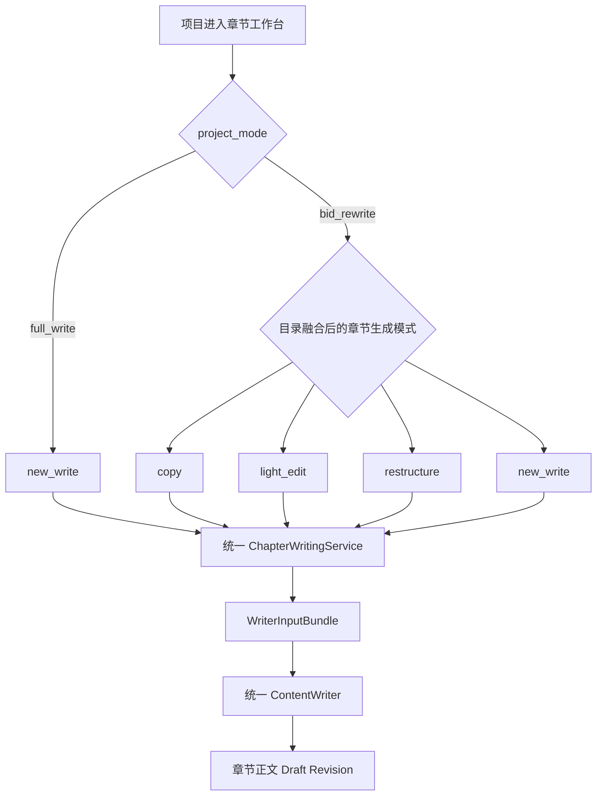
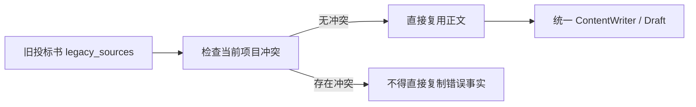
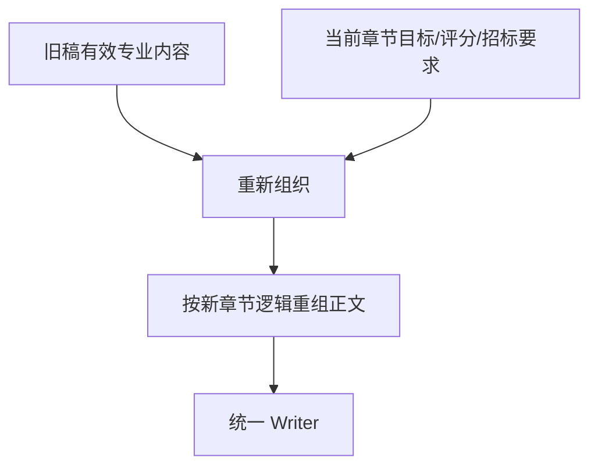
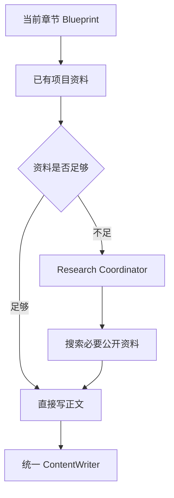
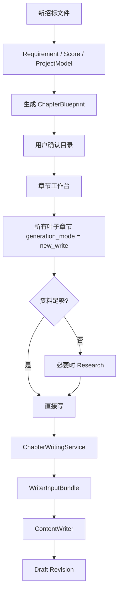
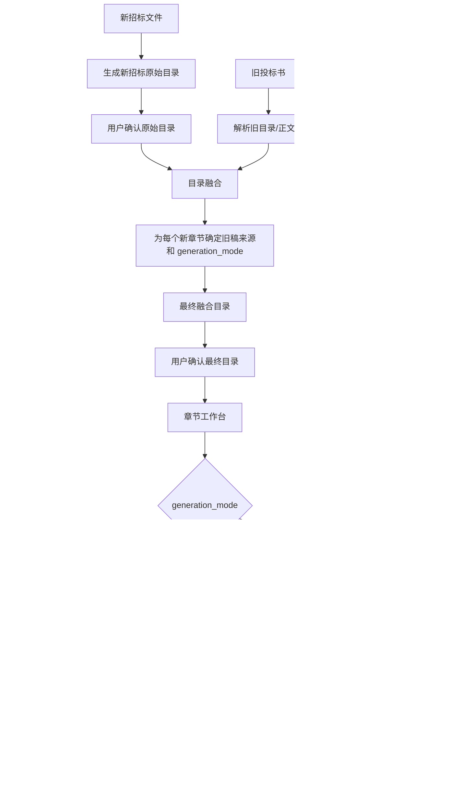

# 标书 Agent 章节工作台统一写作设计（MVP）

> 版本：MVP 展示版  
> 目标：统一“全量编写”和“历史标书改写”的章节写作逻辑，保证工作台只有一套章节写作能力，历史改写仅通过不同的正文生成模式复用旧稿。

---

## 1. 设计目标

当前系统不应存在“全量写一套、历史改写再写一套”的两套 Writer。

最终统一为：

- **2 种项目模式**
  - `full_write`：全量编写
  - `bid_rewrite`：历史标书改写
- **4 种工作台章节正文生成模式**
  - `copy`
  - `light_edit`
  - `restructure`
  - `new_write`
- **1 套统一章节写作链**
  - `ChapterAgent`
  - `ChapterWritingService`
  - `WriterInputBundle`
  - `ContentWriter`
  - `Draft Revision`

核心原则：

> `project_mode` 决定项目资料来源；  
> `generation_mode` 决定当前章节怎么生成正文。

---

# 2. 总体关系图



### 关键结论

**工作台始终只有 4 种正文生成模式。**

`full_write` 并不是第 5 种模式。

它只是：

```text
full_write 项目
→ 所有章节固定使用 new_write
```

而：

```text
bid_rewrite 项目
→ 每个章节根据目录融合结果，
  可以使用 copy / light_edit / restructure / new_write 任意一种
```

---

# 3. 四种章节正文生成模式

## 3.1 copy

### 使用场景

旧投标书对应章节与当前新招标要求基本一致，可直接复用。

### 输入

- 当前章节 Blueprint
- `legacy_sources`
- 当前招标要求
- 当前项目事实

### 行为



### 规则

- 尽量直接保留旧稿成熟正文；
- 不重新匹配旧章节；
- 不重新搜索旧稿；
- 不执行公开资料 Research；
- 当前招标文件和当前项目事实优先于旧投标书。

---

## 3.2 light_edit

### 使用场景

旧稿整体可用，但项目名称、地区、年份、范围、任务等发生少量变化。

### 输入

- `legacy_sources`
- `required_changes`
- 当前招标要求
- 当前项目事实

### 行为

```text
旧正文
+ required_changes
+ 当前项目事实
↓
只修改必须修改的部分
↓
尽量保留原结构和成熟表达
↓
生成正文
```

### 规则

- 旧稿作为正文底稿；
- 最小修改；
- 不进行公开资料 Research；
- 不重新判断资料归属。

---

## 3.3 restructure

### 使用场景

旧稿专业内容仍有价值，但新标书章节结构、评分要求或表达顺序发生明显变化。

### 输入

- `legacy_sources`
- `required_changes`
- `purpose`
- `writing_objectives`
- 当前招标要求
- 当前评分要求
- 当前项目事实

### 行为



### 规则

- 使用旧稿内容，但不机械照搬旧结构；
- 根据当前章节目标重新组织；
- 不执行公开资料 Research；
- 不重新搜索或重新分配旧标书内容。

---

## 3.4 new_write

### 使用场景

- 历史改写中没有适合复用的旧稿；
- 或当前章节本身需要重新编写；
- **全量编写项目的所有章节都使用该模式。**

### 核心定义

> `new_write` 就是系统已有的“正常单章节新写正文能力”。

它不是历史改写专用的新 Writer。

### 行为



### 规则

- 不依赖旧投标书正文；
- Research 不是必跑；
- 只在资料不足时查询；
- `full_write` 和 `bid_rewrite + new_write` 必须走同一套代码路径。

---

# 4. 两种项目模式如何使用四种生成模式

| 项目模式 | copy | light_edit | restructure | new_write |
|---|---:|---:|---:|---:|
| `full_write` | × | × | × | ✓ 所有章节 |
| `bid_rewrite` | ✓ | ✓ | ✓ | ✓ |

因此系统不需要：

- FullWriteWriter
- RewriteWriter
- CopyWriter
- NewWriteWriter

这些都会制造重复链路。

---

# 5. 全量编写完整流程



### 全量编写的本质

```text
full_write
→ 工作台
→ 所有章节使用 new_write
```

---

# 6. 历史标书改写完整流程



### 目录融合阶段必须完成的事情

目录融合解决：

> **“当前新章节应该使用旧投标书里的什么内容，以及采用哪种生成模式。”**

每个叶子章节至少形成：

```text
rewrite_mode
legacy_sources
required_changes
purpose
writing_objectives
```

正文阶段不应再次让用户重新选择旧原文块。

---

# 7. 目录融合与正文写作职责边界

## 目录融合阶段

负责：

- 新旧章节结构对应；
- 当前新章节引用哪些旧章节/旧正文块；
- 确定：
  - `copy`
  - `light_edit`
  - `restructure`
  - `new_write`
- 生成 `required_changes`；
- 把 `legacy_sources` 固定绑定到 ChapterBlueprint。

### 不负责

- 最终逐句写正文；
- 公开资料搜索；
- 文风润色。

---

## 章节写作阶段

负责：

- 读取已经确认的 ChapterBlueprint；
- 根据当前 generation mode 写正文；
- 当前招标事实覆盖旧项目事实；
- 必要时对 `new_write` 执行 Research；
- 最终生成 Draft Revision。

### 不应该再次做

- 重新匹配旧章节；
- 再生成 RewriteMatch；
- 再生成 RewritePlan 决定一次“怎么写”；
- 再让用户逐块选择旧正文。

---

# 8. 统一章节写作链

无论四种模式中的哪一种，最终均进入同一个章节写作服务。


这条链不因 `full_write / bid_rewrite` 分叉。

---

# 9. WriterInputBundle 应包含什么

统一 Writer 不直接到处读取项目文件，而是由 Bundle 统一提供当前章节需要的信息。

建议逻辑结构：

```text
WriterInputBundle
├── 当前章节 Blueprint
│   ├── title
│   ├── purpose
│   ├── writing_objectives
│   ├── score_point_ids
│   ├── score_condition_ids
│   ├── rewrite_mode
│   ├── legacy_sources
│   └── required_changes
│
├── 招标要求
├── 评分要求
├── GlobalProjectContext
├── Chapter Context
├── WritingPlan
├── 当前章节对话
├── Research Evidence
└── Document Target Constraints
```

其中改写项目才可能存在：

```text
rewrite_mode
legacy_sources
required_changes
```

全量项目则自然视为：

```text
effective_generation_mode = new_write
```

无需修改 canonical Blueprint 强行增加字段。

---

# 10. generation mode 的统一解析

推荐工作台只认一个统一概念：

```text
effective_generation_mode
```

逻辑：

```python
effective_generation_mode = (
    node.rewrite_mode
    if node.rewrite_mode
    else "new_write"
)
```

效果：

### full_write

```text
node.rewrite_mode = None
→ effective_generation_mode = new_write
```

### bid_rewrite

```text
node.rewrite_mode = copy / light_edit / restructure / new_write
→ 直接使用目录融合结果
```

最终整个工作台只存在：

```text
copy
light_edit
restructure
new_write
```

四种模式。

---

# 11. Research 规则

Research 由章节生成模式决定。

| generation mode | 是否进入公开资料 Research |
|---|---|
| copy | 否 |
| light_edit | 否 |
| restructure | 否 |
| new_write | 按资料缺口判断 |

因此：

```text
full_write
→ 所有章节 new_write
→ 按资料缺口判断 Research

bid_rewrite + copy
→ 不 Research

bid_rewrite + light_edit
→ 不 Research

bid_rewrite + restructure
→ 不 Research

bid_rewrite + new_write
→ 与 full_write 完全相同
→ 按资料缺口判断 Research
```

注意：

> `new_write` ≠ 必须联网。

Research Coordinator 只负责判断：

```text
已有资料够不够？
```

够了直接写。

---

# 12. DocumentContract 的定位

当前系统还有 `DocumentContract`。

它不应该负责：

- 判断 full_write / bid_rewrite；
- 判断 copy / light_edit / restructure / new_write；
- 决定是否 Research；
- 决定旧标书怎么复用。

它只负责：

> **当前章节是不是合法可写目标，以及写到哪个 target / template slot。**

可以理解为：

```text
ChapterBlueprint
= 写什么、为什么写、当前章节属于哪种生成模式

DocumentContract
= 能不能写到这个位置

WriterInputBundle
= 把本次真正需要的数据冻结后交给 Writer
```

对于 `template_strict`，DocumentContract 的 slot 映射价值很高。

对于普通 auto outline，它与 Blueprint 存在部分结构字段重复，但 MVP 阶段不做大重构，只保证 `rewrite_merge` 能正常进入统一 Writer。

---

# 13. 当前代码职责映射

当前关键代码建议保持如下职责：

| 文件 | 职责 |
|---|---|
| `rewrite_outline_merge_skill.py` | 新旧目录融合，确定 `rewrite_mode / legacy_sources / required_changes` |
| `contracts.py` | ChapterBlueprint / WriterInputBundle 等 Schema |
| `chapter_chat.py` | 章节 Agent、章节对话、调用统一章节写作入口 |
| `chapter_writing_service.py` | 唯一章节正文编排入口 |
| `writer_bundle.py` | 组装冻结 WriterInputBundle |
| `content_writer.py` | 唯一正文 Writer |
| `writer_research.py` | new_write 时判断是否需要补充公开资料 |
| `document_contract.py` | 结构授权 / target 映射 |

---

# 14. MVP 展示目标

为了保证演示至少能够生成一版，MVP 应优先保证以下真实链路：

## 历史改写项目

```text
上传新招标文件
+
上传旧投标书
↓
生成新目录
↓
确认
↓
融合旧目录
↓
得到最终目录
↓
确认
↓
选择章节
↓
工作台展示 generation mode
↓
点击开始编写
↓
Chapter Agent
↓
统一 Writer
↓
成功生成正文
```

至少验证：

### copy

能使用旧正文生成。

### light_edit

能看到旧正文被最小修改。

### restructure

能看到旧内容按新章节要求重组。

### new_write

能像普通全量编写一样生成正文，并在必要时判断是否补资料。

---

# 15. 明确禁止的重复设计

MVP 及后续实现中，不应该新增：

```text
RewriteWriter
FullWriteWriter
NewWriteWriter
CopyWriter
LightEditWriter
RestructureWriter

RewriteChapterAgent
FullWriteChapterAgent
```

也不应该让：

```text
RewriteMatch
RewritePlan
污染治理确认
```

重新成为章节正文的强制前置流程。

这些能力可以作为诊断或历史兼容逻辑存在，但不能阻塞统一工作台正文生成。

---

# 16. 最终设计一句话

> **工作台只有 4 种正文生成模式：copy、light_edit、restructure、new_write。  
> bid_rewrite 可以使用全部 4 种；full_write 的所有章节固定使用 new_write。  
> 四种模式最终全部进入同一个 ChapterWritingService 和 ContentWriter。**
